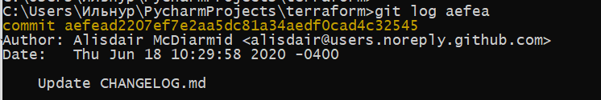
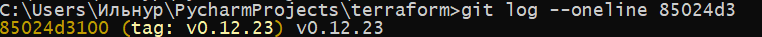
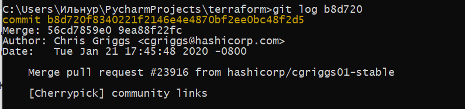
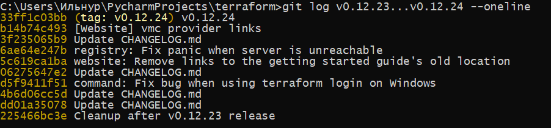
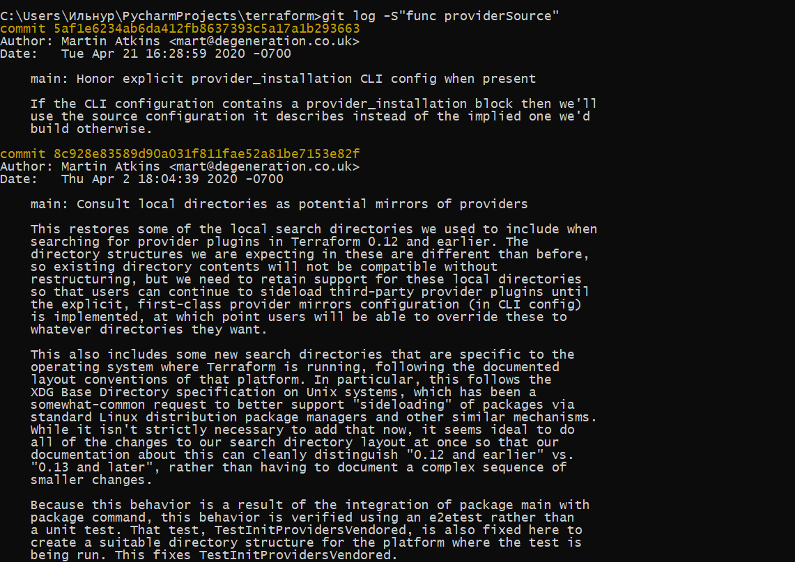
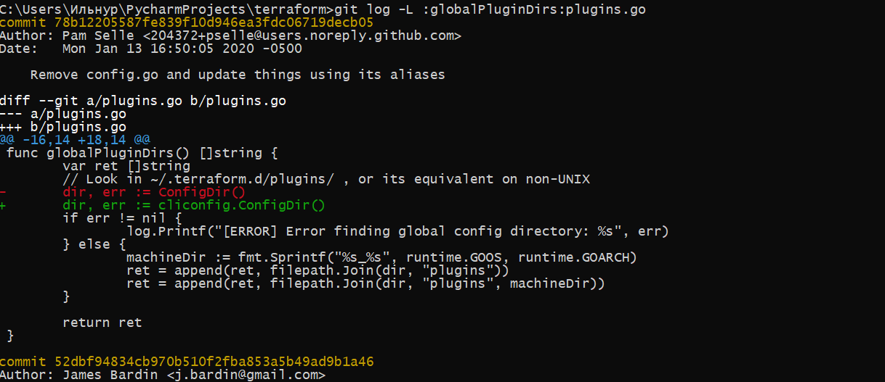
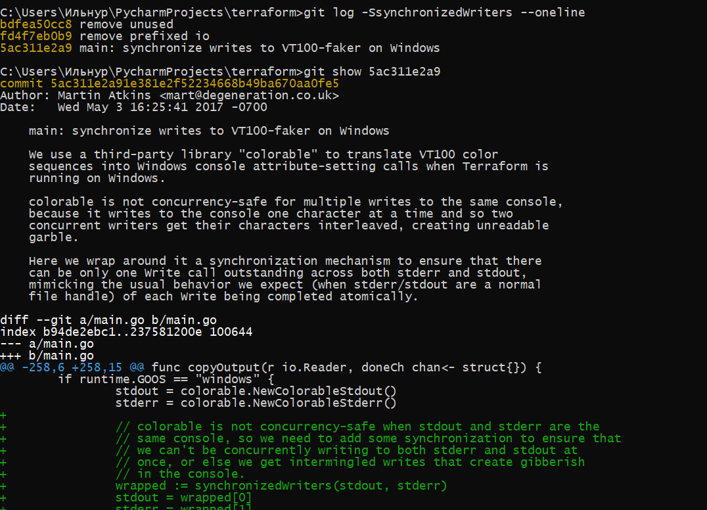

# Домашнее задание к занятию "Инструменты Git"
## Выполнил Хайруллин Ильнур

1. Задание №1.
    Поиск произвел с помощью команды: git log aefea (так же можно воспользоваться git show [хеш])
    
   - хеш: aefead2207ef7e2aa5dc81a34aedf0cad4c32545
   - комментарий: Update CHANGELOG.md

2. Задание №2
    Тег можно найти такой же командой git log [хеш] (либо git show [хеш]) , так же можно вывести все в одну строку командой git log [хеш] --oneline:
    
    - тег: v0.12.23
3. Задание №3
    Коммит является мерж коммитом и имеет два родительских коммита. Так же можно увидеть коммандой git log [хеш] или git show [хеш]:
    
    - хеш первого родителя:56cd7859e0
    - хеш второго родителя:9ea88f22fc

4. Задание №4
    Для этого можно воспользоваться командой, которая покажет коммиты между тегами: git log tagA..tagB  -  т.е. все коммиты от тега А до тега В (--oneline выведет сокращенный вариант):
    
    - 33ff1c03bb (tag: v0.12.24) v0.12.24
    - b14b74c493 [Website] vmc provider links
    - 3f235065b9 Update CHANGELOG.md
    - 6ae64e247b registry: Fix panic when server is unreachable
    - 5c619ca1ba website: Remove links to the getting started guide's old location
    - 06275647e2 Update CHANGELOG.md
    - d5f9411f51 command: Fix bug when using terraform login on Windows
    - 4b6d06cc5d Update CHANGELOG.md
    - dd01a35078 Update CHANGELOG.md
    - 225466bc3e Cleanup after v0.12.23 release

5. Задание №5
    Для этого я использовал ключ -S команды git log при этом экранировав знак пробела двойными ковычками. В результате выполнения команды git log -S"func providerSource" получил два коммита, посмотрев командой git show [хеш] в более старый коммит, я удостоверился, что функция была создана в этом коммите:
     
     .png)
    - хеш коммита с созданной функцией: 8c928e83589d90a031f811fae52a81be7153e82f

6. Задание №6
   Для этого коммандой git grep --show-function я нашел файл с нужной функцией. Далее при помощи ключа -L команды git log (git log -L :globalPluginDirs:plugins.go) нашел коммиты в которых менялась функция: 
   
    Хеши коммитов (их 5):
    - 78b12205587fe839f10d946ea3fdc06719decb05
    - 52dbf94834cb970b510f2fba853a5b49ad9b1a46
    - 41ab0aef7a0fe030e84018973a64135b11abcd70
    - 66ebff90cdfaa6938f26f908c7ebad8d547fea17
    - 8364383c359a6b738a436d1b7745ccdce178df47

7.Задание №7
    Снова воспользовался ключом -S команды git log, посмотрел самый старый коммит командой git show и увидел, что там был добавлен кусок кода с нужной функцией:
    
    - автор коммита с функцией: Martin Atkins <mart@degeneration.co.uk>