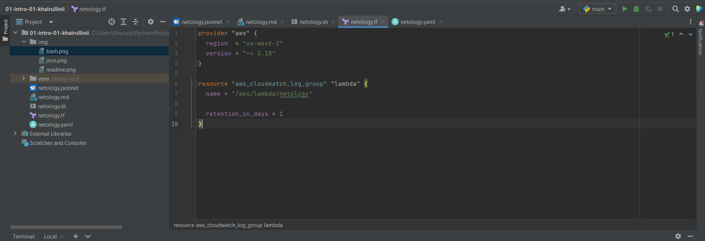
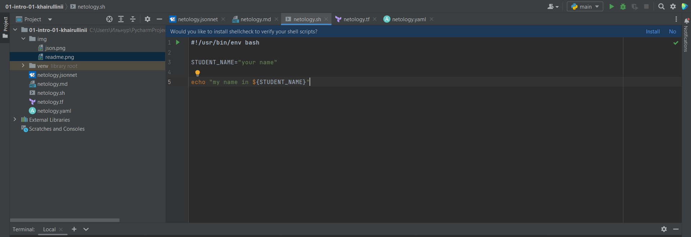
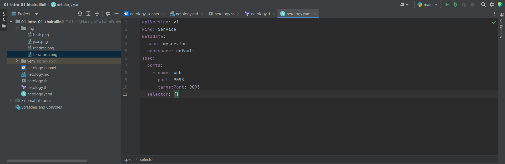
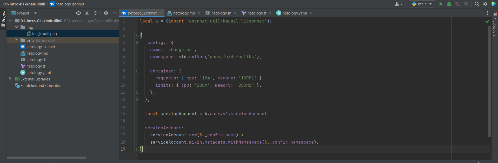

# Домашнее задание к занятию "Введение в DevOps"

## Выполнил Хайруллин Ильнур

1. Задание №1.
Установить Pycharm cо следующими плагинами:

Terraform: 

Bash: 

Markdown: 

Yaml: 

Jsonnet: 

2. Задание №2.

Описание жизненного цикла задачи(разработка нового функционала).

    1 Этап:Разработка концепции нового фунционала.
    - Получение тех. задания от заказчика (Менеджеры)
    - Определение языка программирования (Разработчики)
    - Определение команды разработчиков (Разработчики)

    2 Этап:Разработка функционала.
    - Создание ответвление репозитория для разработки (DevOps)
    - Разворачивание среды для разработки (DevOps)
    - Разработка функционала (Разработчики)
    
    3 Этап:Тестирование и отладка.
    - Написание тестов (Тестировщики)
    - Разворачиваниее среды для тестирования (DevOps)
    - Тестирование и отладка кода (Тестировщики + Разработчики)
    - Код-ревью (Разработчики)
    - Поиск уязвимостей в коде (DevSecOps)
   
    4 Этап: Представление нового фунционала:
    - Презентация заказчику (Менеджеры)
    - Предусмотреть откат изменений (DevOps)
    - Ввести код в продуктив, соеденить основной код программы с кодом нового фунционала (DevOps)