# Домашнее задание к занятию "3.5. Файловые системы"

## Выполнил Хайруллин Ильнур

1. Задание №1.
Узнайте о sparse (разряженных) файлах.
        
        Это файлы, в которых последовательность нулевых битов вырезена, а данные о них находятся в метаданных файловой системы.
        Используются для экономии дискового пространства.

2. Задание №2.
Могут ли файлы, являющиеся жесткой ссылкой на один объект, иметь разные права доступа и владельца? Почему?

         Не могут, так как жесткая ссылка копирует inode, то все атрибуты тоже копируются.
         Т.е. права доступа и владелец тоже наследуются от файла, на который указывает ссылка.
3. Задание №3.
Сделайте vagrant destroy на имеющийся инстанс Ubuntu. Замените содержимое Vagrantfile представленной конфигурацией.Данная конфигурация создаст новую виртуальную машину с двумя дополнительными неразмеченными дисками по 2.5 Гб.

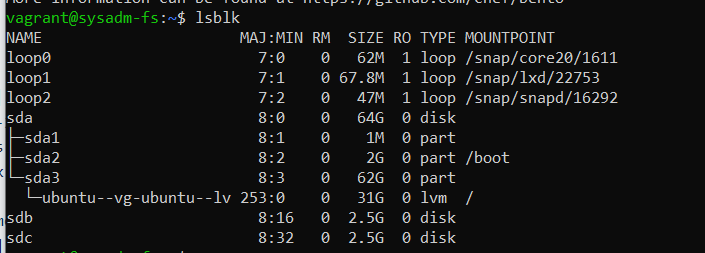  

         Установил, вижу два неразмеченных дисковых простраснаста

4. Задание №4.
Используя fdisk, разбейте первый диск на 2 раздела: 2 Гб, оставшееся пространство.

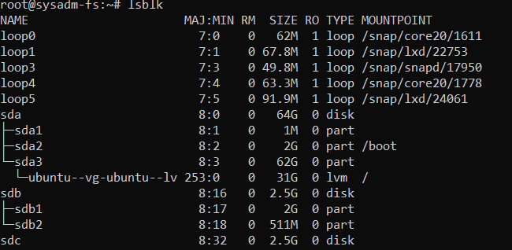  

         fdisk /dev/sdb в меню выбрал ключ n и написал +2G, второй раздел по дефолту. И записал ключом w.

5. Задание №5.
Используя sfdisk, перенесите данную таблицу разделов на второй диск.

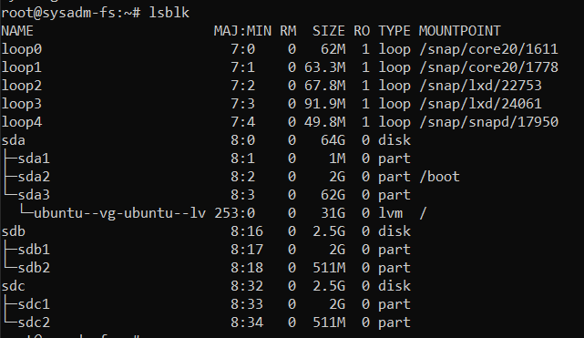

         sfdisk -d /dev/sdb | sfdisk /dev/sdc 

6. Задание №6.
Соберите mdadm RAID1 на паре разделов 2 Гб.

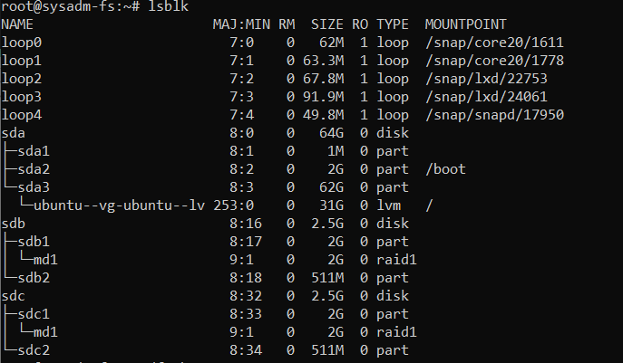  

         mdadm --create --verbose /dev/md1 --level=1 --raid-devices=2 /dev/sdb1 /dev/sdc1

7. Задание №7.
Соберите mdadm RAID0 на второй паре маленьких разделов.

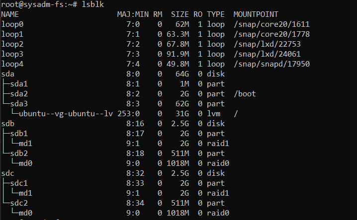  

         mdadm --create --verbose /dev/md0 --level=0 --raid-devices=2 /dev/sdb2 /dev/sdc2
8. Задание №8.
Создайте 2 независимых PV на получившихся md-устройствах.

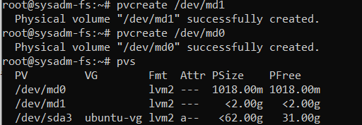  

         pvcreate /dev/md0     pvcreate /dev/md1

9. Задание №9.
Создайте общую volume-group на этих двух PV.

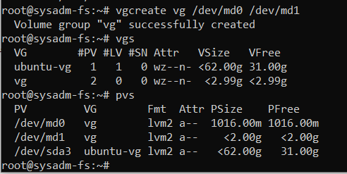  

         vgcreate vg /dev/md0 /dev/md1

10. Задание №10.
Создайте LV размером 100 Мб, указав его расположение на PV с RAID0.

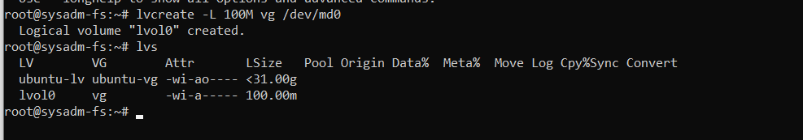  

         lvcreate -L 100M vg /dev/md0

11. Задание №11.
Создайте mkfs.ext4 ФС на получившемся LV.

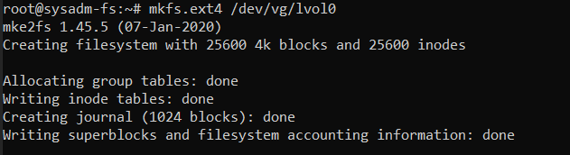  

         mkfs.ext4 /dev/vg/lvol0

12. Задание №12.
Смонтируйте этот раздел в любую директорию, например, /tmp/new.

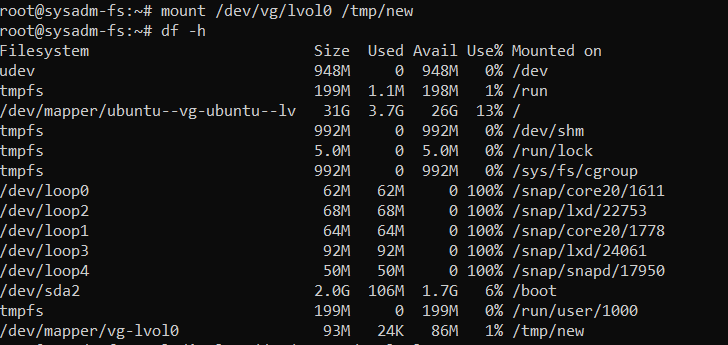  

         mount /dev/vg/lvol0 /tmp/new

13. Задание №13.
Поместите туда тестовый файл, например wget https://mirror.yandex.ru/ubuntu/ls-lR.gz -O /tmp/new/test.gz.

         Выполнено
14. Задание №14.
Прикрепите вывод lsblk.

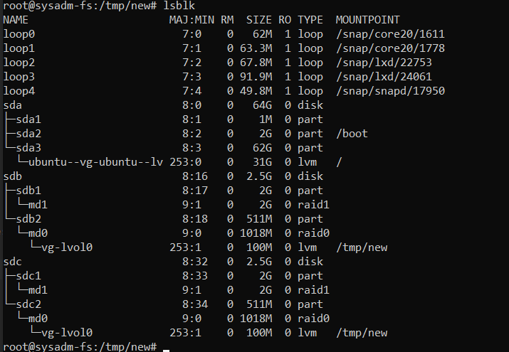  

15. Задание №15.
Протестируйте целостность файла:

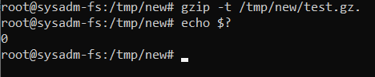  

16. Задание №16.
Используя pvmove, переместите содержимое PV с RAID0 на RAID1.

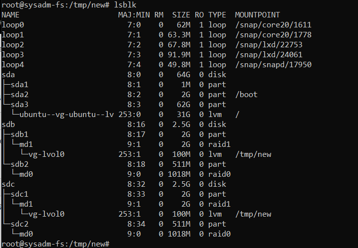  

         pvmove /dev/md0 /dev/md1

17. Задание №17.
Сделайте --fail на устройство в вашем RAID1 md.

        mdadm --fail /dev/md1 /dev/sdc1

18. Задание №18.
Подтвердите выводом dmesg, что RAID1 работает в деградированном состоянии.

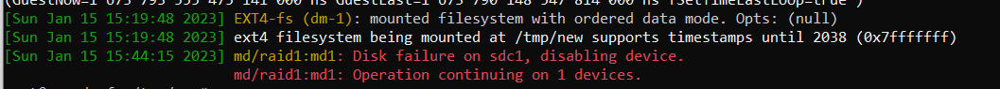  

         dmesg -T

19. Задание №19.
Протестируйте целостность файла, несмотря на "сбойный" диск он должен продолжать быть доступен:

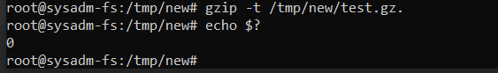  

20. Задание №20.
Погасите тестовый хост, vagrant destroy.

        Спасибо