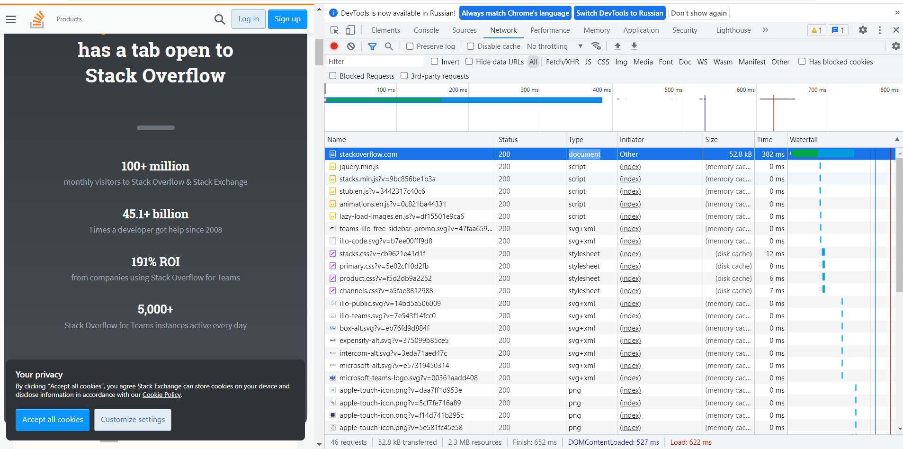

# Домашнее задание к занятию "3.6. Компьютерные сети. Лекция 1"

## Выполнил Хайруллин Ильнур

1. Задание №1.
Работа c HTTP через телнет.Подключитесь утилитой телнет к сайту stackoverflow.com. Отправьте HTTP запрос. В ответе укажите полученный HTTP код, что он означает? 

        Получил код 403 Forbiden. 403 возвращается клиенту сервером, когда доступ к указанному ресурсу ограничен. ( МСЭ, WAF и тд)

2. Задание №2.
Повторите задание 1 в браузере, используя консоль разработчика F12.

         укажите в ответе полученный HTTP код = 200
         проверьте время загрузки страницы, какой запрос обрабатывался дольше всего? = https://stackoverflow.com/    type document

3. Задание №3.
Какой IP адрес у вас в интернете?

         188.234.16.119

4. Задание №4.
Какому провайдеру принадлежит ваш IP адрес? Какой автономной системе AS? Воспользуйтесь утилитой whois

         "ER-Telecom Holding" Dom.ru. Автономная система - 41668

5. Задание №5.
Через какие сети проходит пакет, отправленный с вашего компьютера на адрес 8.8.8.8? Через какие AS? Воспользуйтесь утилитой traceroute

         К сожалению, видимо провайдер блокирует ICMP. Поэтому я вижу только свой компьютер и конечный dns гугла.
         AS для 8.8.8.8 google - 15169
         traceroute -An 8.8.8.8

         Ниже, скрин с ВМ на хостинге

6. Задание №6.
Повторите задание 5 в утилите mtr. На каком участке наибольшая задержка - delay?

         
         mtr -zn 8.8.8.8 , рзультат такой же
         
         На ВМ с хостинга наибольший delay на AS15169 142.251.237.142  

7. Задание №7.
Какие DNS сервера отвечают за доменное имя dns.google? Какие A записи? Воспользуйтесь утилитой dig

         dig dns.google
         A записи: 8.8.4.4 и 8.8.8.8         

8. Задание №8.
Проверьте PTR записи для IP адресов из задания 7. Какое доменное имя привязано к IP? Воспользуйтесь утилитой dig

         dig -x 8.8.8.8      dig -x 8.8.4.4
         dns.google          dns.google