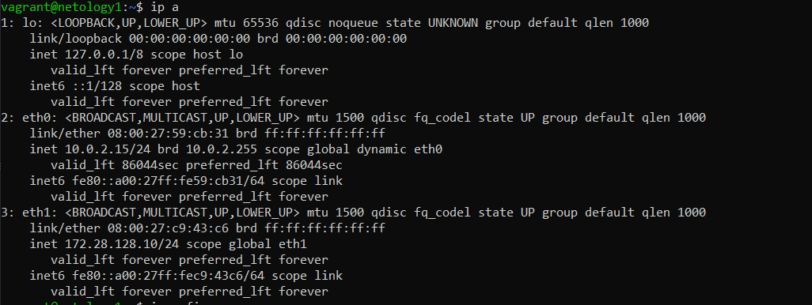
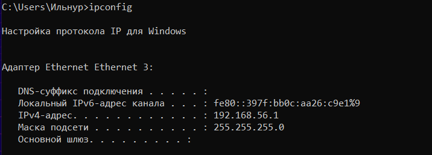
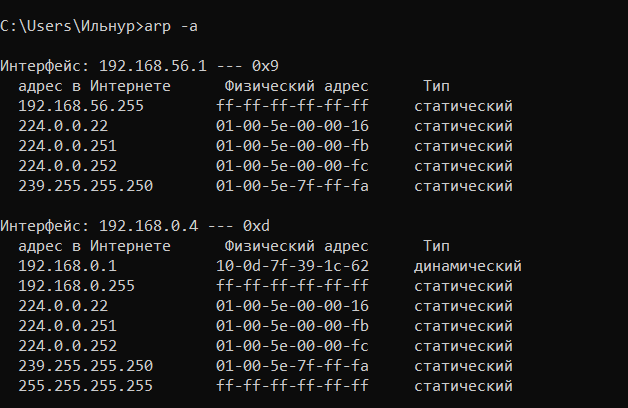
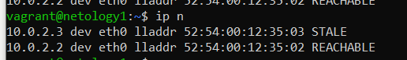

# Домашнее задание к занятию "3.7. Компьютерные сети. Лекция 2"

## Выполнил Хайруллин Ильнур

1. Задание №1.
Проверьте список доступных сетевых интерфейсов на вашем компьютере. Какие команды есть для этого в Linux и в Windows?

        ip address (ip a) для вывода сетевых интерфейсов на Linux

         ipconfig (ipconfig /all) для вывода сетевых интерфейсов на Windows

2. Задание №2.
Какой протокол используется для распознавания соседа по сетевому интерфейсу? Какой пакет и команды есть в Linux для этого?

         распознавания соседа по сетевому интерфейсу происходит по протоколу LLDP. В линукс есть пакет lldpd, который используется для определение соседних устройств в сети
         lldpctl - для просмотра соседей.

3. Задание №3.
Какая технология используется для разделения L2 коммутатора на несколько виртуальных сетей? Какой пакет и команды есть в Linux для этого? Приведите пример конфига.

         На уровне L2 для разделения широковещательных доменов используется проткол VLAN.  В Linux для работы с Vlan используется пакет vlan.
         Пример конфига по настройке vlan:
         В файле конфигурации интерфейса можно прописать vlan и поднять внутри него виртуальный интерфейс, на котором можно прописать сеть.
         auto vlan1400  (прописываем vlan id - Это уровень L2)
         iface vlan1400 inet static        (Виртуальный интерфейс, на котором прописана сеть - это L3 уровень)
              address 192.168.1.1
              netmask 255.255.255.0

4. Задание №4.
Какие типы агрегации интерфейсов есть в Linux? Какие опции есть для балансировки нагрузки? Приведите пример конфига.

         Для агрегации интерфейсов(LAG) в Linux использeуется пакет ifenslave, с помощью него можно собирать интерфейсы в бонды.
         Различают статические и динамические типы агрегации каналов.
         auto bond0               (определяем bond0)
         iface bond0 inet static             
             bond-slaves wlan0 eth0          (пределены интерфейсы в бонде)
             bond-mode active-backup          (тип агрегации)
             address <ipv4address>/<maskbits>       (ip адрес на интерфейсе)
             gateway <ipv4address>                   (шлюз по умолчанию)

5. Задание №5.
Сколько IP адресов в сети с маской /29 ? Сколько /29 подсетей можно получить из сети с маской /24. Приведите несколько примеров /29 подсетей внутри сети 10.10.10.0/24.

         В 29 маске подсети доступно 8 адресов. Из них 1ый адрес - это адрес подсети. 8ой - адрес широковещательной рассылки. И 6 адресов для хостов.
         32 подсети с маской /29 вмещается в подсеть /24.   Примеры: 10.10.10.16/29 10.10.10.80/29  10.10.10.168/29

6. Задание №6.
Задача: вас попросили организовать стык между 2-мя организациями. Диапазоны 10.0.0.0/8, 172.16.0.0/12, 192.168.0.0/16 уже заняты. Из какой подсети допустимо взять частные IP адреса? Маску выберите из расчета максимум 40-50 хостов внутри подсети.
         
         Можно взять подсеть из 100.64.0.0/10 , для 50 хостов хватит 26 маски. Например:         100.64.0.64/26

7. Задание №7.
Как проверить ARP таблицу в Linux, Windows? Как очистить ARP кеш полностью? Как из ARP таблицы удалить только один нужный IP?

         Для просмотра арпов в Windows используется команда arp -a. Для очистки кеша   arp -d * . Для удаления конкретной записи arp -d X.X.X.X

     
         
         Для просмотра арпов на Linux используется команда  ip neigh (ip n).    Для очистки кеша ip neigh flush all.       Для удаления конкретной записи    ip neigh flush X.X.X.X