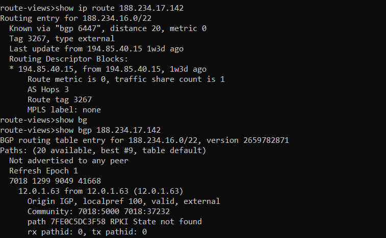
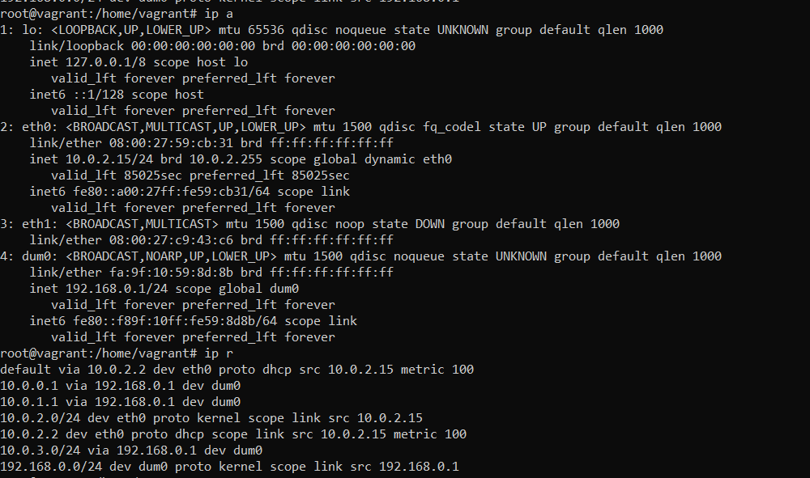
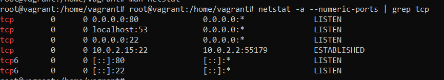
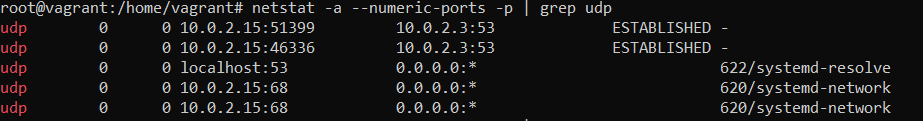
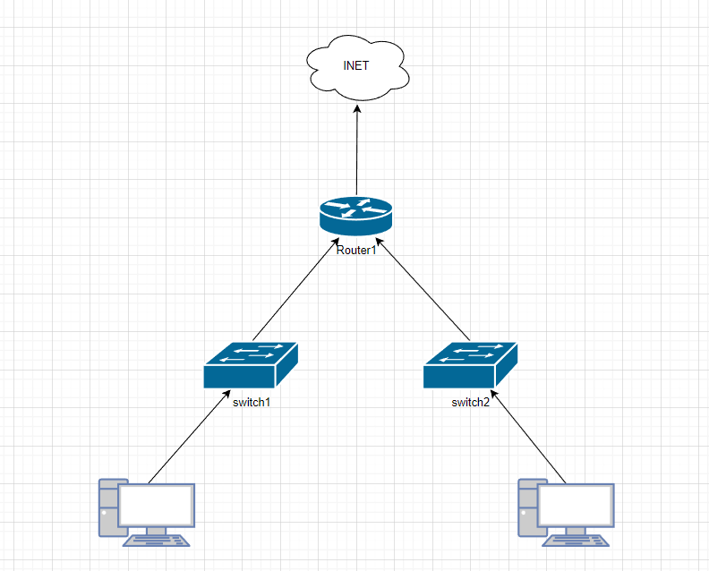
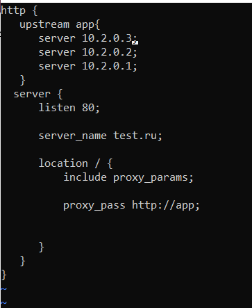

# Домашнее задание к занятию "3.8. Компьютерные сети. Лекция 3"

## Выполнил Хайруллин Ильнур

1. Задание №1.
Подключитесь к публичному маршрутизатору в интернет. Найдите маршрут к вашему публичному IP

        Маршрут до моего домашнего адреса (Sh ip ro X.X.X.X). И маршрут с пояснением каждого хопа (sh bgp X.X.X.X)

2. Задание №2.
Создайте dummy0 интерфейс в Ubuntu. Добавьте несколько статических маршрутов. Проверьте таблицу маршрутизации.

         ip link add dev dum0 type dummy - для создания виртуального интерфейса
         ip address add 192.168.0.1/24 dev dum0 - для добавления ip адреса на интерфейс
         ip link set dum0 up - для включения интерфейса
         ip route add 10.0.0.0/24 via 192.168.0.1 - для добавления маршрута 

3. Задание №3.
Проверьте открытые TCP порты в Ubuntu, какие протоколы и приложения используют эти порты? Приведите несколько примеров.

         
         netstat -a -p --numeric-ports | grep tcp  - для просмотра открытых портов с их номерами. 
         http 80 порт - протокол передачи данных (html) (приложение nginx)
         ssh 22 порт - сетевой протокол для безопасной передачи данных и удаленного управления (приложение sshd)

4. Задание №4.
Проверьте используемые UDP сокеты в Ubuntu, какие протоколы и приложения используют эти порты?

         netstat -a -p --numeric-ports | grep udp  - для просмотра открытых портов с их номерами. 
         udp 53 порт - для резолва доменных имен (DNS) (приложение systemd-resolve)
         udp 68 порт - используется в DHCP-динамическая выдача ip адресов (приложение systemd-network)

5. Задание №5.
Используя diagrams.net, создайте L3 диаграмму вашей домашней сети или любой другой сети, с которой вы работали.

         

## Дополнительные задания

6. Задание №6.
Установите Nginx, настройте в режиме балансировщика TCP или UDP.

         apt-get install nginx для установки nginx
         /etc/nginx/sites-available/default - файл для конфигурации сервера

         upstream app  -  сервера куда проксируем (если не прописывать тип, то дефолтный Round Robin, нагрузка распределяется между всеми одинаково )
         server - настройки самого nginx (слушаем на 80 порту, имя сервера, proxy_pass - какой апстрим использем)