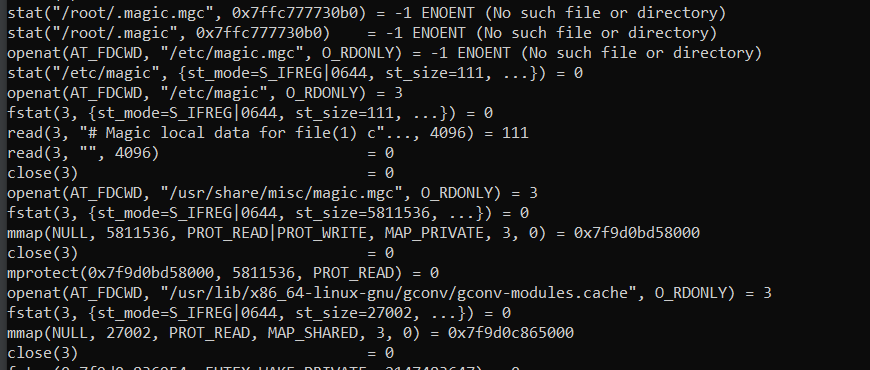
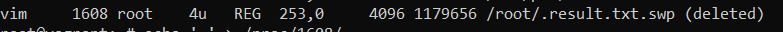
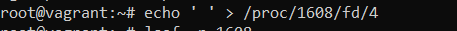
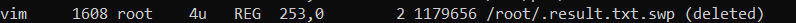
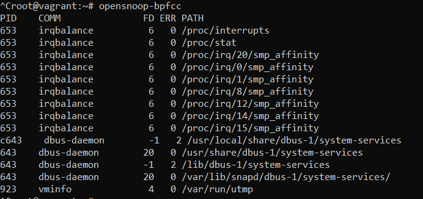
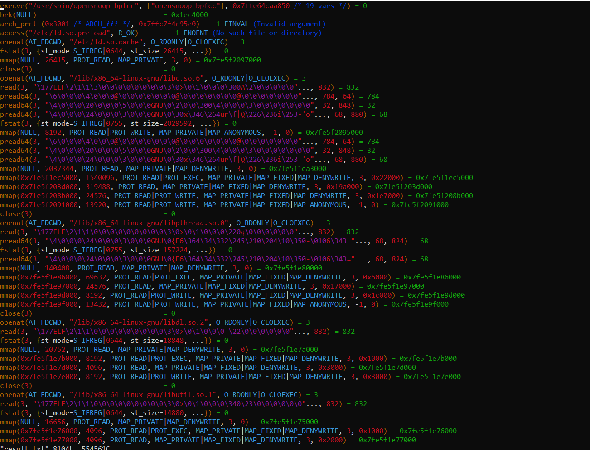

# Домашнее задание к занятию "3.3. Операционные системы. Лекция 1"

## Выполнил Хайруллин Ильнур

1. Задание №1.
Какой системный вызов делает команда cd?
        
        cd делает системный вызов смены директории - chdir("/tmp")
2. Задание №2.
Попробуйте использовать команду file на объекты разных типов в файловой системе.
Используя strace выясните, где находится база данных file, на основании которой она делает свои догадки.

         Нагуглил, что file обращается к файлу magic.mgc. В выводе strace вижу, что поиск идет в нескольких директориях.
         /usr/share/misc/magic.mgc - и нашел файл в этой директории.
         openat - открыл файл для чтения
         fstat - получил информацию о файле 
         close - закрыть файл после чтения или записи

3. Задание №3.
Предположим, приложение пишет лог в текстовый файл. Этот файл оказался удален (deleted в lsof), однако возможности сигналом сказать приложению переоткрыть файлы или просто перезапустить приложение – нет. Так как приложение продолжает писать в удаленный файл, место на диске постепенно заканчивается. Основываясь на знаниях о перенаправлении потоков предложите способ обнуления открытого удаленного файла (чтобы освободить место на файловой системе).

         lsof -p PID узнаем какой фд использует процесс. И перенаправить stdout пустого echo в фд для этого процесса.

        

4. Задание №4.
Занимают ли зомби-процессы какие-то ресурсы в ОС (CPU, RAM, IO)?

         Зомби процесс не занимает ресурсы ОС, но занимает PID в таблице процессов. 
         Сиротские же процессы продолжают потреблять ресурсы.

5. Задание №5.
На какие файлы вы увидели вызовы группы open за первую секунду работы утилиты? Воспользуйтесь пакетом bpfcc-tools для Ubuntu 20.04.

         Вывод самой команды  

         Вывод strsace для opensnoop-bpfcc

         openat(AT_FDCWD, "/lib/x86_64-linux-gnu/libc.so.6", O_RDONLY|O_CLOEXEC) = 3 - читаются библиотеки
         openat(AT_FDCWD, "/lib/x86_64-linux-gnu/libpthread.so.0", O_RDONLY|O_CLOEXEC) = 3
         openat(AT_FDCWD, "/lib/x86_64-linux-gnu/libdl.so.2", O_RDONLY|O_CLOEXEC) = 3
         openat(AT_FDCWD, "/lib/x86_64-linux-gnu/libutil.so.1", O_RDONLY|O_CLOEXEC) = 3
         openat(AT_FDCWD, "/lib/x86_64-linux-gnu/libm.so.6", O_RDONLY|O_CLOEXEC) = 3
         openat(AT_FDCWD, "/lib/x86_64-linux-gnu/libexpat.so.1", O_RDONLY|O_CLOEXEC) = 3
         openat(AT_FDCWD, "/lib/x86_64-linux-gnu/libz.so.1", O_RDONLY|O_CLOEXEC) = 3
         openat(AT_FDCWD, "/usr/lib/locale/locale-archive", O_RDONLY|O_CLOEXEC) = 3
         openat(AT_FDCWD, "/usr/lib/x86_64-linux-gnu/gconv/gconv-modules.cache", O_RDONLY) = 3
         openat(AT_FDCWD, "/usr/bin/pyvenv.cfg", O_RDONLY) = -1 ENOENT (No such file or directory)
         openat(AT_FDCWD, "/usr/pyvenv.cfg", O_RDONLY) = -1 ENOENT (No such file or directory)

6. Задание №6.
Какой системный вызов использует uname -a? Приведите цитату из man по этому системному вызову, где описывается альтернативное местоположение в /proc, где можно узнать версию ядра и релиз ОС.

         системный вызов uname()
         Part of the utsname information is also accessible via
       /proc/sys/kernel/{ostype, hostname, osrelease, version,
       domainname}.

7. Задание №7.
Чем отличается последовательность команд через ; и через && в bash?

         ; запускает команды последовательно , т.е. запустит след. после завершения предыдущей
         && запускает команды параллельно в фоновом режиме, т.е. не дожидаясь окончания сразу выполняет след. команду

8. Задание №8.
Из каких опций состоит режим bash set -euxo pipefail и почему его хорошо было бы использовать в сценариях?

         -e - Немедленно завершить работу, если команда завершается с ненулевым статусом (т.е. с ошибкой)
         -u - определить неустановленные переменные как ошибку
         -x - Выводитm команды и их аргументы по мере их выполнения.
         -о pipefile - код завершения конвейера будет совпадать с первым ненулевым кодом завершения одной из команд конвейера или же нулю в случае, если все команды завершились корректно

         Эти ключи удобно использовать для более быстрой отладки скриптов, также они делают более информативным вывод выполнения скрипта

9. Задание №9.
Используя -o stat для ps, определите, какой наиболее часто встречающийся статус у процессов в системе. В man ps ознакомьтесь (/PROCESS STATE CODES) что значат дополнительные к основной заглавной буквы статуса процессов. Его можно не учитывать при расчете (считать S, Ss или Ssl равнозначными).

         Наиболее часто встречаются S,Ss,Ssl
         S - прерываемый режим сна (ожидание завершения события)
         s - лидер сессии
         l - является многопоточным (треды использует)
         N - низкий приорите
         > - высокий приорите
   