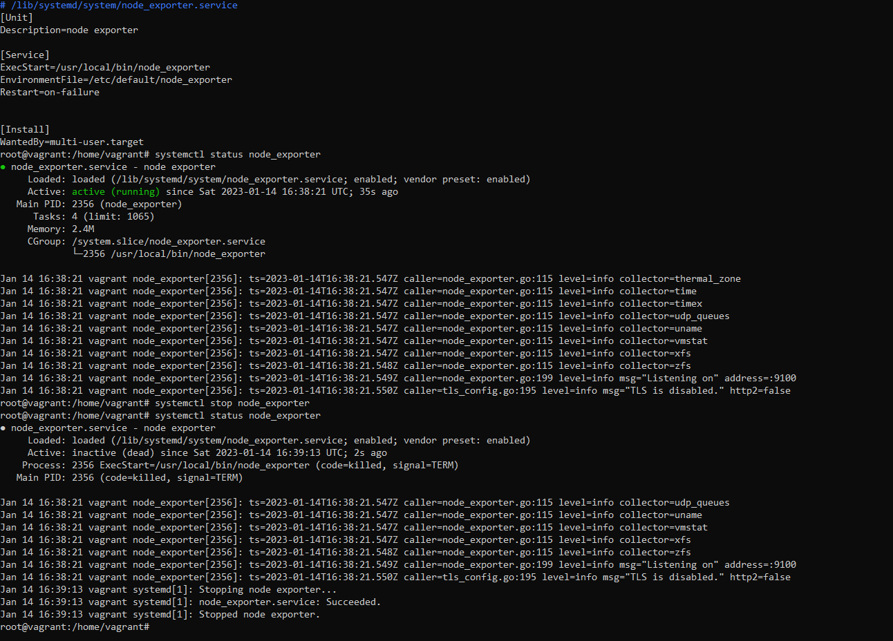
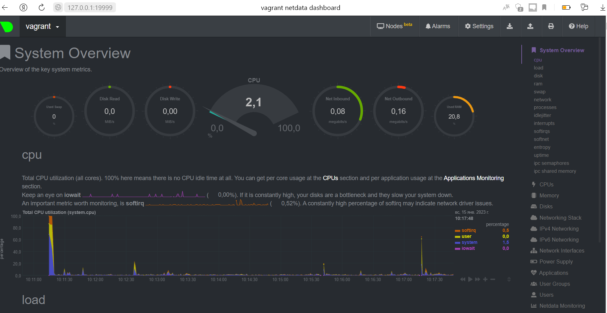
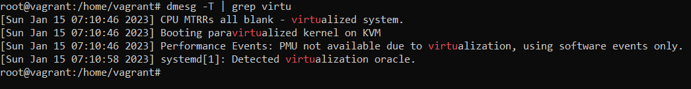
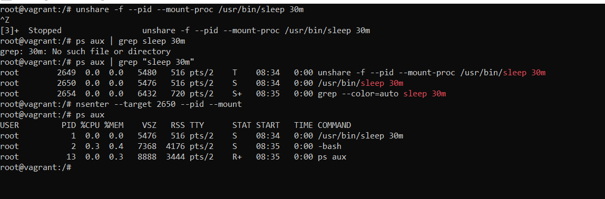
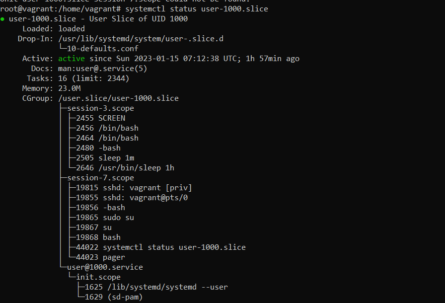
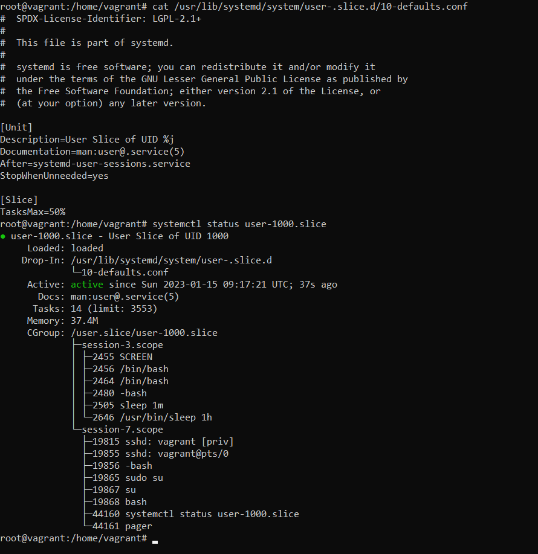

# Домашнее задание к занятию "3.4. Операционные системы. Лекция 2"

## Выполнил Хайруллин Ильнур

1. Задание №1.
На лекции мы познакомились с node_exporter. В демонстрации его исполняемый файл запускался в background. Этого достаточно для демо, но не для настоящей production-системы, где процессы должны находиться под внешним управлением. Используя знания из лекции по systemd, создайте самостоятельно простой unit-файл для node_exporter:
        
        
        Установил node_exporter, создал unit файл (содержимое на скриншоте), перечитал измененные unit файлы и запустил 
        Для добавления в автозагрузку: systemctl enable node_exporter
        Добавил в unit файл EnvironmentFile= для возможности добавления опций к запускаемому процессу через внешний файл 
2. Задание №2.
Ознакомьтесь с опциями node_exporter и выводом /metrics по-умолчанию. Приведите несколько опций, которые вы бы выбрали для базового мониторинга хоста по CPU, памяти, диску и сети.

         CPU:  node_cpu_seconds_total{cpu="0",mode="system"}  и  node_cpu_seconds_total{cpu="1",mode="system"} 
         memory:  node_memory_MemAvailable_bytes   и    node_memory_MemFree_bytes    
         disk: node_disk_filesystem_info  и  node_disk_io_time_seconds_total (для всех смонтированных дисков)
         network: node_network_receive_bytes_total  и   node_network_transmit_bytes_total (Для всех сетевых адаптеров)
3. Задание №3.
Установите в свою виртуальную машину Netdata. Воспользуйтесь готовыми пакетами для установки (sudo apt install -y netdata).
После успешной перезагрузки в браузере на своем ПК (не в виртуальной машине) вы должны суметь зайти на localhost:19999. Ознакомьтесь с метриками, которые по умолчанию собираются Netdata и с комментариями, которые даны к этим метрикам.
  

         Успешно установил и ознокомился с метриками

4. Задание №4.
Можно ли по выводу dmesg понять, осознает ли ОС, что загружена не на настоящем оборудовании, а на системе виртуализации?
  

         Да, в выводе dmseg определяется, что ОС загружается в виртуальной среде

5. Задание №5.
Как настроен sysctl fs.nr_open на системе по-умолчанию? Определите, что означает этот параметр. Какой другой существующий лимит не позволит достичь такого числа (ulimit --help)?

         Настройка по-умолчанию fs.nr_open = 1048576 - это лимит лимит открытых ФД для каждого отдельного процесса
         Дополнительно ограничено лимитами оболочки.
         soft limit: open files  (-n) 1024
         hard limit: open files  (-n) 1048576

6. Задание №6.
Запустите любой долгоживущий процесс (не ls, который отработает мгновенно, а, например, sleep 1h) в отдельном неймспейсе процессов; покажите, что ваш процесс работает под PID 1 через nsenter. Для простоты работайте в данном задании под root (sudo -i). Под обычным пользователем требуются дополнительные опции (--map-root-user) и т.д.
  

7. Задание №7.
Найдите информацию о том, что такое :(){ :|:& };:. Запустите эту команду в своей виртуальной машине Vagrant с Ubuntu 20.04 (это важно, поведение в других ОС не проверялось). Некоторое время все будет "плохо", после чего (минуты) – ОС должна стабилизироваться. Вызов dmesg расскажет, какой механизм помог автоматической стабилизации.
Как настроен этот механизм по-умолчанию, и как изменить число процессов, которое можно создать в сессии?

         Видимо, этот процесс  почистил форкнутые процессы: [ 5507.950822] cgroup: fork rejected by pids controller in /user.slice/user-1000.slice/session-3.scope
         Настройки по-умолчанию cat /sys/fs/cgroup/pids/user.slice/user-1000.slice/pids.max           2344  (можно увидеть на скриншоте)

     

         Изменить можно отрекдаривовав файл конфигурации /usr/lib/systemd/system/user-.slice.d/10-defaults.conf

  