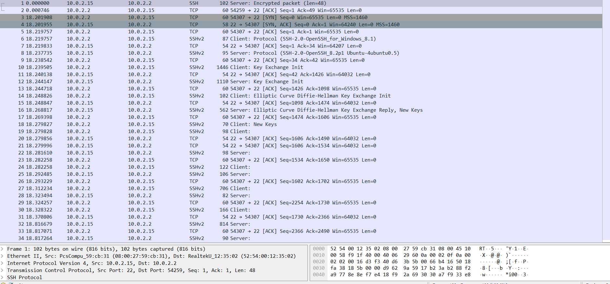

# Домашнее задание к занятию "Элементы безопасности информационных систем"

## Выполнил Хайруллин Ильнур

1. Задание №1.
Установите Bitwarden плагин для браузера. Зарегестрируйтесь и сохраните несколько паролей.

        Установил плагин на Chrome. Перешел на сайт и прошел регистрацию.
         Создал тестовые креды для вк.

2. Задание №2.
Установите Google authenticator на мобильный телефон. Настройте вход в Bitwarden акаунт через Google authenticator OTP.

         Установил  Google authenticator на телефон. Перешел в настройки аккаунта, выбрал провайдера для двухфакторки.
         Отсканировал QR и ввел код с телефона.

3. Задание №3.
Установите apache2, сгенерируйте самоподписанный сертификат, настройте тестовый сайт для работы по HTTPS.

         
         Для установки: sudo apt install apache2 (при ошибке добавить ключ --fix-missing). Если ошибка сохраняется,
         обновить соурс лист репозиториев с пакетами (/etc/apt/sources.list) и запустить apt update
         systemctl status apache2 (для проверки статуса)
         создаем новый виртуальный хост: /etc/apache2/sites-available/test.site.conf

         ServerAlias - доменное имя, DocumentRoot - директория с html, SSLEngine - для ssl (путь до серта и ключ)
         Второй блок для редиректа с http

         При выпуске сертификата в common name пишем домен (www.test.site)

         a2ensite test.site  для активации виртуального хоста, systemctl reload apache2 для перечитывания конфига

4. Задание №4.
Проверьте на TLS уязвимости произвольный сайт в интернете (кроме сайтов МВД, ФСБ, МинОбр, НацБанк, РосКосмос, РосАтом, РосНАНО и любых госкомпаний, объектов КИИ, ВПК ... и тому подобное).

         
          git clone --depth 1 https://github.com/drwetter/testssl.sh.git  - для установки
         ./testssl.sh https://домен.ru/  - для сканирования

5. Задание №5.
Установите на Ubuntu ssh сервер, сгенерируйте новый приватный ключ. Скопируйте свой публичный ключ на другой сервер. Подключитесь к серверу по SSH-ключу.

         Для генирации ключа - ssh-keygen 
         копируем публичный ключ на удаленный сервер - ssh-copy-id имя_пользователя@ip_адрес (можно добавить руками echo public_key_string >> ~/.ssh/authorized_keys)
         Для подключения - ssh имя_пользователя@ip_адрес  (так же можно указать путь к ключу через ключ -i)

6. Задание №6.
Переименуйте файлы ключей из задания 5. Настройте файл конфигурации SSH клиента, так чтобы вход на удаленный сервер осуществлялся по имени сервера.

         Создаем файл конфига в .ssh. Указываем все необходимые параметры для доступа. ( временно отключить проверку known_hosts:  -o StrictHostKeyChecking=no srv_name)

7. Задание №7.
Соберите дамп трафика утилитой tcpdump в формате pcap, 100 пакетов. Откройте файл pcap в Wireshark.

         tcpdump -c 100 -i eth0 -w 01.pcap  (для сбора 100 пакетрв с интерфейса с записью в файл)