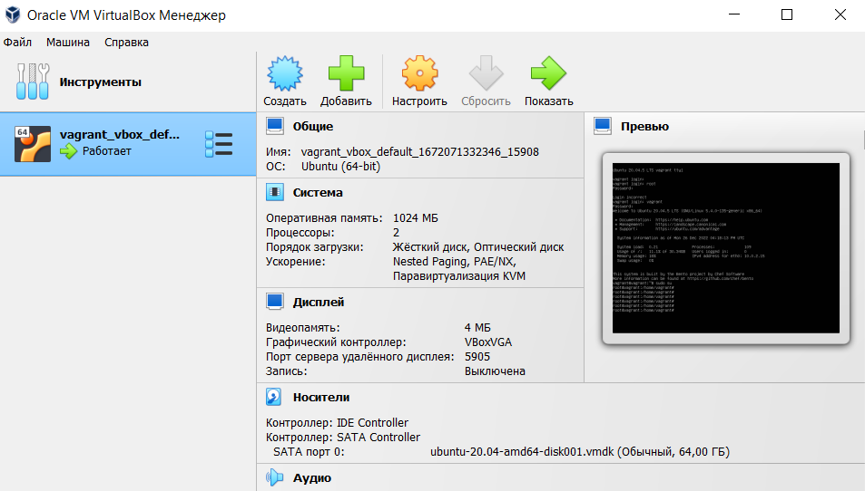
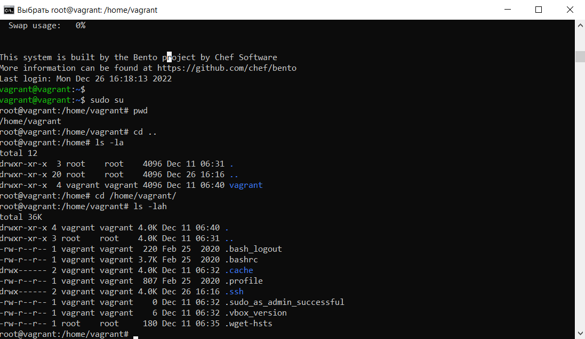
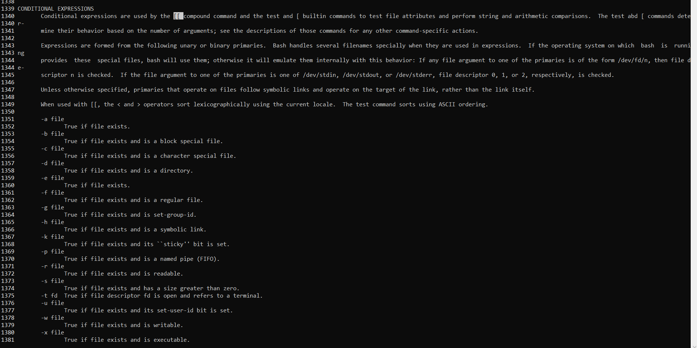

# Домашнее задание к занятию "3.1. Работа в терминале. Лекция 1"

## Выполнил Хайруллин Ильнур

1. Задание №1.
С помощью базового файла конфигурации запустите Ubuntu 20.04 в VirtualBox посредством Vagrant

Установил VirtualBox и Vagrant. Создал директорию для инициализации Vagrant. После чего заменил файл конфигурации и запустил процесс инициализации ВМ.

P.S. Не обошлось без трудностей связанных с кодировкой (Так как работаю на Windows). Решил проблему заменой названий директорий и прописыванием допполнительных строк в файл в глубинах vagranta.

2. Задание №2.
Ознакомьтесь с графическим интерфейсом VirtualBox, посмотрите как выглядит виртуальная машина, которую создал для вас Vagrant, какие аппаратные ресурсы ей выделены. Какие ресурсы выделены по-умолчанию?

    Для ВМ выделено:
    - CPU = 2
    - OЗУ = 1024Мб
    - HDD = 64ГБ
    - ОС - Ubuntu-20.04

3. Задание №3.
Ознакомьтесь с возможностями конфигурации VirtualBox через Vagrantfile: документация. Как добавить оперативной памяти или ресурсов процессора виртуальной машине?

        Для добавление ресурсов ВМ через vagrant необходимо в файл конфигурации Vagrantfile добавить следующие строки:
        config.vm.provider "virtualbox" do |v|
            v.memory = 1024
            v.cpus = 2
        end
        
        где 1024 - кол-во выделенного ОЗУ, 2 - кол-во ядер.
4.  Задание №4.
Команда vagrant ssh из директории, в которой содержится Vagrantfile, позволит вам оказаться внутри виртуальной машины без каких-либо дополнительных настроек. Попрактикуйтесь в выполнении обсуждаемых команд в терминале Ubuntu.

5.  Задание №5
Ознакомьтесь с разделами man bash, почитайте о настройках самого bash

         1) 862 строчка, длинна журнала history задеется в переменной HISTSIZE
         2) задается значением в переменной HISTCONTROL, говорит не записывать в историю идущие друг за другом одинаковые команды (т.е. дубли) и не записывать команды, начинающиеся с пробела (сокращение от ignorespace и ignoredups)
6. Задание №6
В каких сценариях использования применимы скобки {} и на какой строчке man bash это описано?

            Символы {} или "Расширение фигурных скобок" - это механизм, с помощью которого могут быть сгенерированы произвольные строки согласно правилу, описанному внутри фигурных скобок (строки 791-821)
7. Задание №7
С учётом ответа на предыдущий вопрос, как создать однократным вызовом touch 100000 файлов? Получится ли аналогичным образом создать 300000? Если нет, то почему?

            1)Для создания 100000 файлов можно возспользоваться командой: touch test{1..100000}.
            2)Создание 300000 файлов не возможно из-за ограничения ARG_MAX, это количество байтов, которое может составлять общая длина среды и списка аргументов команды
8. Задание №8
В man bash поищите по /\[\[. Что делает конструкция [[ -d /tmp ]]

         Возвращает True, если каталог /tmp существует.
      

9. Задание №9
Сделайте так, чтобы в выводе команды type -a bash первым стояла запись с нестандартным путем, например bash is ... Используйте знания о просмотре существующих и создании новых переменных окружения, обратите внимание на переменную окружения PATH

         1)создал директорию:  new_path_directory
         2)скопировал исполняемый файл bash:  cp /usr/bin/bash /tmp/new_path_directory/bash
         3)добавил в параметр PATH  созданную директорию в самое начало (в файле /etc/environment):    PATH="/tmp/new_path_directory:/usr/local/sbin:/usr/local/bin:/usr/sbin:/usr/bin:/sbin:/bin:/usr/games:/usr/local/games:/snap/bin"
10. Задание №10
Чем отличается планирование команд с помощью batch и at?

         at - команда выполняется один раз в указанное время
         batch - команда выполнится в указанное время если позволяет закрузка системы. Иначе процесс будет ждать в очереди, и запустится когда загрузка системы упадет ниже выставленной границы.
