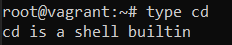
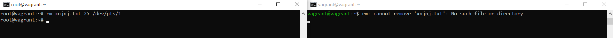
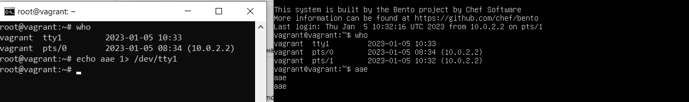
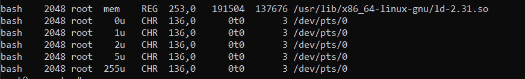
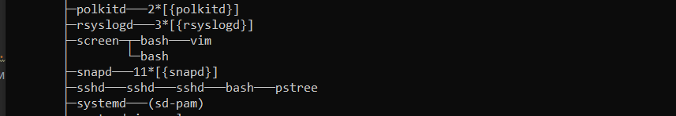

# Домашнее задание к занятию "3.2. Работа в терминале. Лекция 2"

## Выполнил Хайруллин Ильнур

1. Задание №1.
Какого типа команда cd? Попробуйте объяснить, почему она именно такого типа: опишите ход своих мыслей, если считаете, что она могла бы быть другого типа.

        Команда cd явлеятеся командой програмной оболочки. В моем случаее програмнная оболочка это BASH 
        (проверить какую программную оболчка используется ОС можно командой "echo $SHELL"). 
        Хождение по каталогам явлется базовым функционалом для управления ОС , поэтому, я думаю, команда cd и "вшита" в программную оболочку SHELLa.

2. Задание №2.
Какая альтернатива без pipe команде grep <some_string> <some_file> | wc -l?

        Можно воспользоваться ключем -с команды grep, он выведет кол-во совпадений в файле.

3. Задание №3.
Какой процесс с PID 1 является родителем для всех процессов в вашей виртуальной машине Ubuntu 20.04?

        Можно воспользоваться командой lsof и посмотреть процесс с PID = 1, либо воспользоваться утилитой pstree и увидеть наглядно.
        В рассматриваемой ОС процесс с PID 1 является systemd.
4. Задание №4.
Как будет выглядеть команда, которая перенаправит вывод stderr ls на другую сессию терминала?

         Команда по удалению несуществующего файла, ошибка передается в другую ссесию.
         rm xnjnj.txt 2> /dev/pts/1 , 
         где 2 - это псевдо процесс stderr, перенапровленный на другую ссесию указав соответсвующий файловый дескриптер для сессии 
         (/dev/pts/n , узнать текущий можно командой tty)
         
         Для команды ls структура похожа:  ls - 2> /dev/pts/1
         ошибка, указывающая о несуществующей директории будет выведена в соседнем терминале.

5. Задание №5.
Получится ли одновременно передать команде файл на stdin и вывести ее stdout в другой файл? Приведите работающий пример.

         grep current < file.txt > result.txt , на stdin команды grep подаем ключевое слово и файл, stdout записываем в файл result.txt

6. Задание №6.
Получится ли, находясь в графическом режиме, вывести данные из PTY в какой-либо из эмуляторов TTY? Сможете ли вы наблюдать выводимые данные?

         Да, смогу.

7. Задание №7.
Выполните команду bash 5>&1. К чему она приведет? Что будет, если вы выполните echo netology > /proc/$$/fd/5? Почему так происходит?

         Создался новый файловвый дескриптер и соотвественно псевдо процесс 5 перенаправленный в 1 (stdout).
         Второй командой мы передаем stdout команды echo на stdin процесса 5, после чего видим в терминале stdout, так как 5 перенаправлен в 1.

8. Задание №8.
Получится ли в качестве входного потока для pipe использовать только stderr команды, не потеряв при этом отображение stdout на pty?

         ls -l 7>&2 2>&1 1>&7 | grep such 
         stdout перенаправлен на новый файловый дескриптер 7, Pipe не обрабатывает его, так как слушает процесс 1 и следовательно грепа не произойдет. 
         Но когда команда выдаст ошибку перенапрваленныей stderr на stdout обработается pipe и stderr пойдет на stdin grep.

9. Задание №9.
Что выведет команда cat /proc/$$/environ? Как еще можно получить аналогичный по содержанию вывод?

         Переменные окружения. Так же их можно получить командой env

10. Задание №10.
Используя man, опишите что доступно по адресам /proc/<PID>/cmdline, /proc/<PID>/exe.

         proc/PID/cmdline - содержит информацию о переданной командной строке при запуске процесса (как выглядела команда при запуске процесса) (строка 178)
         proc/PID/exe - содержит путь с символьной ссылкой на исполненный бинарный файл (строка 219)

11. Задание №11.
Узнайте, какую наиболее старшую версию набора инструкций SSE поддерживает ваш процессор с помощью /proc/cpuinfo.

         sse4_2  -  grep sse /proc/cpuinfo

12. Задание №12.
При открытии нового окна терминала и vagrant ssh создается новая сессия и выделяется pty.

         В этом случае команда 'tty' передается по ssh сразу на stdin и для него не создается псевдотерминал.
         Можно добавить ключ -t , который принудительно создаст псевдотерминал.

13. Задание №13.
Бывает, что есть необходимость переместить запущенный процесс из одной сессии в другую. Попробуйте сделать это, воспользовавшись reptyr.

         
        Отправил vim в фоновый режим, отвязал от родительских процессов и отправил в screen. 
        Перезапустил ssh сесию и могу открыть процесс запущенный в прошлой сесиии.

14. Задание №14.
sudo echo string > /root/new_file не даст выполнить перенаправление под обычным пользователем, так как перенаправлением занимается процесс shell'а, который запущен без sudo под вашим пользователем. Для решения данной проблемы можно использовать конструкцию echo string | sudo tee /root/new_file. Узнайте? что делает команда tee и почему в отличие от sudo echo команда с sudo tee будет работать.

        Команда tee делает вывод в файл, указаный в качестве параметра. 
        При выполнении перенаправления с помощью > используется процесс shell'a, которому не хватает прав при выполнении от простого юзера. При использовании pipe stdout от echo перенаправляется на stdin tee c sudo , которому хватает прав на запись stdout tee в файл.