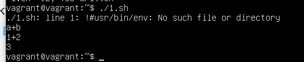

# Домашнее задание к занятию "Командная оболочка Bash: Практические навыки"

## Выполнил Хайруллин Ильнур

### Инструкция к заданию

## Задание 1

Есть скрипт:
```bash
a=1
b=2
c=a+b
d=$a+$b
e=$(($a+$b))
```

Какие значения переменным c,d,e будут присвоены? Почему?

| Переменная  | Значение | Обоснование |
| ------------- |----------|--|
| `c`  | a+b      | Задали переменной C просто строку "a+b" |
| `d`  | 1+2      | Задали переменной d строку со значениями переменных a и b и + |
| `e`  | 3        | Задали переменной e числовое значение, арифметической операции сложения значений а и b|



----

## Задание 2

На нашем локальном сервере упал сервис и мы написали скрипт, который постоянно проверяет его доступность, записывая дату проверок до тех пор, пока сервис не станет доступным (после чего скрипт должен завершиться). В скрипте допущена ошибка, из-за которой выполнение не может завершиться, при этом место на Жёстком Диске постоянно уменьшается. Что необходимо сделать, чтобы его исправить:
```bash
while ((1==1)
do
	curl https://localhost:4757
	if (($? != 0))
	then
		date >> curl.log
	fi
done
```

### Ваш скрипт:
```bash
!#usr/bin/env bash
while ((1==1))
do
	curl https://localhost:4757
	if (($? != 0))
	then
	     date >> curl.log
	else
	     break 
	fi
done
```

---

## Задание 3

Необходимо написать скрипт, который проверяет доступность трёх IP: `192.168.0.1`, `173.194.222.113`, `87.250.250.242` по `80` порту и записывает результат в файл `log`. Проверять доступность необходимо пять раз для каждого узла.

### Ваш скрипт:
```bash
!#usr/bin/env bash
ip_a=(192.168.0.1 173.194.222.113 87.250.250.242)
counter=0
echo  >log
while (($counter<5))
do
        for ip in ${ip_a[@]}
        do
                curl -Is $ip:80 | head -1 >> log
        done
counter=$(($counter+1))
done
```

---
## Задание 4

Необходимо дописать скрипт из предыдущего задания так, чтобы он выполнялся до тех пор, пока один из узлов не окажется недоступным. Если любой из узлов недоступен - IP этого узла пишется в файл error, скрипт прерывается.

### Ваш скрипт:
```bash
!#usr/bin/env bash
ip_a=(192.168.0.1 173.194.222.113 87.250.250.242)
res=0
echo  >log
while ((1==1))
do
        for ip in ${ip_a[@]}
        do
                res=($(curl -Is $ip:80 | head -1))
                if ((${res[1]} == 200)) || ((${res[1]} == 301))
                then
                        echo доступен
                else
                        echo $ip >> error
                        break
                fi
        done
        break
done
```

---

## Дополнительное задание (со звездочкой*) - необязательно к выполнению

Мы хотим, чтобы у нас были красивые сообщения для коммитов в репозиторий. Для этого нужно написать локальный хук для git, который будет проверять, что сообщение в коммите содержит код текущего задания в квадратных скобках и количество символов в сообщении не превышает 30. Пример сообщения: \[04-script-01-bash\] сломал хук.

### Ваш скрипт:
```bash
???
```

----

