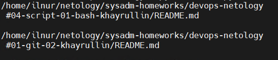
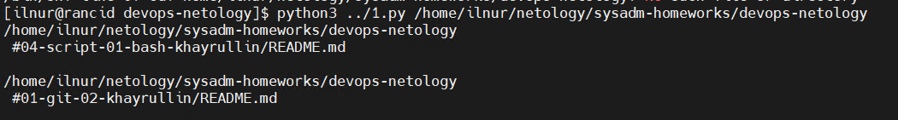
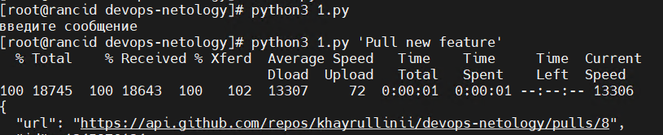

# Домашнее задание к занятию "Использование Python для решения типовых DevOps задач"

## Выполнил Хайруллин Ильнур

## Задание 1

Есть скрипт:
```python
#!/usr/bin/env python3
a = 1
b = '2'
c = a + b
```

### Вопросы:

| Вопрос  | Ответ |
| ------------- |--|
| Какое значение будет присвоено переменной `c`?  | ошибка (стр + инт) |
| Как получить для переменной `c` значение 12?  | int(str(a)+b) |
| Как получить для переменной `c` значение 3?  | a+int(b) |

------

## Задание 2

Мы устроились на работу в компанию, где раньше уже был DevOps Engineer. Он написал скрипт, позволяющий узнать, какие файлы модифицированы в репозитории, относительно локальных изменений. Этим скриптом недовольно начальство, потому что в его выводе есть не все изменённые файлы, а также непонятен полный путь к директории, где они находятся. 

Как можно доработать скрипт ниже, чтобы он исполнял требования вашего руководителя?

```python
#!/usr/bin/env python3

import os

bash_command = ["cd ~/netology/sysadm-homeworks", "git status"]
result_os = os.popen(' && '.join(bash_command)).read()
is_change = False
for result in result_os.split('\n'):
    if result.find('modified') != -1:
        prepare_result = result.replace('\tmodified:   ', '')
        print(prepare_result)
        break
```

### Ваш скрипт:
Что бы цикл не прерывался при первом попадании в if, убрал брейк. В принт добавил pwd (путь до текущей директории)
```python
import os

bash_command = ["cd ~/netology/sysadm-homeworks/devops-netology", "git status"]
result_os = os.popen(' && '.join(bash_command)).read()
is_change = False
for result in result_os.split('\n'):
    if result.find('modified') != -1:
         prepare_result = result.replace('\tmodified:   ', '')
         print(f"{os.popen('pwd').read()} {prepare_result}\n")


```

### Вывод скрипта при запуске при тестировании:



------

## Задание 3

Доработать скрипт выше так, чтобы он не только мог проверять локальный репозиторий в текущей директории, но и умел воспринимать путь к репозиторию, который мы передаём как входной параметр. Мы точно знаем, что начальство коварное и будет проверять работу этого скрипта в директориях, которые не являются локальными репозиториями.

### Ваш скрипт:
```python
import os, sys

result_os = os.popen(f'cd {sys.argv[1]} && git status ').read()
is_change = False
for result in result_os.split('\n'):
    if result.find('modified') != -1:
         prepare_result = result.replace('\tmodified:   ', '')
         print(f"{os.popen('pwd').read()} {prepare_result}\n")

```

### Вывод скрипта при запуске при тестировании:



------

## Задание 4

Наша команда разрабатывает несколько веб-сервисов, доступных по http. Мы точно знаем, что на их стенде нет никакой балансировки, кластеризации, за DNS прячется конкретный IP сервера, где установлен сервис. 

Проблема в том, что отдел, занимающийся нашей инфраструктурой очень часто меняет нам сервера, поэтому IP меняются примерно раз в неделю, при этом сервисы сохраняют за собой DNS имена. Это бы совсем никого не беспокоило, если бы несколько раз сервера не уезжали в такой сегмент сети нашей компании, который недоступен для разработчиков. 

Мы хотим написать скрипт, который: 
- опрашивает веб-сервисы, 
- получает их IP, 
- выводит информацию в стандартный вывод в виде: <URL сервиса> - <его IP>. 

Также, должна быть реализована возможность проверки текущего IP сервиса c его IP из предыдущей проверки. Если проверка будет провалена - оповестить об этом в стандартный вывод сообщением: [ERROR] <URL сервиса> IP mismatch: <старый IP> <Новый IP>. Будем считать, что наша разработка реализовала сервисы: `drive.google.com`, `mail.google.com`, `google.com`.

### Ваш скрипт:
```python
import socket

history={'drive.google.com': '','mail.google.com': '','google.com': ''}
urls = ['drive.google.com', 'mail.google.com', 'google.com']
while True:
    for url in urls:
        ip_ad = socket.gethostbyname(url)
        if history[url] == ip_ad:
            print(f'{url} - {ip_ad}')
        else:
            print(f"[ERROR] {url} IP mismatch: {history[url]} {ip_ad}")
            history[url] = ip_ad

```

### Вывод скрипта при запуске при тестировании:


------

## Дополнительное задание (со звездочкой*) - необязательно к выполнению

Так получилось, что мы очень часто вносим правки в конфигурацию своей системы прямо на сервере. Но так как вся наша команда разработки держит файлы конфигурации в github и пользуется gitflow, то нам приходится каждый раз: 
* переносить архив с нашими изменениями с сервера на наш локальный компьютер, 
* формировать новую ветку, 
* коммитить в неё изменения, 
* создавать pull request (PR) 
* и только после выполнения Merge мы наконец можем официально подтвердить, что новая конфигурация применена. 

Мы хотим максимально автоматизировать всю цепочку действий. 
* Для этого нам нужно написать скрипт, который будет в директории с локальным репозиторием обращаться по API к github, создавать PR для вливания текущей выбранной ветки в master с сообщением, которое мы вписываем в первый параметр при обращении к py-файлу (сообщение не может быть пустым).
* При желании, можно добавить к указанному функционалу создание новой ветки, commit и push в неё изменений конфигурации. 
* С директорией локального репозитория можно делать всё, что угодно. 
* Также, принимаем во внимание, что Merge Conflict у нас отсутствуют и их точно не будет при push, как в свою ветку, так и при слиянии в master. 

Важно получить конечный результат с созданным PR, в котором применяются наши изменения. 

### Ваш скрипт:
```python
import os, sys

branch_name = os.popen(f'git status ').read()

for branch in branch_name.split('\n'):
    if branch.find('branch') != -1:
         branch_result = branch.replace('# On branch ', '')
try:
    if sys.argv[1] != '':
        param = f""" "title":"{sys.argv[1]}","body":"{sys.argv[1]}","head":"khayrullinii:{branch_result}","base":"master" """
        symb = ['{', '}']
        PR = os.popen(f"""curl   -X POST   -H "Accept: application/vnd.github+json"   -H "X-GitHub-Api-Version: 2022-11-28"   -H "Authorization: Bearer <сюда вставляем токен с удаленного репозитория>"  https://api.github.com/repos/khayrullinii/devops-netology/pulls   -d '{symb[0]}{param}{symb[1]}'""").read()
        print(PR)
except:
    print('введите сообщение первым аргументом после вызова скрипта')

```

### Вывод скрипта при запуске при тестировании:



Так же можно воспользоваться библиотеками для формирования HTTP запросов.

----
