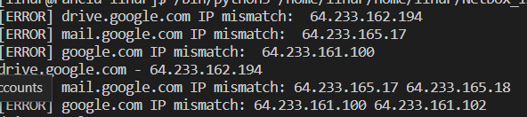
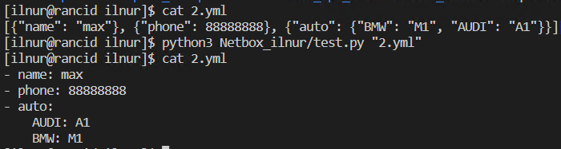
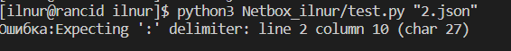

# Домашнее задание к занятию "Языки разметки JSON и YAML"

### Выполнил Хайруллин Ильнур


## Задание 1

Мы выгрузили JSON, который получили через API запрос к нашему сервису:

```
    { "info" : "Sample JSON output from our service\t",
        "elements" :[
            { "name" : "first",
            "type" : "server",
            "ip" : 7175 
            }
            { "name" : "second",
            "type" : "proxy",
            "ip : 71.78.22.43
            }
        ]
    }
```
  Нужно найти и исправить все ошибки, которые допускает наш сервис

### Ваш скрипт:
```
{ "info" : "Sample JSON output from our service\t",
        "elements" :[
            { "name" : "first",
            "type" : "server",
            "ip" : "71.75.1.1" 
            },
            { "name" : "second",
            "type" : "proxy",
            "ip" : "71.78.22.43"
            }
        ]
    }
```

---

## Задание 2

В прошлый рабочий день мы создавали скрипт, позволяющий опрашивать веб-сервисы и получать их IP. К уже реализованному функционалу нам нужно добавить возможность записи JSON и YAML файлов, описывающих наши сервисы. Формат записи JSON по одному сервису: `{ "имя сервиса" : "его IP"}`. Формат записи YAML по одному сервису: `- имя сервиса: его IP`. Если в момент исполнения скрипта меняется IP у сервиса - он должен так же поменяться в yml и json файле.

### Ваш скрипт:
```python
import socket,yaml,json

history={'drive.google.com': '','mail.google.com': '','google.com': ''}
urls = ['drive.google.com', 'mail.google.com', 'google.com']
while True:
    for url in urls:
        ip_ad = socket.gethostbyname(url)
        if history[url] == ip_ad:
            print(f'{url} - {ip_ad}')
        else:
            print(f"[ERROR] {url} IP mismatch: {history[url]} {ip_ad}")
            history[url] = ip_ad
            with open('url.json', 'w') as js:
                js.write(json.dumps(history))
            with open('url.yml', 'w') as ym:
                ym.write(yaml.dump(history))
```

### Вывод скрипта при запуске при тестировании:




### json-файл(ы), который(е) записал ваш скрипт:
```json
{"drive.google.com": "64.233.162.194", 
  "mail.google.com": "64.233.165.17", 
  "google.com": "64.233.161.138"}
```

### yml-файл(ы), который(е) записал ваш скрипт:
```yaml
drive.google.com: 64.233.162.194
google.com: 216.58.210.142
mail.google.com: 64.233.164.18
```

---

## Дополнительное задание (со звездочкой*) - необязательно к выполнению

Так как команды в нашей компании никак не могут прийти к единому мнению о том, какой формат разметки данных использовать: JSON или YAML, нам нужно реализовать парсер из одного формата в другой. Он должен уметь:
   * Принимать на вход имя файла
   * Проверять формат исходного файла. Если файл не json или yml - скрипт должен остановить свою работу
   * Распознавать какой формат данных в файле. Считается, что файлы *.json и *.yml могут быть перепутаны
   * Перекодировать данные из исходного формата во второй доступный (из JSON в YAML, из YAML в JSON)
   * При обнаружении ошибки в исходном файле - указать в стандартном выводе строку с ошибкой синтаксиса и её номер
   * Полученный файл должен иметь имя исходного файла, разница в наименовании обеспечивается разницей расширения файлов

### Ваш скрипт:
```python
import socket,yaml,json,sys,traceback,os,time


file_name = sys.argv[1]
ex = file_name.split('.')
new_file = []
r = os.popen(f"cat {sys.argv[1]} | grep -E '^-\s*\w+'").read()


if len(r) == 0 and ex[1] == "yml":
    ex[1] = 'json'
elif len(r) != 0 and ex[1] == "json":
    ex[1] = 'yml'
    
 
if ex[1] == "json":
    with open(f'{file_name}', 'r') as js:
        try:
            new_file = json.load(js)
        except Exception as e:
            result_trac =traceback.format_exc()
            for result in result_trac.split('\n'):
                if result.find('Expecting') != -1:
                    prepare_result = result.replace('json.decoder.JSONDecodeError: ', '')
                    print(f'Ошибка:{prepare_result}\n')
            sys.exit()        
    with open(f'{ex[0]}.yml', 'w') as ym:
        ym.write(yaml.dump(new_file))
elif ex[1] == "yml":
    with open(f'{file_name}', 'r') as ym:
        try:
            new_file = yaml.safe_load(ym)
        except Exception as e:
            print(traceback.format_exc())
            sys.exit() 
    with open(f'{ex[0]}.json', 'w') as js:
        js.write(json.dumps(new_file))
else:
    print("Не подходящее расширение файла")
```

### Пример работы скрипта:




----

