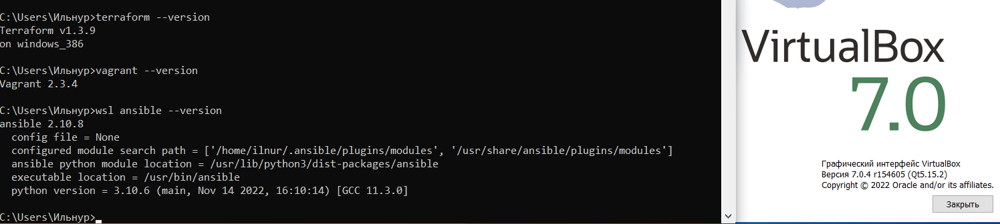
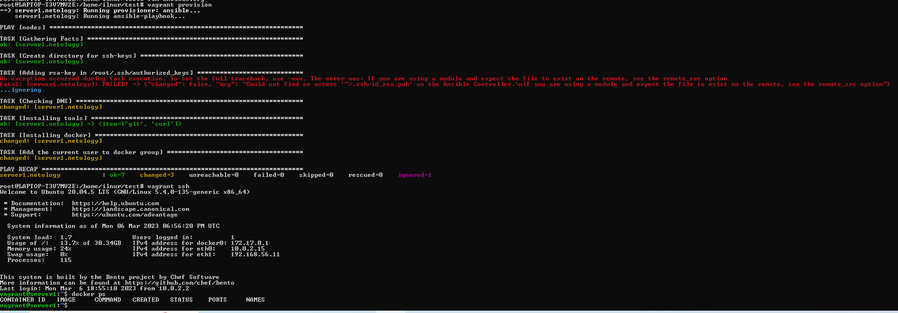

# Домашнее задание к занятию 2. «Применение принципов IaaC в работе с виртуальными машинами»

### Выполнил Хайруллин Ильнур

## Задание 1
- Опишите основные преимущества применения на практике IaaC-паттернов.
- Какой из принципов IaaC является основополагающим?

## Ответ:
1. 
- Уменьшение "time to market" - ускорение ввода в продуктивную среду
- Устранение отличий в конфигурациях на ВМ (хостах)
- ускорение разработки (можно быстро развернуть среду для тестов и отладки)

2. идемпотентность - получать идентичный результат при многократном повторении

## Задание 2
- Чем Ansible выгодно отличается от других систем управление конфигурациями?
- Какой, на ваш взгляд, метод работы систем конфигурации более надёжный — push или pull?

## Ответ:
1. 
- Написан на языке python (наверно самый простой язык для начинающих)
- Не требует установки агентов

2. Есть много нюансов. При пуле можно на каком-то хосте забыть спулить плейбук, тогда конфигурации хостов будут отличаться, чего не должно случиться при пуше. Но если в плейбуке ошибка, то неправильный конфиг при пуше разлетится на все хосты, чего не случится при пуле. Но при правильном написании плейбуков пуш кажется более надежным.

## Задание 3
Установите на личный компьютер:

- VirtualBox,
- Vagrant,
- Terraform,
- Ansible.

Приложите вывод команд установленных версий каждой из программ, оформленный в Markdown.

## Ответ:

## Задание 4
Воспроизведите практическую часть лекции самостоятельно.

- Создайте виртуальную машину.
- Зайдите внутрь ВМ, убедитесь, что Docker установлен с помощью команды

            docker ps

## Ответ:
Использовал WSL(vagrant+ansible) + virtualbox на windows
Пути оставлю для себя:
    
    export VAGRANT_WSL_ENABLE_WINDOWS_ACCESS="1"
    export PATH=$PATH:/mnt/c/Windows/System32
    export PATH="$PATH:/mnt/c/Windows/System32/WindowsPowerShell/v1.0"
    export VAGRANT_WSL_WINDOWS_ACCESS_USER_HOME_PATH="/mnt/c/{имя домашней директории}"
    export PATH="$PATH:/mnt/c/Program Files/Oracle/VirtualBox"

P.S. ошибку с ключом видел, в папке откуда его нужно было забрать его нет