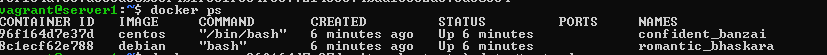
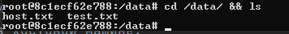

# Домашнее задание к занятию 3. «Введение. Экосистема. Архитектура. Жизненный цикл Docker-контейнера»

### Выполнил Хайруллин Ильнур

## Задание 1
Сценарий выполнения задачи:

- создайте свой репозиторий на https://hub.docker.com;
- выберите любой образ, который содержит веб-сервер Nginx;
- создайте свой fork образа;
- реализуйте функциональность: запуск веб-сервера в фоне с индекс-страницей

## Ответ:
https://hub.docker.com/r/khayrullinii/netology_nginx_khayrullinii

        #наполнения докерфайла
        FROM nginx
        COPY index.html /usr/share/nginx/html/index.html

        #команда для сбора образа
        docker build {директория, где хранятся докерфай и статические файлы} -f {название докерфайла} -t {имя пользователя}/{название образа}:{tag} 

        #команда запуска
        docker run -d -p 8080:80  {имя пользователя}/{название образа}:{tag} 
            -p - проброс портов
            -d - запуск в фоне

## Задание 2
Посмотрите на сценарий ниже и ответьте на вопрос: «Подходит ли в этом сценарии использование Docker-контейнеров или лучше подойдёт виртуальная машина, физическая машина? Может быть, возможны разные варианты?»

Детально опишите и обоснуйте свой выбор.

--

Сценарий:

- высоконагруженное монолитное Java веб-приложение;
- Nodejs веб-приложение;
- мобильное приложение c версиями для Android и iOS;
- шина данных на базе Apache Kafka;
- Elasticsearch-кластер для реализации логирования продуктивного веб-приложения — три ноды elasticsearch, два logstash и две ноды kibana;
- мониторинг-стек на базе Prometheus и Grafana;
- MongoDB как основное хранилище данных для Java-приложения;
- Gitlab-сервер для реализации CI/CD-процессов и приватный (закрытый) Docker Registry.

## Ответ:
1. Для высоконагруженной системы лучше использовать виртуальную машину, чтобы не было прослойки с вирт. на уровне ОС
2. Подойдет контейнеры с минимумом пакетов и необходимым кол-вом ресурсов
3. Контейнеры будут хорошим решением, так как можно разбить на микросервисы (веб приложение, версия для андроид и версия для ios), каждый сервис будет в своем окружении без лишнего
4. для storage используем виртуальную машину, так как важно сохранять данные даже после выключения. А вот коннекторы можно развернуть в докере
5. для хранения логов используем ВМ, так как важно не потерять данные. Ноды анализаторов развернуть в контейнерах для экономии ресурсов
6. так же Prometheus на ВМ, а графану в контейнере, сделав линк до бд
7. база данных однозначно на ВМ для хранения информации, даже после выключения
8. Микросервисы можно разнести по контейнерам, а вот registry надо развернуть на ВМ все по той же причине хранения информации
## Задание 3
- Запустите первый контейнер из образа centos c любым тегом в фоновом режиме, подключив папку /data из текущей рабочей директории на хостовой машине в /data контейнера.
- Запустите второй контейнер из образа debian в фоновом режиме, подключив папку /data из текущей рабочей директории на хостовой машине в /data контейнера.
- Подключитесь к первому контейнеру с помощью docker exec и создайте текстовый файл любого содержания в /data.
- Добавьте ещё один файл в папку /data на хостовой машине.
- Подключитесь во второй контейнер и отобразите листинг и содержание файлов в /data контейнера.

## Ответ:
        #Для запуска контейнера (при отсутствиии образа локального, run сам спулит)
        docker run -t -d -v ./data:/data {имя образа}:{tag}
        где -t - tty true,  -d - в фоне, -v - подключение директории {dir на хосту}:{dir в контенере}

        #Для подключения к контейнеру
        docker exec -it {id или имя контейнера} /bin/bash   (проваливаемся в shell)
        где -i - stdin оставить открытым

И создав файлы в разных местах, я получил везде одинаковое наполнение директории data:

## Задание 4*
Воспроизведите практическую часть лекции самостоятельно.

Соберите Docker-образ с Ansible, загрузите на Docker Hub и пришлите ссылку вместе с остальными ответами к задачам.

## Ответ:
https://hub.docker.com/r/khayrullinii/netology
