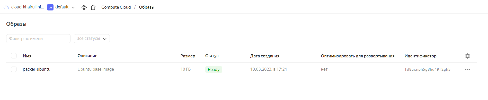
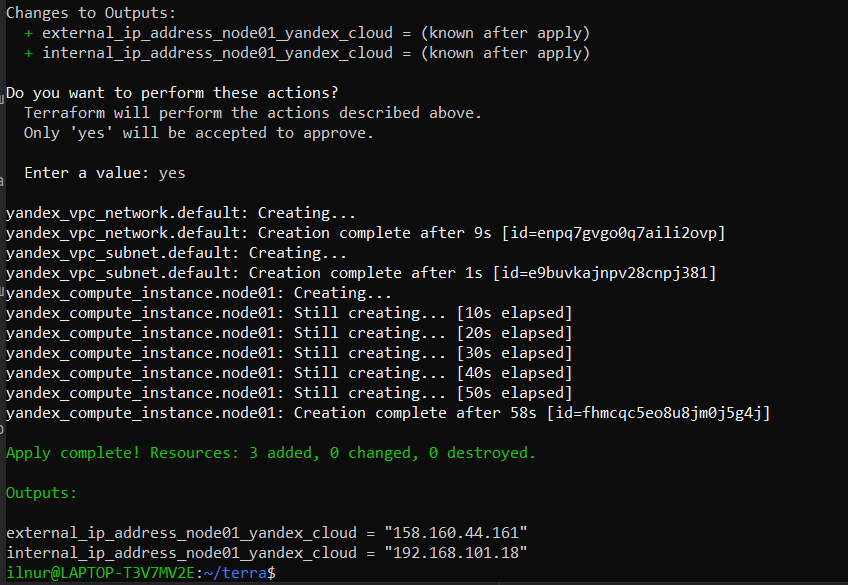
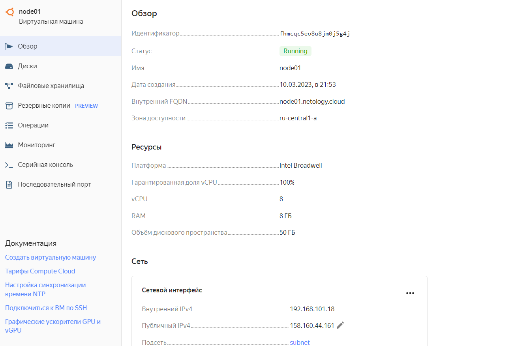
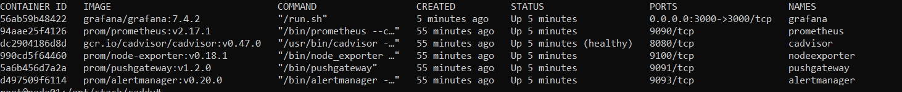
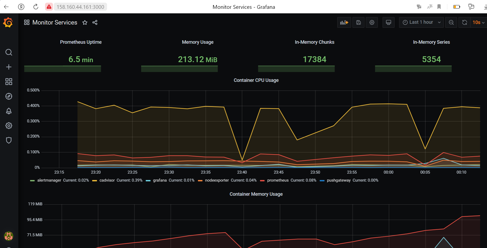
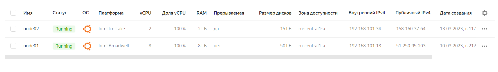
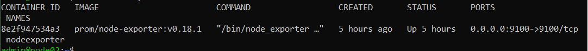
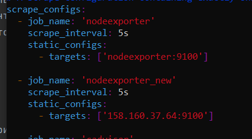
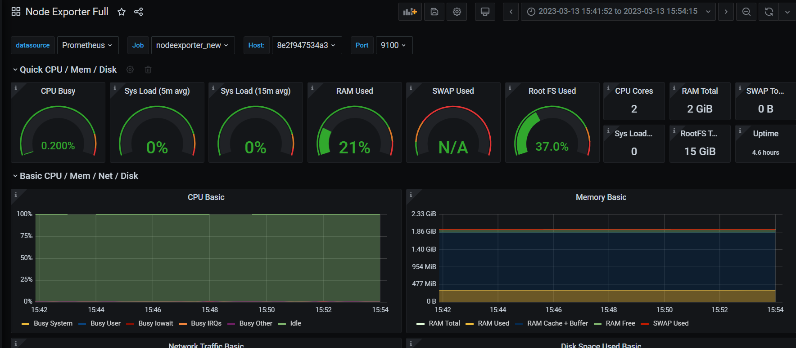

# Домашнее задание к занятию 4. «Оркестрация группой Docker-контейнеров на примере Docker Compose»

### Выполнил Хайруллин Ильнур

## Задание 1
Создайте собственный образ любой операционной системы (например ubuntu-20.04) с помощью Packer

## Ответ:

Установил packer c инструкциями с оф.сайта, после чего запустил скрипт для оболочки yc.
После чего сделал файл с директивами для создания образа, изначально, создав сеть и подсеть:
                
        {
            "builders": [
                {
                    "type": "yandex",     #Провайдер
                    "token": "my token",   # QAuth токен (загуглил как создать)
                    "folder_id": "b1g00oamqjffah66t52c",  # id директории в облаке
                    "zone": "ru-central1-a",  # зона в подсети
                    "image_name": "packer-ubuntu", # имя образа без использования латиницы и спецсимволов в том числе .  
                    "image_family": "ubuntu-2204-lts",  #family id  образа
                    "image_description": "Ubuntu base image", 
                    "source_image_family": "ubuntu-2204-lts", #family id  родительского образа
                    "subnet_id": "e9bssuehqodvtktkrl58",   # id созданной подсети
                    "use_ipv4_nat": true,  # включаем NAT
                    "disk_type": "network-ssd",   # выбираем тип диска
                    "ssh_username": "ubuntu"    # username для проверки доступности
                }
            ]
        }   

## Задание 2
### Задание 2.1
Создайте вашу первую виртуальную машину в YandexCloud с помощью web-интерфейса YandexCloud.

### Ответ:
Ввел имя, описание, выбрал сеть, указал логин и добавил SSH ключ

### Задание 2.2 (*)
Создайте вашу первую виртуальную машину в YandexCloud с помощью Terraform (вместо использования веб-интерфейса YandexCloud). Используйте Terraform-код в директории (src/terraform).
### Ответ:
Установил терраформ по инструкции с оф.сайта
Скопировал файлы для терраформа с гита и заполнил индивидуальные поля в конфиге, создал сервисный аккаунт и создал для него ключ. Сгенерировал SSH ключ на ВМ для входа по SSH.
terraform init - для проверки и инициализации 
terraform plan - для проверки сценария
Вывод команды terrafform apply:

Страница с YC:

## Задание 3
С помощью Ansible и Docker Compose разверните на виртуальной машине из предыдущего задания систему мониторинга на основе Prometheus/Grafana. Используйте Ansible-код в директории (src/ansible).

## Ответ:
В inventory файле добавил адрес ВМ в облаке и исправил внутри плейбука все команды под ubuntu.
Запустил конфигурирование ansibl'ом:  ansible-playbook provision.yml 

		
P.S. контейнер с caddy не запустился, пробросил порт для графаны, прописав в директиве к графане 

## Задание 4
1. Откройте веб-браузер, зайдите на страницу http://<внешний_ip_адрес_вашей_ВМ>:3000.
2. Используйте для авторизации логин и пароль из .env-file.
3. Изучите доступный интерфейс, найдите в интерфейсе автоматически созданные docker-compose-панели с графиками(dashboards).
4. Подождите 5-10 минут, чтобы система мониторинга успела накопить данные.

## Ответ:

## Задание 5*
Создайте вторую ВМ и подключите её к мониторингу, развёрнутому на первом сервере.

## Ответ:
С помощью терраформа развернул вторую ВМ:

После чего с помощью ансибла на новой ВМ установил docker и поднял контейнер для node exporter.

На вм с графаной в прометеусе добавил еще один таргет с новой ВМ:

После чего в графану импортировал дашборд для node exporter с оф.сайта и подключил к нему прометеус, теперь можно выбрать хост и смотреть метрики:

