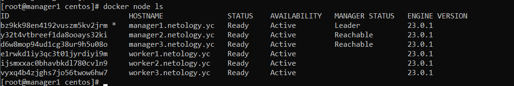
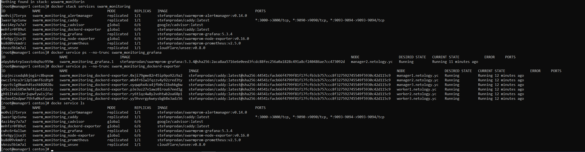
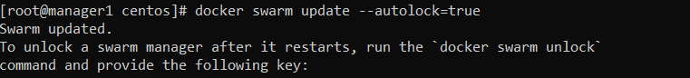

# Домашнее задание к занятию 5. «Оркестрация кластером Docker контейнеров на примере Docker Swarm»

### Выполнил Хайруллин Ильнур

## Задание 1
Дайте письменые ответы на вопросы:

- В чём отличие режимов работы сервисов в Docker Swarm-кластере: replication и global?
- Какой алгоритм выбора лидера используется в Docker Swarm-кластере?
- Что такое Overlay Network?

## Ответ:

- При режиме global будет создан один сервис на каждой ноде, а при режиме replicated будет создано n-сервисов на всех доступных нодах.
- Механизм выбора лидера основан на алгоритме raft, который подразумевает выбор лидера на основе голосования (лидером становится тот, кто получил больше всего голосов, если кто-то не был назначен предыдущим лидером)
- Overlay - это подсеть, которая используется для связи контейнеров (сервисов) в кластере

## Задание 2
Создайте ваш первый Docker Swarm-кластер в Яндекс Облаке.

### Ответ:
- Склонировал репозиторй, изменил конфиги терраформа на свое облако (сеть, идентификаторы, названия ВМ, сделал ВМ прерываемыми для экономии)
- Зашел на первую ВМ и инициализировал swarm кластер и узнал токены для других нод:

            docker swarm init -adversite-addr 192.168.101.14
            docker swarm join-token -q worker
            docker swarm join-token -q manager
- Добавил остальные ноды в кластер используя соответсвтующие токены для worker и manager:

            docker swarm join --token <Token> 192.168.101.14:2377
Вывод docker node ls на лидере кластера

## Задание 3
Создайте ваш первый, готовый к боевой эксплуатации кластер мониторинга, состоящий из стека микросервисов.

## Ответ:
- Склонировал репозиторй, изменил конфиги терраформа на свое облако (сеть, идентификаторы, названия ВМ, сделал ВМ прерываемыми для экономии, переменные названий ВМ в ансибле плейбуке)

## Задание 4 (*)
Выполните на лидере Docker Swarm-кластера команду, указанную ниже, и дайте письменное описание её функционала — что она делает и зачем нужна:
            
    docker swarm update --autolock=true

## Ответ:

Данная команда включает автоблокировку manager нод. Для защиты от утечки TLS ключей, которые нужны для связи между узлами, и ключей шифрования Raft журналов.

Для разблокировки manager ноды после рестарата:

    docker swarm unlock <token из сообщения после включения автоблокировки>

