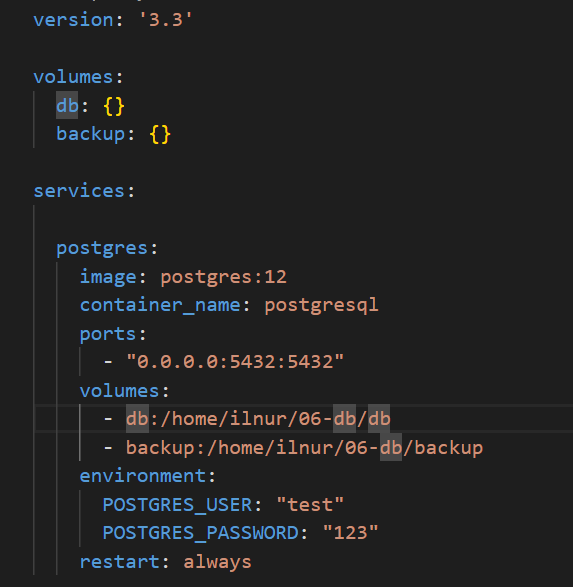
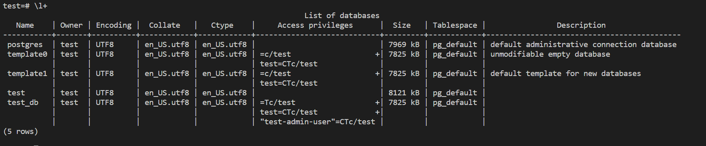
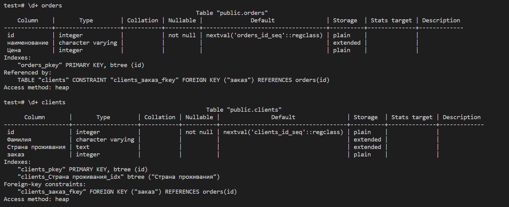
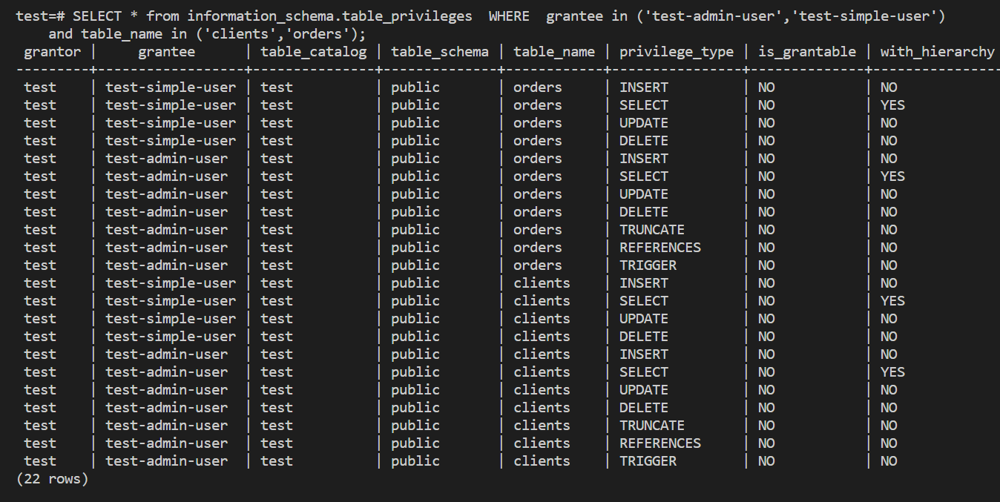
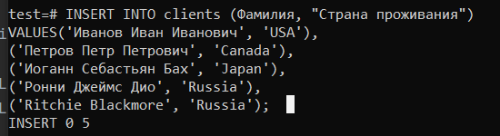

# Домашнее задание к занятию 2. «SQL»

### Выполнил Хайруллин Ильнур

## Задание 1
Используя Docker, поднимите инстанс PostgreSQL (версию 12) c 2 volume, в который будут складываться данные БД и бэкапы.

Приведите получившуюся команду или docker-compose-манифест.

## Ответ:

## Задание 2
В БД из задачи 1:

- создайте пользователя test-admin-user и БД test_db;
- в БД test_db создайте таблицу orders и clients (спeцификация таблиц ниже);
- предоставьте привилегии на все операции пользователю test-admin-user на таблицы БД test_db;
- создайте пользователя test-simple-user;
- предоставьте пользователю test-simple-user права на SELECT/INSERT/UPDATE/DELETE этих таблиц БД test_db.

Таблица orders:

- id (serial primary key);
- наименование (string);
- цена (integer).

Таблица clients:

- id (serial primary key);
- фамилия (string);
- страна проживания (string, index);
- заказ (foreign key orders).

Приведите:

- итоговый список БД после выполнения пунктов выше;
- описание таблиц (describe);
- SQL-запрос для выдачи списка пользователей с правами над таблицами test_db;
- список пользователей с правами над таблицами test_db.

### Ответ:

    test=# CREATE USER "test-admin-user" WITH PASSWORD '1234';
    CREATE ROLE
    test=# CREATE DATABASE "test_db";
    CREATE DATABASE
    test=# CREATE TABLE orders (id SERIAL PRIMARY KEY, наименование VARCHAR, Цена INT);
    CREATE TABLE
    test=# CREATE TABLE clients (id SERIAL PRIMARY KEY, Фамилия VARCHAR, "Страна проживания" TEXT,заказ INT, FOREIGN KEY(заказ) REFERENCES  orders (id));
    CREATE TABLE
    test=# CREATE INDEX ON clients("Страна проживания");
    CREATE INDEX
    test=# GRANT ALL ON TABLE orders,clients TO "test-admin-user";
    GRANT
    test=# CREATE USER "test-simple-user" WITH PASSWORD '1234';
    CREATE ROLE
    GRANT SELECT,INSERT,UPDATE,DELETE ON TABLE orders,clients TO "test-simple-user"; 
    GRANT
    
- итоговый список БД:

- описание таблиц:

- SELECT * from information_schema.table_privileges  WHERE  grantee in ('test-admin-user','test-simple-user')
    and table_name in ('clients','orders');

- список пользователей с правами над таблицами test_db

## Задание 3
Используя SQL-синтаксис, наполните таблицы следующими тестовыми данными.
Используя SQL-синтаксис:

- вычислите количество записей для каждой таблицы.

Приведите в ответе:

- запросы,
- результаты их выполнения.

## Ответ:

 
    test=# select count(*) from clients;
     count
    -------
         5
    (1 row)
    
    test=# select count(*) from orders;
     count
    -------
         5
    (1 row)
## Задание 4 
Часть пользователей из таблицы clients решили оформить заказы из таблицы orders.

Используя foreign keys, свяжите записи из таблиц, согласно таблице:

- Приведите SQL-запросы для выполнения этих операций.
- Приведите SQL-запрос для выдачи всех пользователей, которые совершили заказ, а также вывод этого запроса.

## Ответ:

    test=# UPDATE clients SET "заказ" = (SELECT id FROM orders WHERE "наименование"='Книга') WHERE "Фамилия"='Иванов Иван Ив
    анович';
    UPDATE 1
    test=# UPDATE clients SET "заказ" = (SELECT id FROM orders WHERE "наименование"='Монитор') WHERE "Фамилия"='Петров Петр
    Петрович';
    UPDATE 1
    test=# UPDATE clients SET "заказ" = (SELECT id FROM orders WHERE "наименование"='Гитара') WHERE "Фамилия"='Иоганн Себаст
    ьян Бах';
    UPDATE 1
    test=# SELECT c.* FROM clients c JOIN orders o ON c.заказ = o.id;
     id |       Фамилия        | Страна проживания | заказ
    ----+----------------------+-------------------+-------
      1 | Иванов Иван Иванович | USA               |     5
      2 | Петров Петр Петрович | Canada            |     3
      3 | Иоганн Себастьян Бах | Japan             |     4
    (3 rows)

## Задание 5 
Получите полную информацию по выполнению запроса выдачи всех пользователей из задачи 4 (используя директиву EXPLAIN).

Приведите получившийся результат и объясните, что значат полученные значения

## Ответ:

    test=# explain analyze verbose SELECT c.* FROM clients c JOIN orders o ON c.заказ = o.id;
                                                           QUERY PLAN
    -------------------------------------------------------------------------------------------------------------------------
     Hash Join  (cost=37.00..57.24 rows=810 width=72) (actual time=0.222..0.226 rows=3 loops=1)
       Output: c.id, c."Фамилия", c."Страна проживания", c."заказ"
       Inner Unique: true
       Hash Cond: (c."заказ" = o.id)
       ->  Seq Scan on public.clients c  (cost=0.00..18.10 rows=810 width=72) (actual time=0.020..0.021 rows=5 loops=1)
             Output: c.id, c."Фамилия", c."Страна проживания", c."заказ"
       ->  Hash  (cost=22.00..22.00 rows=1200 width=4) (actual time=0.127..0.128 rows=5 loops=1)
             Output: o.id
             Buckets: 2048  Batches: 1  Memory Usage: 17kB
             ->  Seq Scan on public.orders o  (cost=0.00..22.00 rows=1200 width=4) (actual time=0.016..0.020 rows=5 loops=1)
                   Output: o.id
     Planning Time: 0.224 ms
     Execution Time: 0.462 ms
    (13 rows)

Команда выводит название столбцов таблицы clients, и построчно сверяет хэши элементов столбца "заказ" таблицы клиент с хэшами элементов столбца id таблицы orders. При совпадении выводит текущую строчку. Запрос прошел за 0.686 ms.

## Задание 6
Создайте бэкап БД test_db и поместите его в volume, предназначенный для бэкапов (см. задачу 1).

- Остановите контейнер с PostgreSQL, но не удаляйте volumes.
- Поднимите новый пустой контейнер с PostgreSQL.
- Восстановите БД test_db в новом контейнере.

Приведите список операций, который вы применяли для бэкапа данных и восстановления.

## Ответ:
Для бекапа:
    
    pg_dumpall  -U test > /home/ilnur/06-db/backup/test_db.sql     

Для развертывания:

    docker run --rm -d -e POSTGRES_USER=test -e POSTGRES_PASSWORD=123 -e POSTGRES_DB=test_db -v ilnur_backup:/home/ilnur/06-db/backup --name postgresql2 postgres:12

Для восстановления:

     psql  -U test -f /home/ilnur/06-db/backup/test_db.sql test_db