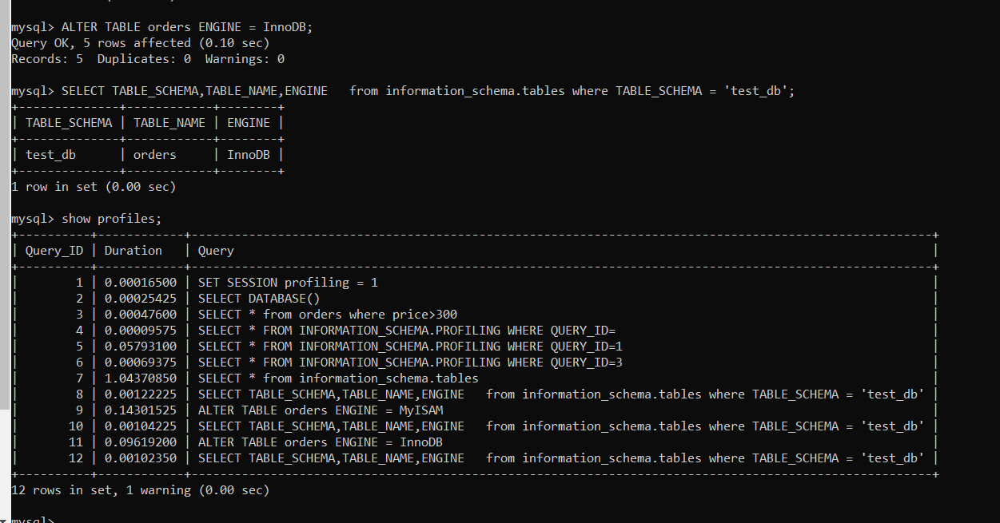

# Домашнее задание к занятию 1. «Типы и структура СУБД»

### Выполнил Хайруллин Ильнур

## Задание 1
Используя Docker, поднимите инстанс MySQL (версию 8). Данные БД сохраните в volume.

Изучите бэкап БД и восстановитесь из него.

Перейдите в управляющую консоль mysql внутри контейнера.

Используя команду \h, получите список управляющих команд.

Найдите команду для выдачи статуса БД и приведите в ответе из её вывода версию сервера БД.

Подключитесь к восстановленной БД и получите список таблиц из этой БД.

Приведите в ответе количество записей с price > 300.

В следующих заданиях мы будем продолжать работу с этим контейнером.

## Ответ:
Версия:

Вывод записей с price > 300:

    mysql> SELECT * from orders where price>300;
    +----+----------------+-------+
    | id | title          | price |
    +----+----------------+-------+
    |  2 | My little pony |   500 |
    +----+----------------+-------+
    1 row in set (0.00 sec)

## Задание 2
Создайте пользователя test в БД c паролем test-pass, используя:

- плагин авторизации mysql_native_password
- срок истечения пароля — 180 дней
- количество попыток авторизации — 3
- максимальное количество запросов в час — 100
- аттрибуты пользователя:
  - Фамилия "Pretty"
  - Имя "James".
  
Предоставьте привелегии пользователю test на операции SELECT базы test_db.

Используя таблицу INFORMATION_SCHEMA.USER_ATTRIBUTES, получите данные по пользователю test и приведите в ответе к задаче.

### Ответ:
Команды для создания пользователя:

    create user 'test' identified with mysql_native_password by 'test-pass' password expire interval 180 day failed_login_attempts 3 attribute '{"Surname": "Pretty","Name": "James"}';
    alter user 'test' with max_queries_per_hour 100;
    grant select on test_db.* to 'test';
    flush privileges;

Вывод информации по пользователю:

    mysql> SELECT * FROM INFORMATION_SCHEMA.USER_ATTRIBUTES where USER='test';
    +------+------+----------------------------------------+
    | USER | HOST | ATTRIBUTE                              |
    +------+------+----------------------------------------+
    | test | %    | {"Name": "James", "Surname": "Pretty"} |
    +------+------+----------------------------------------+
    1 row in set (0.00 sec)

## Задание 3
Установите профилирование SET profiling = 1. Изучите вывод профилирования команд SHOW PROFILES;.

Исследуйте, какой engine используется в таблице БД test_db и приведите в ответе.

Измените engine и приведите время выполнения и запрос на изменения из профайлера в ответе:

- на MyISAM,
- на InnoDB.

## Ответ:
Вывод show profiles:

(Для просмотра каждой операции: SELECT * FROM INFORMATION_SCHEMA.PROFILING WHERE QUERY_ID=3;)

Вывод движка всех таблиц в бд test_db:

    mysql> SELECT TABLE_SCHEMA,TABLE_NAME,ENGINE   from information_schema.tables where TABLE_SCHEMA = 'test_db';
    +--------------+------------+--------+
    | TABLE_SCHEMA | TABLE_NAME | ENGINE |
    +--------------+------------+--------+
    | test_db      | orders     | InnoDB |
    +--------------+------------+--------+
    1 row in set (0.00 sec)

Переключение на MyISAM:

Переключение на InnoDB:

## Задание 4 

Изучите файл my.cnf в директории /etc/mysql.

Измените его согласно ТЗ (движок InnoDB):

- скорость IO важнее сохранности данных;
- нужна компрессия таблиц для экономии места на диске;
- размер буффера с незакомиченными транзакциями 1 Мб;
- буффер кеширования 30% от ОЗУ;
- размер файла логов операций 100 Мб.

Приведите в ответе изменённый файл my.cnf.

## Ответ:
Исправленный my.cnf
    
    [mysqld]
    
    skip-host-cache
    skip-name-resolve
    datadir=/var/lib/mysql
    socket=/var/run/mysqld/mysqld.sock
    secure-file-priv=/var/lib/mysql-files
    user=mysql
    
    innodb_flush_log_at_trx_commit = 2
    innodb_file_per_table = 1
    innodb_log_buffer_size = 1M
    innodb_buffer_pool_size = 615M
    innodb_log_file_size = 100M

    pid-file=/var/run/mysqld/mysqld.pid
    [client]
    socket=/var/run/mysqld/mysqld.sock
    
    !includedir /etc/mysql/conf.d/
