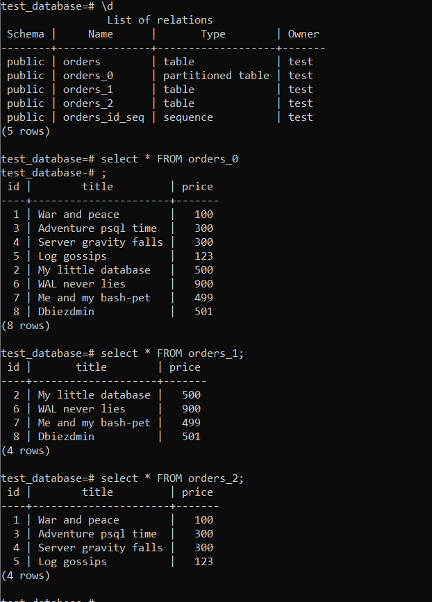

# Домашнее задание к занятию 4. «PostgreSQL»

### Выполнил Хайруллин Ильнур

## Задание 1
Используя Docker, поднимите инстанс PostgreSQL (версию 13). Данные БД сохраните в volume.

Подключитесь к БД PostgreSQL, используя psql.

Воспользуйтесь командой \? для вывода подсказки по имеющимся в psql управляющим командам.

Найдите и приведите управляющие команды для:

- вывода списка БД,
- подключения к БД,
- вывода списка таблиц,
- вывода описания содержимого таблиц,
- выхода из psql.

## Ответ:

- вывода списка БД - \l[+]   [PATTERN]     
- подключения к БД - \c[onnect] {[DBNAME|- USER|- HOST|- PORT|-] | conninfo} 
- вывода списка таблиц - \dt[S+] [PATTERN]      
- вывода описания содержимого таблиц - \d[S+]  NAME           
- выхода из psql - \q                    

## Задание 2
Используя psql, создайте БД test_database.

Изучите бэкап БД.

Восстановите бэкап БД в test_database.

Перейдите в управляющую консоль psql внутри контейнера.

Подключитесь к восстановленной БД и проведите операцию ANALYZE для сбора статистики по таблице.

Используя таблицу pg_stats, найдите столбец таблицы orders с наибольшим средним значением размера элементов в байтах.

Приведите в ответе команду, которую вы использовали для вычисления, и полученный результат.

### Ответ:
Команда для поиска столбца с наибольшим средним значением размера элементов в байтах:

    test_database=# SELECT attname, avg_width FROM pg_stats WHERE tablename = 'orders' ORDER BY avg_width DESC LIMIT 1;
     attname | avg_width
    ---------+-----------
     title   |        16
    (1 row)

## Задание 3
Архитектор и администратор БД выяснили, что ваша таблица orders разрослась до невиданных размеров и поиск по ней занимает долгое время. Вам как успешному выпускнику курсов DevOps в Нетологии предложили провести разбиение таблицы на 2: шардировать на orders_1 - price>499 и orders_2 - price<=499.

Предложите SQL-транзакцию для проведения этой операции.

Можно ли было изначально исключить ручное разбиение при проектировании таблицы orders?

## Ответ:
Транзакции для шардирования:

    create table public.orders_0 (like public.orders) partition by range(price);
    create table public.orders_1 partition of public.orders_0 for values from (499) to (999999999);
    create table public.orders_2 partition of public.orders_0 for values from (0) to (499);
    insert into public.orders_0 (id,title,price) select*from public.orders;

Безусловно можно изначально разбивать на партиции с необходимыми ограничениями, чтобы данные записывались в партиции в равных долях.

## Задание 4 
Используя утилиту pg_dump, создайте бекап БД test_database.

Как бы вы доработали бэкап-файл, чтобы добавить уникальность значения столбца title для таблиц test_database?

## Ответ:

Для снятия дампа базы:

    pg_dump -U test test_database > /var/lib/pg/test_database.sql

Доработал бы добавлением параметера "unique" в строчки, где описывается title при создании таблиц. В итоге эти строчки выглядяли бы следующим образом:

    title character varying(80) unique NOT NULL