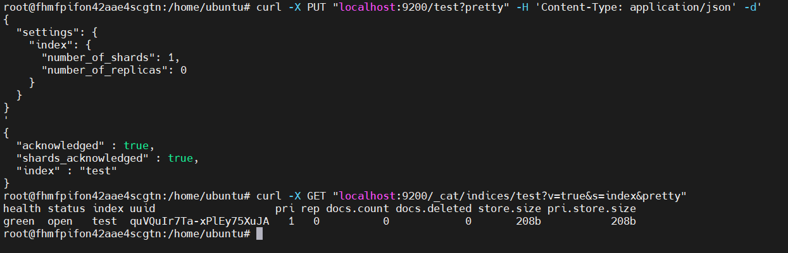
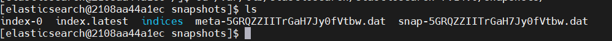
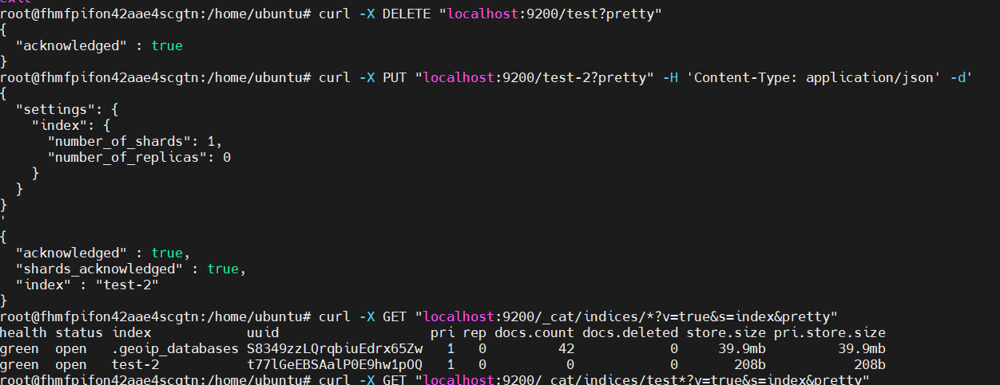
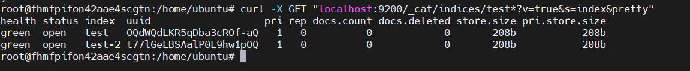

# Домашнее задание к занятию 5. «Elasticsearch»

### Выполнил Хайруллин Ильнур

## Задание 1
В этом задании вы потренируетесь в:

- установке Elasticsearch,
- первоначальном конфигурировании Elasticsearch,
- запуске Elasticsearch в Docker.

Используя Docker-образ centos:7 как базовый и документацию по установке и запуску Elastcisearch:

- составьте Dockerfile-манифест для Elasticsearch,
- соберите Docker-образ и сделайте push в ваш docker.io-репозиторий,
- запустите контейнер из получившегося образа и выполните запрос пути / c хост-машины.

Требования к elasticsearch.yml:

- данные path должны сохраняться в /var/lib,
- имя ноды должно быть netology_test.

В ответе приведите:

- текст Dockerfile-манифеста,
- ссылку на образ в репозитории dockerhub,
- ответ Elasticsearch на запрос пути / в json-виде.

Подсказки:

- возможно, вам понадобится установка пакета perl-Digest-SHA для корректной работы пакета shasum,
- при сетевых проблемах внимательно изучите кластерные и сетевые настройки в elasticsearch.yml,
- при некоторых проблемах вам поможет Docker-директива ulimit,
- Elasticsearch в логах обычно описывает проблему и пути её решения.

Далее мы будем работать с этим экземпляром Elasticsearch.

## Ответ:

Докер файл:

        FROM centos:7
        USER 0
        RUN groupadd -g 1000 elasticsearch && useradd elasticsearch -u 1000 -g 1000
        
        RUN yum makecache && \
            yum -y install wget perl-Digest-SHA openjdk-11-jdk
        
        COPY elasticsearch-7.14.0-linux-x86_64.tar.gz /
        
        RUN mkdir /var/lib/data /var/lib/logs /var/lib/elasticsearch && \
            chown -R elasticsearch:elasticsearch /var/lib/data /var/lib/logs /var/lib/elasticsearch
        
        
        RUN \
            cd / && \
            tar -xzf elasticsearch-7.14.0-linux-x86_64.tar.gz && \
            rm -rf elasticsearch-7.14.0-linux-x86_64.tar.gz && \
            mv /elasticsearch-7.14.0 /var/lib/elasticsearch && \
            chown -R elasticsearch:elasticsearch /var/lib/elasticsearch/
        
        COPY elasticsearch.yml /var/lib/elasticsearch/elasticsearch-7.14.0/config/
        
        USER 1000
        
        

Ссылка на репозиторий с образом: https://hub.docker.com/repository/docker/khayrullinii/netology_elastic/general

Вывод curl запроса  curl localhost:9200/:

        {
          "name" : "6d0e6ca38088",
          "cluster_name" : "netology_test",
          "cluster_uuid" : "G9RXn52QTUezNvZXzR0oXA",
          "version" : {
            "number" : "7.14.0",
            "build_flavor" : "default",
            "build_type" : "tar",
            "build_hash" : "dd5a0a2acaa2045ff9624f3729fc8a6f40835aa1",
            "build_date" : "2021-07-29T20:49:32.864135063Z",
            "build_snapshot" : false,
            "lucene_version" : "8.9.0",
            "minimum_wire_compatibility_version" : "6.8.0",
            "minimum_index_compatibility_version" : "6.0.0-beta1"
          },
          "tagline" : "You Know, for Search"
        }

## Задание 2
В этом задании вы научитесь:

- создавать и удалять индексы,
- изучать состояние кластера,
- обосновывать причину деградации доступности данных.

Ознакомьтесь с [документацией](https://www.elastic.co/guide/en/elasticsearch/reference/current/indices-create-index.html) 
и добавьте в `Elasticsearch` 3 индекса в соответствии с таблицей:

| Имя | Количество реплик | Количество шард |
|-----|-------------------|-----------------|
| ind-1| 0 | 1 |
| ind-2 | 1 | 2 |
| ind-3 | 2 | 4 |

Получите список индексов и их статусов, используя API, и **приведите в ответе** на задание.

Получите состояние кластера `Elasticsearch`, используя API.

Как вы думаете, почему часть индексов и кластер находятся в состоянии yellow?

Удалите все индексы.

**Важно**

При проектировании кластера Elasticsearch нужно корректно рассчитывать количество реплик и шард,
иначе возможна потеря данных индексов, вплоть до полной, при деградации системы.

### Ответ:

Вывод curl с индексами и их статусом curl -X GET "localhost:9200/_cat/indices/ind-*?v=true&s=index&pretty":

    halth status index uuid                   pri rep docs.count docs.deleted store.size pri.store.size
    green  open   ind-1 msvIg56KTa2Hjpw74EAX9A   1   0          0            0       208b           208b
    yellow open   ind-2 tFO2cRv6SbOtENIMZjiI3A   2   1          0            0       416b           416b
    yellow open   ind-3 kQmYFZRJRaazIq1Bu4bEvQ   4   2          0            0       832b           832b

Вывод curl запроса со статусом кластера curl -X GET "localhost:9200/_cat/health?v=true&pretty":

    epoch      timestamp cluster       status node.total node.data shards pri relo init unassign pending_tasks max_task_wait_time active_shards_percent
    1680704725 14:25:25  netology_test yellow          1         1      8   8    0    0       10             0                  -                 44.4%

Часть индексов и кластер находятся в состоянии yellow, потому что в кластере одна нода и нет возможности разместить реплики на других нодах.

Для удаления всех индексов:

    curl -X DELETE "localhost:9200/ind-*?pretty"

## Задание 3
В этом задании вы научитесь:

- создавать бэкапы данных,
- восстанавливать индексы из бэкапов.

Создайте директорию `{путь до корневой директории с Elasticsearch в образе}/snapshots`.

Используя API, [зарегистрируйте](https://www.elastic.co/guide/en/elasticsearch/reference/current/snapshots-register-repository.html#snapshots-register-repository) 
эту директорию как `snapshot repository` c именем `netology_backup`.

**Приведите в ответе** запрос API и результат вызова API для создания репозитория.

Создайте индекс `test` с 0 реплик и 1 шардом и **приведите в ответе** список индексов.

[Создайте `snapshot`](https://www.elastic.co/guide/en/elasticsearch/reference/current/snapshots-take-snapshot.html) 
состояния кластера `Elasticsearch`.

**Приведите в ответе** список файлов в директории со `snapshot`.

Удалите индекс `test` и создайте индекс `test-2`. **Приведите в ответе** список индексов.

[Восстановите](https://www.elastic.co/guide/en/elasticsearch/reference/current/snapshots-restore-snapshot.html) состояние
кластера `Elasticsearch` из `snapshot`, созданного ранее. 

**Приведите в ответе** запрос к API восстановления и итоговый список индексов.

Подсказки:

- возможно, вам понадобится доработать `elasticsearch.yml` в части директивы `path.repo` и перезапустить `Elasticsearch`.

## Ответ:
Для создания репозитория (запрос и вывод):

    curl -X PUT "localhost:9200/_snapshot/netology_backup?verify=false&pretty" -H 'Content-Type: application/json' -d'
    {
      "type": "fs",
      "settings": {
        "location": "/var/lib/elasticsearch/elasticsearch-7.14.0/snapshots"
      }
    }
    '
    {
      "acknowledged" : true
    }

Создал индекс 'test':

Для создания снапшота:

    curl -X PUT "localhost:9200/_snapshot/netology_backup/%3Csnapshot_%7Bnow%2Fd%7D%3E?pretty"

Файлы в директории снапшот внутри докера:

Удалил test создал tets-2, вывел все индексы:

Восстановлени из снапшота:

    curl -X POST "localhost:9200/_snapshot/netology_backup/snapshot_2023.04.05/_restore?pretty" -H 'Content-Type: application/json' -d'
    {
      "indices": "test"
    }
    '
    {
      "accepted" : true
    }

Cписок индексов после восстановлени:

