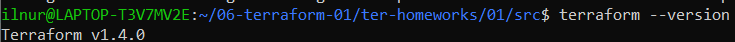
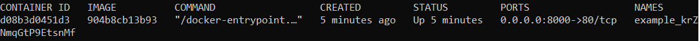

# Домашнее задание к занятию "Введение в Terraform"

### Выполнил Хайруллин Ильнур

## Задание 1

1. Перейдите в каталог src. Скачайте все необходимые зависимости, использованные в проекте.
2. Изучите файл .gitignore. В каком terraform файле допустимо сохранить личную, секретную информацию?
3. Выполните код проекта. Найдите в State-файле секретное содержимое созданного ресурса random_password. Пришлите его в качестве ответа.
4. Раскомментируйте блок кода, примерно расположенный на строчках 29-42 файла main.tf. Выполните команду terraform -validate. Объясните в чем заключаются намеренно допущенные ошибки? Исправьте их.
5. Выполните код. В качестве ответа приложите вывод команды docker ps
6. Замените имя docker-контейнера в блоке кода на hello_world, выполните команду terraform apply -auto-approve. Объясните своими словами, в чем может быть опасность применения ключа -auto-approve ?
7. Уничтожьте созданные ресурсы с помощью terraform. Убедитесь, что все ресурсы удалены. Приложите содержимое файла terraform.tfstate.
8. Объясните, почему при этом не был удален docker образ nginx:latest ?(Ответ найдите в коде проекта или документации)

## Ответ:

1. terraform init - для инициализации и скачивания зависимостей (добавил зеркало для скачивания нужных зависимостей)
2. в файле personal.auto.tfvars
3. krZNmqGtP9EtsnMf
4. В блоке resource "docker_image" не хватает второго лейбла(локального), а в блоке resource "docker_container" "1nginx" лейблы могут начинаться только с символов латинского алфавита. Исправил следующим образом:

5. Вывод команды docker ps

6. -auto-approve запускает apply без подтверждения, тем самым можно запустить неправильные конфиги и не проверить при применении. Вывод команды docker ps

7. вывод terraform.tfstate 

8. В блоке resource "docker_image" "nginx" прописана опция keep_locally = true, которая не дает удалить образ, меняя значение на false можно удалить образ командой destroy

## Задание 2 (*)

1. Изучите в документации provider Virtualbox от shekeriev.
2. Создайте с его помощью любую виртуальную машину.

### Ответ:

