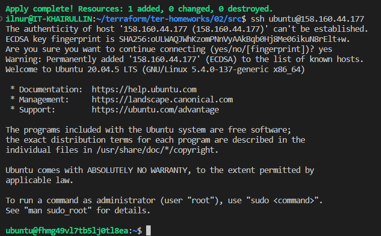
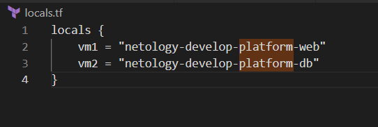
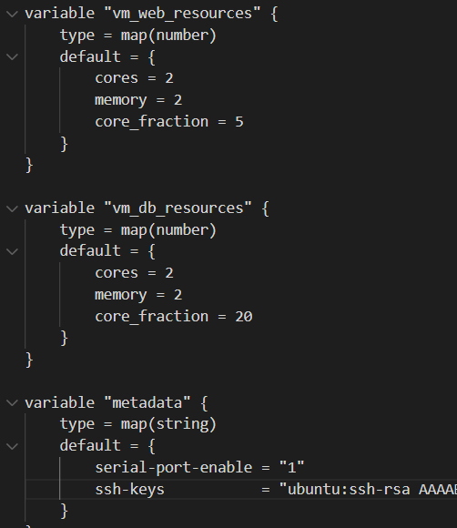
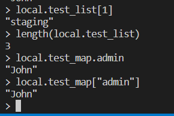

# Домашнее задание к занятию . "Основы Terraform. Yandex Cloud"

### Выполнил Хайруллин Ильнур

## Задание 1
1. Изучите проект. В файле variables.tf объявлены переменные для yandex provider.
2. Переименуйте файл personal.auto.tfvars_example в personal.auto.tfvars. Заполните переменные (идентификаторы облака, токен доступа). Благодаря .gitignore этот файл не попадет в публичный репозиторий. Вы можете выбрать иной способ безопасно передать секретные данные в terraform.
3. Сгенерируйте или используйте свой текущий ssh ключ. Запишите его открытую часть в переменную vms_ssh_root_key.
4. Инициализируйте проект, выполните код. Исправьте возникшую ошибку. Ответьте в чем заключается ее суть?
5. Ответьте, что означает preemptible = true и core_fraction в параметрах ВМ? Как это может пригодится в процессе обучения? Ответ в документации Yandex cloud.

## Ответ:
4. Ошибка была связана с тем, что для выбранной платформы необходимо 2 или 4 процессора. Исправил изменением resources { core = 2 }
5. preemptible - создает прерываемую ВМ, core_fraction - Гарантированная доля vCPU в процентах

## Задание 2
1. Изучите файлы проекта.
2. Замените все "хардкод" значения для ресурсов yandex_compute_image и yandex_compute_instance на отдельные переменные. К названиям переменных ВМ добавьте в начало префикс vm_web_ . Пример: vm_web_name.
3. Объявите нужные переменные в файле variables.tf, обязательно указывайте тип переменной. Заполните их default прежними значениями из main.tf.
4. Проверьте terraform plan (изменений быть не должно).

### Ответ:
изменений нет (terraform apply)

## Задание 3
1. Создайте в корне проекта файл 'vms_platform.tf' . Перенесите в него все переменные ВМ.
2. Скопируйте блок ресурса и создайте с его помощью вторую ВМ: "netology-develop-platform-db" , cores = 2, memory = 2, core_fraction = 20. Объявите ее переменные с префиксом vm_db_ в том же файле.
3. Примените изменения.

## Ответ:

## Задание 4
1. Объявите в файле outputs.tf отдельные output, для каждой из ВМ с ее внешним IP адресом.
2. Примените изменения.

## Ответ:

## Задание 5
1. В файле locals.tf опишите в одном local-блоке имя каждой ВМ, используйте интерполяцию по примеру из лекции.
2. Замените переменные с именами ВМ из файла variables.tf на созданные вами local переменные.
3. Примените изменения.

## Ответ:

## Задание 6
1. Вместо использования 3-х переменных ".._cores",".._memory",".._core_fraction" в блоке resources {...}, объедените их в переменные типа map с именами "vm_web_resources" и "vm_db_resources".
2. Так же поступите с блоком metadata {serial-port-enable, ssh-keys}, эта переменная должна быть общая для всех ваших ВМ.
3. Найдите и удалите все более не используемые переменные проекта.
4. Проверьте terraform plan (изменений быть не должно).

## Ответ:

## Задание 7(*)
1. Напишите, какой командой можно отобразить второй элемент списка test_list?
2. Найдите длину списка test_list с помощью функции length(<имя переменной>).
3. Напишите, какой командой можно отобразить значение ключа admin из map test_map ?
4. Напишите interpolation выражение, результатом которого будет: "John is admin for production server based on OS ubuntu-20-04 with X vcpu, Y ram and Z virtual disks", используйте данные из переменных test_list, test_map, servers и функцию length() для подстановки значений.

## Ответ:
1. local.test_list[1]
2. length(local.test_list)
3. local.test_map.admin или local.test_map["admin"]

4. "${local.test_map.admin} is admin for production server based on OS ${local.servers.production.image} with ${local.servers.production.cpu} vcpu, ${local.servers.production.ram} ram and ${length(local.servers.production.disks)} virtual disks"

