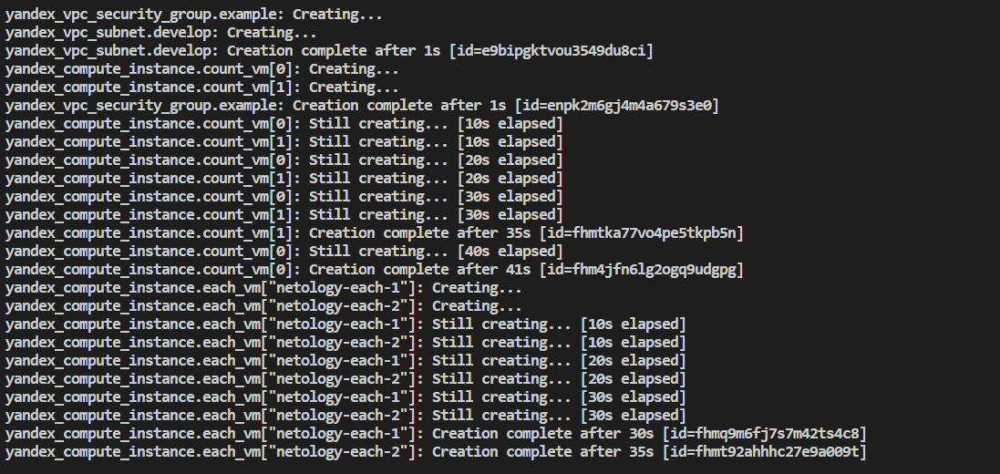
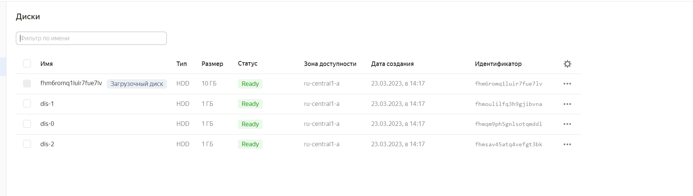
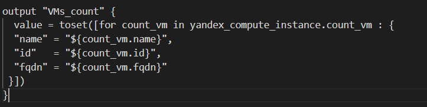

# Домашнее задание к занятию "Управляющие конструкции в коде Terraform"

### Выполнил Хайруллин Ильнур

## Задание 1
1. Изучите проект.
2. Заполните файл personal.auto.tfvars
3. Инициализируйте проект, выполните код (он выполнится даже если доступа к preview нет).

## Ответ:

## Задание 2
1. Создайте файл count-vm.tf. Опишите в нем создание двух одинаковых виртуальных машин с минимальными параметрами, используя мета-аргумент count loop.
2. Создайте файл for_each-vm.tf. Опишите в нем создание 2 разных по cpu/ram/disk виртуальных машин, используя мета-аргумент for_each loop. Используйте переменную типа list(object({ vm_name=string, cpu=number, ram=number, disk=number })). При желании внесите в переменную все возможные параметры.
3. ВМ из пункта 2.2 должны создаваться после создания ВМ из пункта 2.1.
4. Используйте функцию file в local переменной для считывания ключа ~/.ssh/id_rsa.pub и его последующего использования в блоке metadata, взятому из ДЗ №2.
5. Инициализируйте проект, выполните код.

### Ответ:

## Задание 3
1. Создайте 3 одинаковых виртуальных диска, размером 1 Гб с помощью ресурса yandex_compute_disk и мета-аргумента count.
2. Создайте одну любую ВМ. Используйте блок dynamic secondary_disk{..} и мета-аргумент for_each для подключения созданных вами дополнительных дисков.
3. Назначьте ВМ созданную в 1-м задании группу безопасности.

## Ответ:

## Задание 4
1. Создайте inventory-файл для ansible. Используйте функцию tepmplatefile и файл-шаблон для создания ansible inventory-файла из лекции. Готовый код возьмите из демонстрации к лекции demonstration2. Передайте в него в качестве переменных имена и внешние ip-адреса ВМ из задания 2.1 и 2.2.
2. Выполните код. Приложите скриншот получившегося файла.

## Ответ:

## Задание 5 (*)
Напишите output, который отобразит все 5 созданных ВМ в виде списка словарей:

    [
     {
      "name" = 'имя ВМ1'
      "id"   = 'идентификатор ВМ1'
      "fqdn" = 'Внутренний FQDN ВМ1'
     },
     {
      "name" = 'имя ВМ2'
      "id"   = 'идентификатор ВМ2'
      "fqdn" = 'Внутренний FQDN ВМ2'
     },
     ....
    ]

## Ответ:

## Задание 6 (*)
1. Используя null_resource и local-exec примените ansible-playbook к ВМ из ansible inventory файла. Готовый код возьмите из демонстрации к лекции demonstration2.
2. Дополните файл шаблон hosts.tftpl. Формат готового файла: netology-develop-platform-web-0   ansible_host="<внешний IP-address или внутренний IP-address если у ВМ отсутвует внешний адрес>"

## Ответ:

1. 

2. К сожалению не смог сделать. Это не сработало.
    
         %{ if ${i["network_interface"][0]["nat_ip_address"] != ""}
            ${i["name"]}   ansible_host=${i["network_interface"][0]["nat_ip_address"]} 
         %{ else }
            ${i["name"]}   ansible_host=${i["network_interface"][0]["ip_address"]}
         %{ endif }  