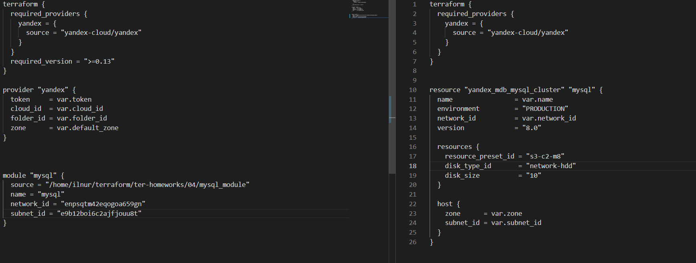

# Домашнее задание к занятию "Продвинутые методы работы с Terraform"

### Выполнил Хайруллин Ильнур

## Задание 1
1. Возьмите из демонстрации к лекции готовый код для создания ВМ с помощью remote модуля.
2. Создайте 1 ВМ, используя данный модуль. В файле cloud-init.yml необходимо использовать переменную для ssh ключа вместо хардкода. Передайте ssh-ключ в функцию template_file в блоке vars ={} . Воспользуйтесь примером. Обратите внимание что ssh-authorized-keys принимает в себя список, а не строку!
3. Добавьте в файл cloud-init.yml установку nginx.
4. Предоставьте скриншот подключения к консоли и вывод команды nginx -t.

## Ответ:

## Задание 2
1. Напишите локальный модуль vpc, который будет создавать 2 ресурса: одну сеть и одну подсеть в зоне, объявленной при вызове модуля. например: ru-central1-a.
2. Модуль должен возвращать значения vpc.id и subnet.id
3. Замените ресурсы yandex_vpc_network и yandex_vpc_subnet, созданным модулем.
4. Сгенерируйте документацию к модулю с помощью terraform-docs.

### Ответ:

## Задание 3
1. Выведите список ресурсов в стейте.
2. Удалите из стейта модуль vpc.
3. Импортируйте его обратно. Проверьте terraform plan - изменений быть не должно. Приложите список выполненных команд и вывод.

## Ответ:

## Задание 4 (*)
1. Измените модуль vpc так, чтобы он мог создать подсети во всех зонах доступности, переданных в переменной типа list(object) при вызове модуля.
Предоставьте код, план выполнения, результат из консоли YC.
## Ответ:

## Задание 5 (**)
1. Напишите модуль для создания кластера managed БД Mysql в Yandex Cloud с 1 или 3 хостами в зависимости от переменной HA=true или HA=false. Используйте ресурс yandex_mdb_mysql_cluster (передайте имя кластера и id сети).
2. Напишите модуль для создания базы данных и пользователя в уже существующем кластере managed БД Mysql. Используйте ресурсы yandex_mdb_mysql_database и yandex_mdb_mysql_user (передайте имя базы данных, имя пользователя и id кластера при вызове модуля).
3. Используя оба модуля, создайте кластер example из одного хоста, а затем добавьте в него БД test и пользователя app. Затем измените переменную и превратите сингл хост в кластер из 2х серверов.

Предоставьте план выполнения и по-возможности результат. Сразу же удаляйте созданные ресурсы, так как кластер может стоить очень дорого! Используйте минимальную конфигурацию.
## Ответ:

## Задание 6 (***)
1. Разверните у себя локально vault, используя docker-compose.yml в проекте.
2. Для входа в web интерфейс и авторизации terraform в vault используйте токен "education"
3. Создайте новый секрет по пути http://127.0.0.1:8200/ui/vault/secrets/secret/create
Path: example
secret data key: test secret data value: congrats!
4. Считайте данный секрет с помощью terraform и выведите его в output по примеру:

        provider "vault" {
         address = "https://<IP_ADDRESS>:<PORT_NUMBER>"
         skip_tls_verify = true
         token = "education"
        }
        data "vault_generic_secret" "vault_example"{
         path = "secret/example"
        }
        output "vault_example" {
         value = "${data.vault_generic_secret.vault_example.data["value"]}"
        }

5. Попробуйте разобраться в документации и записать новый секрет в vault с помощью terraform.

## Ответ:

