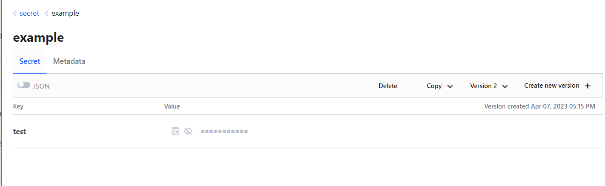

# Домашнее задание к занятию "Продвинутые методы работы с Terraform"

### Выполнил Хайруллин Ильнур


## Задание 1
1. Возьмите из [демонстрации к лекции готовый код](https://github.com/netology-code/ter-homeworks/tree/main/04/demonstration1) для создания ВМ с помощью remote модуля.
2. Создайте 1 ВМ, используя данный модуль. В файле cloud-init.yml необходимо использовать переменную для ssh ключа вместо хардкода. Передайте ssh-ключ в функцию template_file в блоке vars ={} .
Воспользуйтесь [**примером**](https://grantorchard.com/dynamic-cloudinit-content-with-terraform-file-templates/). Обратите внимание что ssh-authorized-keys принимает в себя список, а не строку!
3. Добавьте в файл cloud-init.yml установку nginx.
4. Предоставьте скриншот подключения к консоли и вывод команды ```sudo nginx -t```.

## Ответ:
Вывод "sudo nginx -t" (для установки прописал в packeges):


SSH ключ спрятал в locals, в main.tf в темплейте создал переменную vars = {ssh_authorized_keys = local.server_ssh_key} и в cloud-init.yml файле обратился к этой переменной через шаблон jinja :
ssh_authorized_keys:
    - ${ssh_authorized_keys}

## Задание 2
1. Напишите локальный модуль vpc, который будет создавать 2 ресурса: **одну** сеть и **одну** подсеть в зоне, объявленной при вызове модуля. например: ```ru-central1-a```.
2. Модуль должен возвращать значения vpc.id и subnet.id
3. Замените ресурсы yandex_vpc_network и yandex_vpc_subnet, созданным модулем.
4. Сгенерируйте документацию к модулю с помощью terraform-docs.    
 
Пример вызова:
```
module "vpc_dev" {
  source       = "./vpc"
  env_name     = "develop"
  zone = "ru-central1-a"
  cidr = "10.0.1.0/24"
}
```


### Ответ:
Структура модуля:


Вызов модуля:


Для генарации документации (файл readme для модуля в директории с модулем):

    sudo docker run --rm --volume "/home/ubuntu/vpc_module:/terraform-docs" -u $(id -u) quay.io/terraform-docs/terraform-docs:0.16.0 markdown /terraform-docs

## Задание 3
1. Выведите список ресурсов в стейте.
2. Удалите из стейта модуль vpc.
3. Импортируйте его обратно. Проверьте terraform plan - изменений быть не должно.
Приложите список выполненных команд и вывод.

## Ответ:

1. terraform state list

        data.template_file.cloudinit
        module.test-vm.data.yandex_compute_image.my_image
        module.test-vm.yandex_compute_instance.vm[0]
        module.vpc_module.yandex_vpc_network.develop
        module.vpc_module.yandex_vpc_subnet.develop

2.  terraform state rm 'module.vpc_module.yandex_vpc_network.develop'

        Removed module.vpc_module.yandex_vpc_network.develop
        Successfully removed 1 resource instance(s).

3.  terraform import 'module.vpc_module.yandex_vpc_network.develop' enpjhcb555du0s959d1c

        data.template_file.cloudinit: Reading...
        data.template_file.cloudinit: Read complete after 0s [id=6d58e7b08cfc435e0b323305ddef67e1355769e963c19a22f39858080222c3a1]
        module.vpc_module.yandex_vpc_network.develop: Importing from ID "enpjhcb555du0s959d1c"...
        module.test-vm.data.yandex_compute_image.my_image: Reading...
        module.vpc_module.yandex_vpc_network.develop: Import prepared!
          Prepared yandex_vpc_network for import
        module.vpc_module.yandex_vpc_network.develop: Refreshing state... [id=enpjhcb555du0s959d1c]
        module.test-vm.data.yandex_compute_image.my_image: Read complete after 0s [id=fd8i3uauimpm750kd9vh]

        Import successful!
        
        The resources that were imported are shown above. These resources are now in
        your Terraform state and will henceforth be managed by Terraform.

4. terraform plan 

        No changes. Your infrastructure matches the configuration.

## Задание 4 (*)
1. Измените модуль vpc так, чтобы он мог создать подсети во всех зонах доступности, переданных в переменной типа list(object) при вызове модуля.  
  
Пример вызова:
```
module "vpc_prod" {
  source       = "./vpc"
  env_name     = "production"
  subnets = [
    { zone = "ru-central1-a", cidr = "10.0.1.0/24" },
    { zone = "ru-central1-b", cidr = "10.0.2.0/24" },
    { zone = "ru-central1-c", cidr = "10.0.3.0/24" },
  ]
}

module "vpc_dev" {
  source       = "./vpc"
  env_name     = "develop"
  subnets = [
    { zone = "ru-central1-a", cidr = "10.0.1.0/24" },
  ]
}
```

Предоставьте код, план выполнения, результат из консоли YC.

## Ответ:

Код:


План выполнения:


    Terraform used the selected providers to generate the following execution plan. Resource actions are indicated with the following symbols:
      + create
    
    Terraform will perform the following actions:
        
    Terraform used the selected providers to generate the following execution plan. Resource actions are indicated with the following symbols:
      + create
    
    Terraform will perform the following actions:
    
      # module.vpc_module.yandex_vpc_network.develop will be created
      + resource "yandex_vpc_network" "develop" {
          + created_at                = (known after apply)
          + default_security_group_id = (known after apply)
          + folder_id                 = (known after apply)
          + id                        = (known after apply)
          + labels                    = (known after apply)
          + name                      = "develop"
          + subnet_ids                = (known after apply)
        }
    
      # module.vpc_module.yandex_vpc_subnet.develop[0] will be created
      + resource "yandex_vpc_subnet" "develop" {
          + created_at     = (known after apply)
          + folder_id      = (known after apply)
          + id             = (known after apply)
          + labels         = (known after apply)
          + name           = "ru-central1-a"
          + network_id     = (known after apply)
          + v4_cidr_blocks = [
              + "10.0.1.0/24",
            ]
          + v6_cidr_blocks = (known after apply)
          + zone           = "ru-central1-a"
        }
    
      # module.vpc_module.yandex_vpc_subnet.develop[1] will be created
      + resource "yandex_vpc_subnet" "develop" {
          + created_at     = (known after apply)
          + folder_id      = (known after apply)
          + id             = (known after apply)
          + labels         = (known after apply)
          + name           = "ru-central1-b"
          + network_id     = (known after apply)
          + v4_cidr_blocks = [
              + "10.0.2.0/24",
            ]
          + v6_cidr_blocks = (known after apply)
          + zone           = "ru-central1-b"
        }
    
      # module.vpc_module.yandex_vpc_subnet.develop[2] will be created
      + resource "yandex_vpc_subnet" "develop" {
          + created_at     = (known after apply)
          + folder_id      = (known after apply)
          + id             = (known after apply)
          + labels         = (known after apply)
          + name           = "ru-central1-c"
          + network_id     = (known after apply)
          + v4_cidr_blocks = [
              + "10.0.3.0/24",
            ]
          + v6_cidr_blocks = (known after apply)
          + zone           = "ru-central1-c"
        }
    
    Plan: 4 to add, 0 to change, 0 to destroy.

Вывод из cli yandex:


## Задание 5 (**)

1. Напишите модуль для создания кластера managed БД Mysql в Yandex Cloud с 1 или 3 хостами в зависимости от переменной HA=true или HA=false. Используйте ресурс yandex_mdb_mysql_cluster (передайте имя кластера и id сети).
2. Напишите модуль для создания базы данных и пользователя в уже существующем кластере managed БД Mysql. Используйте ресурсы yandex_mdb_mysql_database и yandex_mdb_mysql_user (передайте имя базы данных, имя пользователя и id кластера при вызове модуля).
3. Используя оба модуля, создайте кластер example из одного хоста, а затем добавьте в него БД test и пользователя app. Затем измените переменную и превратите сингл хост в кластер из 2х серверов.

Предоставьте план выполнения и по-возможности результат. Сразу же удаляйте созданные ресурсы, так как кластер может стоить очень дорого! Используйте минимальную конфигурацию.


## Ответ:

    Terraform used the selected providers to generate the following execution plan. Resource actions are indicated with the following symbols:
      + create
    
    Terraform will perform the following actions:
    
      # module.db.yandex_mdb_mysql_database.db will be created
      + resource "yandex_mdb_mysql_database" "db" {
          + cluster_id = (known after apply)
          + id         = (known after apply)
          + name       = "test"
        }
    
      # module.db.yandex_mdb_mysql_user.user will be created
      + resource "yandex_mdb_mysql_user" "user" {
          + authentication_plugin = (known after apply)
          + cluster_id            = (known after apply)
          + global_permissions    = (known after apply)
          + id                    = (known after apply)
          + name                  = "app"
          + password              = (sensitive value)
    
          + permission {
              + database_name = "test"
              + roles         = [
                  + "ALL",
                ]
            }
        }
    
      # module.mysql.yandex_mdb_mysql_cluster.mysql will be created
      + resource "yandex_mdb_mysql_cluster" "mysql" {
          + allow_regeneration_host   = false
          + backup_retain_period_days = (known after apply)
          + created_at                = (known after apply)
          + deletion_protection       = (known after apply)
          + environment               = "PRODUCTION"
          + folder_id                 = (known after apply)
          + health                    = (known after apply)
          + host_group_ids            = (known after apply)
          + id                        = (known after apply)
          + mysql_config              = (known after apply)
          + name                      = "mysql"
          + network_id                = "enpsqtm42eqogoa659gn"
          + status                    = (known after apply)
          + version                   = "8.0"
    
          + host {
              + assign_public_ip   = false
              + fqdn               = (known after apply)
              + replication_source = (known after apply)
              + subnet_id          = "e9b12boi6c2ajfjouu8t"
              + zone               = "ru-central1-a"
            }
    
          + resources {
              + disk_size          = 10
              + disk_type_id       = "network-hdd"
              + resource_preset_id = "s3-c2-m8"
            }
        }
    
    Plan: 3 to add, 0 to change, 0 to destroy.

После terraform apply (c базой и пользователем):


## Задание 6 (***)
1. Разверните у себя локально vault, используя docker-compose.yml в проекте.
2. Для входа в web интерфейс и авторизации terraform в vault используйте токен "education"
3. Создайте новый секрет по пути http://127.0.0.1:8200/ui/vault/secrets/secret/create  
Path: example  
secret data key: test 
secret data value: congrats!  
4. Считайте данный секрет с помощью terraform и выведите его в output по примеру:
```
provider "vault" {
 address = "http://<IP_ADDRESS>:<PORT_NUMBER>"
 skip_tls_verify = true
 token = "education"
}
data "vault_generic_secret" "vault_example"{
 path = "secret/example"
}
output "vault_example" {
 value = "${data.vault_generic_secret.vault_example.data["value"]}"
}
```
5. Попробуйте разобраться в документации и записать новый секрет в vault с помощью terraform. 

## Ответ:

Равзернул и создал пароль:



Обратиться к сожалению не смог:


C подсказки, так можно получить креды

    output "vault_example" {
     value = "${nonsensitive(data.vault_generic_secret.vault_example.data)}"
    }