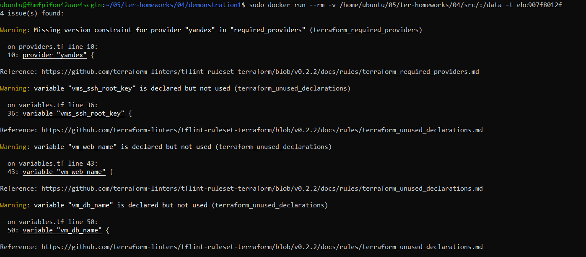

# Домашнее задание к занятию "Использование Terraform в команде"

### Выполнил Хайруллин Ильнур


## Задание 1
1. Возьмите код:
- из [ДЗ к лекции №04](https://github.com/netology-code/ter-homeworks/tree/main/04/src) 
- из [демо к лекции №04](https://github.com/netology-code/ter-homeworks/tree/main/04/demonstration1).
2. Проверьте код с помощью tflint и checkov. Вам не нужно инициализировать этот проект.
3. Перечислите какие **типы** ошибок обнаружены в проекте (без дублей).

## Ответ:

2.




3. Две ошибки от tflint: 
   - не указал верссионность
   - задеклалировал перименные , но нигде не использовал
   

## Задание 2
1. Возьмите ваш GitHub репозиторий с **выполненным ДЗ №4** в ветке 'terraform-04' и сделайте из него ветку 'terraform-05'
2. Повторите демонстрацию лекции: настройте YDB, S3 bucket, yandex service account, права доступа и мигрируйте State проекта в S3 с блокировками.
3. Закомитьте в ветку 'terraform-05' все изменения.
4. Откройте в проекте terraform console, а в другом окне из этой же директории попробуйте запустить terraform apply.
5. Пришлите ответ об ошибке доступа к State.
6. Принудительно разблокируйте State. Пришлите команду и вывод.

### Ответ:


Для принудительной разблокировки:

      terraform plan -lock=false


## Задание 3
1. Сделайте в GitHub из ветки 'terraform-05' новую ветку 'terraform-hotfix'.
2. Проверье код с помощью tflint и checkov, исправьте все предупреждения и ошибки в 'terraform-hotfix', сделайте комит.
3. Откройте новый pull request 'terraform-hotfix' --> 'terraform-05'. 
4. Вставьте в комментарий PR результат анализа tflint и checkov, план изменений инфраструктуры из вывода команды terraform plan.
5. Пришлите ссылку на PR для ревью(вливать код в 'terraform-05' не нужно).

## Ответ:

[Pull Request](https://github.com/khayrullinii/devops-netology/pull/9)

## Задание 4 (*)
1. Напишите переменные с валидацией:
- type=string, description="ip-адрес", проверка что ip-адрес валидный
- type=list(string), description="список ip-адресов", проверка что все валидны
- type=string, description="любая строка", проверка что строка не содержит в себе символов верхнего регистра
- type=object, проверка что введено только одно из опциональных значений по примеру:
```
variable "in_the_end_there_can_be_only_one" {
    description="Who is better Connor or Duncan?"
    type = object({
        Dunkan = optional(bool)
        Connor = optional(bool)
    })
    default = {
        Dunkan = true
        Connor = false
    }
    validation {
        error_message = "There can be only one MacLeod"
        condition = <проверка>
    }
}
```

## Ответ:
```
variable "ip_address" {
  type        = string
  description = "ip-адрес"
  validation {
        error_message = "IP address is incorrect"
        condition = can(cidrnetmask(var.ip_address))
    }
}


variable "ip_address_list" {
  type        = list(string)
  description = "список ip-адресов"
  validation {
        error_message = "one of the IP addresses is incorrect"
        condition = alltrue([
      for a in var.ip_address_list : can(cidrnetmask(a))
    ])
    }
}

variable "string_letter" {
  type        = string
  description = "любая строка"
  validation {
        error_message = "String contains uppercase letters"
        condition = (can(var.string_letter) && var.string_letter == lower(var.string_letter))
    }
}

variable "in_the_end_there_can_be_only_one" {
    description="Who is better Connor or Duncan?"
    type = object({
        Dunkan = optional(bool)
        Connor = optional(bool)
    })
    default = {
        Dunkan = true
        Connor = false
    }
    validation {
        error_message = "There can be only one MacLeod"
        condition = try(var.in_the_end_there_can_be_only_one["Dunkan"] != var.in_the_end_there_can_be_only_one["Connor"])
    }
}
```
## Задание 5 (**)

1. Настройте любую известную вам CI/CD или замените ее самописным bash/python скриптом.
2. Скачайте с ее помощью ваш репозиторий с кодом и инициализируйте инфраструктуру.


