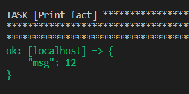
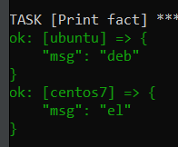
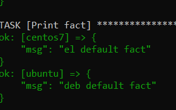
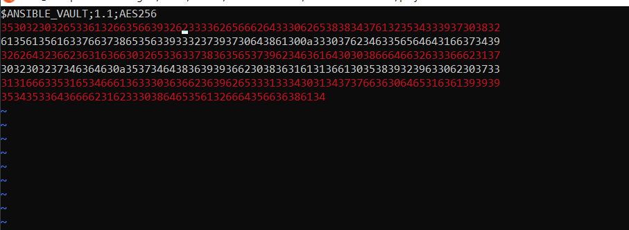
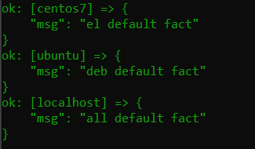
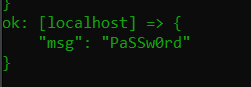

# Домашнее задание к занятию 1 «Введение в Ansible»

### Выполнил Хайруллин Ильнур

## Основная часть

1. Попробуйте запустить playbook на окружении из `test.yml`, зафиксируйте значение, которое имеет факт `some_fact` для указанного хоста при выполнении playbook.
2. Найдите файл с переменными (group_vars), в котором задаётся найденное в первом пункте значение, и поменяйте его на `all default fact`.
3. Воспользуйтесь подготовленным (используется `docker`) или создайте собственное окружение для проведения дальнейших испытаний.
4. Проведите запуск playbook на окружении из `prod.yml`. Зафиксируйте полученные значения `some_fact` для каждого из `managed host`.
5. Добавьте факты в `group_vars` каждой из групп хостов так, чтобы для `some_fact` получились значения: для `deb` — `deb default fact`, для `el` — `el default fact`.
6.  Повторите запуск playbook на окружении `prod.yml`. Убедитесь, что выдаются корректные значения для всех хостов.
7. При помощи `ansible-vault` зашифруйте факты в `group_vars/deb` и `group_vars/el` с паролем `netology`.
8. Запустите playbook на окружении `prod.yml`. При запуске `ansible` должен запросить у вас пароль. Убедитесь в работоспособности.
9. Посмотрите при помощи `ansible-doc` список плагинов для подключения. Выберите подходящий для работы на `control node`.
10. В `prod.yml` добавьте новую группу хостов с именем  `local`, в ней разместите localhost с необходимым типом подключения.
11. Запустите playbook на окружении `prod.yml`. При запуске `ansible` должен запросить у вас пароль. Убедитесь, что факты `some_fact` для каждого из хостов определены из верных `group_vars`.
12. Заполните `README.md` ответами на вопросы. Сделайте `git push` в ветку `master`. В ответе отправьте ссылку на ваш открытый репозиторий с изменённым `playbook` и заполненным `README.md`.

### Ответ:

    ansible-playbook playbook/site.yml -i playbook/inventory/test.yml  
some_fact имеет значение 12

Файл с переменной some_fact находится по пути playbook/group_vars/all/examp.yml

some_fact для всех managed hosts

Измененные значения:

Для шифрования файлов:

    ansible-vault encrypt group_vars/el/examp.yml
    ansible-vault encrypt group_vars/deb/examp.yml

Для запуска с зашифрованными данными:

    ansible-playbook site.yml -i inventory/prod.yml  --ask-vault-pass

Для просмотра плагинов:

    ansible-doc -l

Вывод всех трех managed hosts:

## Необязательная часть

1. При помощи `ansible-vault` расшифруйте все зашифрованные файлы с переменными.
2. Зашифруйте отдельное значение `PaSSw0rd` для переменной `some_fact` паролем `netology`. Добавьте полученное значение в `group_vars/all/exmp.yml`.
3. Запустите `playbook`, убедитесь, что для нужных хостов применился новый `fact`.
4. Добавьте новую группу хостов `fedora`, самостоятельно придумайте для неё переменную. В качестве образа можно использовать [этот вариант](https://hub.docker.com/r/pycontribs/fedora).
5. Напишите скрипт на bash: автоматизируйте поднятие необходимых контейнеров, запуск ansible-playbook и остановку контейнеров.
6. Все изменения должны быть зафиксированы и отправлены в ваш личный репозиторий.

### Ответ:

Для расшифровки файлов:

    ansible-vault decrypt group_vars/deb/examp.yml

Для шифрования текста:

    ansible-vault encrypt_string PaSSw0rd

Баш скрипт:

    #!/bin/bash
    docker run --name fedora_vm -itd pycontribs/fedora
    docker run --name centos7 -itd centos:7
    docker run --name ubuntu -itd ubuntu
    
    cd /home/ubuntu/mnt-homeworks/08-ansible-01-base/playbook && ansible-playbook site.yml -i inventory/prod.yml --vault-password-file=pass
    
    docker stop fedora_vm centos7 ubuntu
    docker rm $(docker ps --filter status=exited -q)