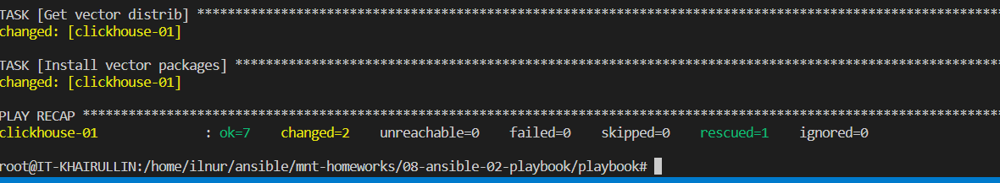
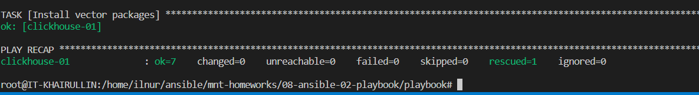

# Домашнее задание к занятию 2 «Работа с Playbook»

### Выполнил Хайруллин Ильнур

## Основная часть

1. Подготовьте свой inventory-файл `prod.yml`.
2. Допишите playbook: нужно сделать ещё один play, который устанавливает и настраивает [vector](https://vector.dev).
3. При создании tasks рекомендую использовать модули: `get_url`, `template`, `unarchive`, `file`.
4. Tasks должны: скачать дистрибутив нужной версии, выполнить распаковку в выбранную директорию, установить vector.
5. Запустите `ansible-lint site.yml` и исправьте ошибки, если они есть.
6. Попробуйте запустить playbook на этом окружении с флагом `--check`.
7. Запустите playbook на `prod.yml` окружении с флагом `--diff`. Убедитесь, что изменения на системе произведены.
8. Повторно запустите playbook с флагом `--diff` и убедитесь, что playbook идемпотентен.
9. Подготовьте README.md-файл по своему playbook. В нём должно быть описано: что делает playbook, какие у него есть параметры и теги.
10. Готовый playbook выложите в свой репозиторий, поставьте тег `08-ansible-02-playbook` на фиксирующий коммит, в ответ предоставьте ссылку на него.

### Ответ:
В inventory-файл `prod.yml` добавил адрес managed хоста.

Дописал новый play:

    - name: Install vector
      hosts: clickhouse
      remote_user: centos
      tasks:
        - name: Get vector distrib
          ansible.builtin.get_url:
            url: "https://packages.timber.io/vector/0.29.1/vector-0.29.1-1.x86_64.rpm"
            dest: "./vector.rpm"
        - name: Install vector packages
          become: true
          ansible.builtin.yum:
            name:
              - vector.rpm

Проверка ansible-lint:

Изменения произведены:

    ansible-playbook -i inventory/prod.yml site.yml --diff

playbook идемпотентен, изменений нет

