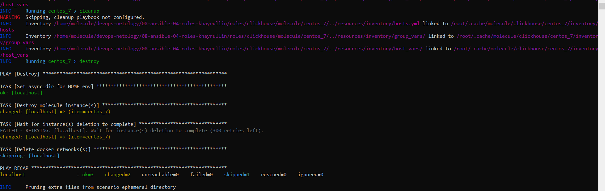
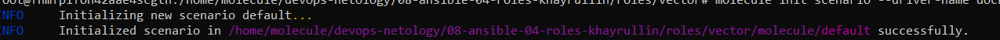
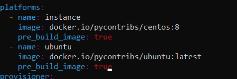
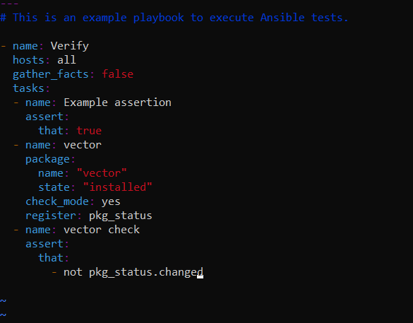
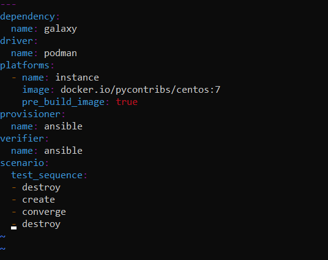
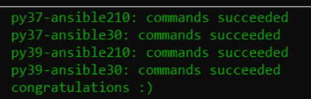

# Домашнее задание к занятию 4 «Тестирование roles»

### Выполнил Хайруллин Ильнур

## Основная часть

### Molecule

1. Запустите  `molecule test -s centos_7` внутри корневой директории clickhouse-role, посмотрите на вывод команды. Данная команда может отработать с ошибками, это нормально. Наша цель - посмотреть как другие в реальном мире используют молекулу.
2. Перейдите в каталог с ролью vector-role и создайте сценарий тестирования по умолчанию при помощи `molecule init scenario --driver-name docker`.
3. Добавьте несколько разных дистрибутивов (centos:8, ubuntu:latest) для инстансов и протестируйте роль, исправьте найденные ошибки, если они есть.
4. Добавьте несколько assert в verify.yml-файл для  проверки работоспособности vector-role (проверка, что конфиг валидный, проверка успешности запуска и др.). 
5. Запустите тестирование роли повторно и проверьте, что оно прошло успешно.
5. Добавьте новый тег на коммит с рабочим сценарием в соответствии с семантическим версионированием.

### Tox

1. Добавьте в директорию с vector-role файлы из [директории](./example).
2. Запустите `docker run --privileged=True -v <path_to_repo>:/opt/vector-role -w /opt/vector-role -it aragast/netology:latest /bin/bash`, где path_to_repo — путь до корня репозитория с vector-role на вашей файловой системе.
3. Внутри контейнера выполните команду `tox`, посмотрите на вывод.
5. Создайте облегчённый сценарий для `molecule` с драйвером `molecule_podman`. Проверьте его на исполнимость.
6. Пропишите правильную команду в `tox.ini`, чтобы запускался облегчённый сценарий.
8. Запустите команду `tox`. Убедитесь, что всё отработало успешно.
9. Добавьте новый тег на коммит с рабочим сценарием в соответствии с семантическим версионированием.

После выполнения у вас должно получится два сценария molecule и один tox.ini файл в репозитории. Не забудьте указать в ответе теги решений Tox и Molecule заданий. В качестве решения пришлите ссылку на  ваш репозиторий и скриншоты этапов выполнения задания. 

## Необязательная часть

1. Проделайте схожие манипуляции для создания роли LightHouse.
2. Создайте сценарий внутри любой из своих ролей, который умеет поднимать весь стек при помощи всех ролей.
3. Убедитесь в работоспособности своего стека. Создайте отдельный verify.yml, который будет проверять работоспособность интеграции всех инструментов между ними.
4. Выложите свои roles в репозитории.

В качестве решения пришлите ссылки и скриншоты этапов выполнения задания.

## Ответ

### Molecule

1. Запуск теста для clickhouse:

    

2. создания сценария для vector:
   
    

3. Добавил платформу:

   

4. Написал проверку установленного пакета:

   

### Tox

1. docker run --privileged=True -v <path_to_repo>:/opt/vector-role -w /opt/vector-role -it aragast/netology:latest /bin/bash  запустил докер примонтировав папку с ролью

2. После вызова tox, произошла ошибка связанная с отсутствуем сценария , который пропискан в tox.ini.  После замены команды на  {posargs:molecule test -s default --destroy always}, проверка прошла.

3. Создал облегченный сценарий с использованием драйвера подман, для этого:
   1. внутри докера провалился в одно из окружений, сделал "molecule init scenario podman --driver-name podman"
   2. Изменил инстанс на centos 7
   3. изменил сценарий внутри файла molecule.yml  
   

4. Изменил команду на {posargs:molecule test -s podman --destroy always} в файле tox.ini

5. Запустил tox.
   