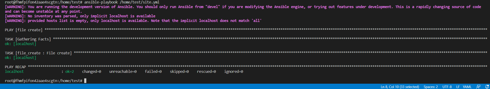

# Домашнее задание к занятию 6 «Создание собственных модулей»

### Выполнил Хайруллин Ильнур

## Основная часть

Ваша цель — написать собственный module, который вы можете использовать в своей role через playbook. Всё это должно быть собрано в виде collection и отправлено в ваш репозиторий.

**Шаг 1.** В виртуальном окружении создайте новый `my_own_module.py` файл.

**Шаг 2.** Наполните его содержимым

**Шаг 3.** Заполните файл в соответствии с требованиями Ansible так, чтобы он выполнял основную задачу: module должен создавать текстовый файл на удалённом хосте по пути, определённом в параметре `path`, с содержимым, определённым в параметре `content`.

**Шаг 4.** Проверьте module на исполняемость локально.

**Шаг 5.** Напишите single task playbook и используйте module в нём.

**Шаг 6.** Проверьте через playbook на идемпотентность.

**Шаг 7.** Выйдите из виртуального окружения.

**Шаг 8.** Инициализируйте новую collection: `ansible-galaxy collection init my_own_namespace.yandex_cloud_elk`.

**Шаг 9.** В эту collection перенесите свой module в соответствующую директорию.

**Шаг 10.** Single task playbook преобразуйте в single task role и перенесите в collection. У role должны быть default всех параметров module.

**Шаг 11.** Создайте playbook для использования этой role.

**Шаг 12.** Заполните всю документацию по collection, выложите в свой репозиторий, поставьте тег `1.0.0` на этот коммит.

**Шаг 13.** Создайте .tar.gz этой collection: `ansible-galaxy collection build` в корневой директории collection.

**Шаг 14.** Создайте ещё одну директорию любого наименования, перенесите туда single task playbook и архив c collection.

**Шаг 15.** Установите collection из локального архива: `ansible-galaxy collection install <archivename>.tar.gz`.

**Шаг 16.** Запустите playbook, убедитесь, что он работает.

**Шаг 17.** В ответ необходимо прислать ссылки на collection и tar.gz архив, а также скриншоты выполнения пунктов 4, 6, 15 и 16.

### Ответ:

Cоздал файл, наполнил содержимым.

Внутри модуля определил переменные:
    
        module_args = dict(
        path=dict(type='str', required=True),
        content=dict(type='str', required=True)
        )

И написал скрипт, для записи контента в файл test.txt по пути path:

         os.system(f"echo {module.params['content']} > {module.params['path']}/test.txt ")

Локальный тест прогон с помощью питона:

Проверка идемпотентности:

Была проиницилизирована коллекция: ansible-galaxy collection init my_own_namespace.yandex_cloud_elk
Была проиницилизирована роль: ansible-galaxy role init file_create

playbook переписан в роль (изменяемы переменные перенесены в default в task  добавлены {{ path}}  и {{ content }}) и добавлен в коллекцию, после чего сделал архив и написал playbook на вызов роли.

Установка коллекции из архива:

Запуск playbook с распакованной коллекции:

