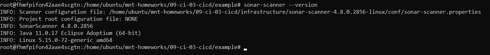
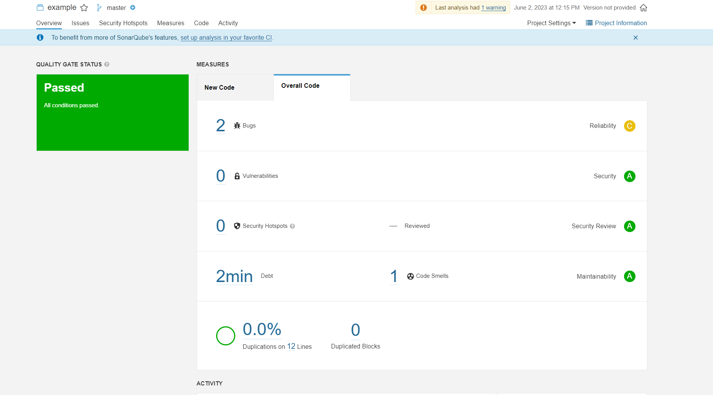
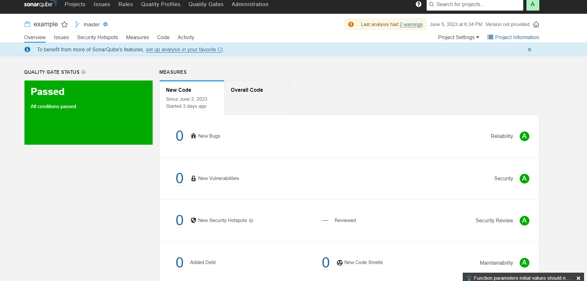
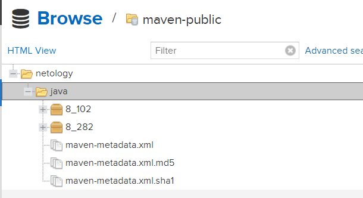
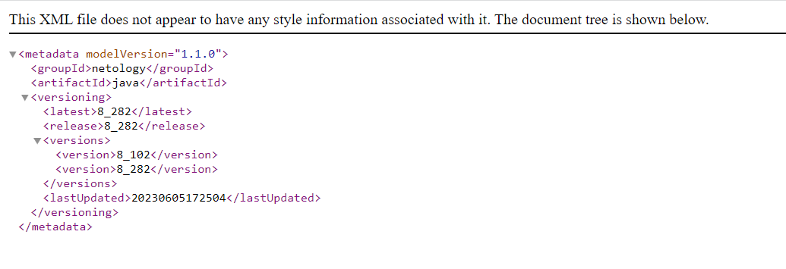
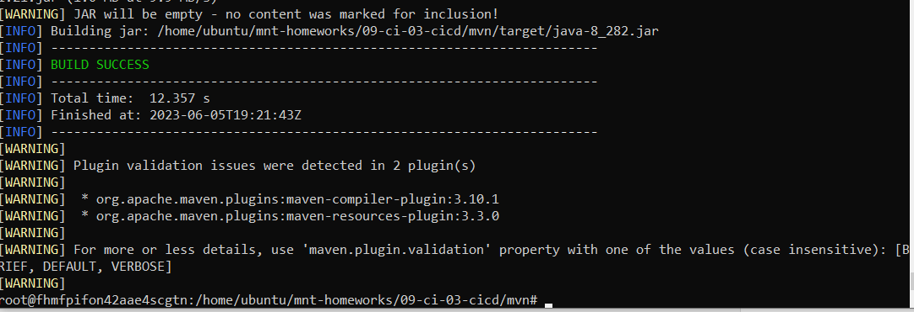
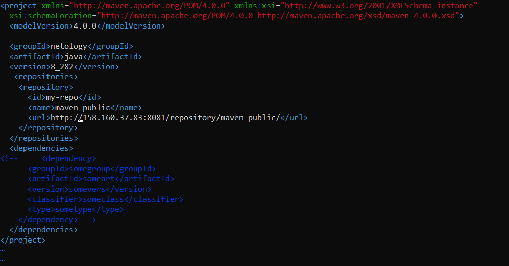

# Домашнее задание к занятию 9 «Жизненный цикл ПО»

### Выполнил Хайруллин Ильнур

## Знакомоство с SonarQube

### Основная часть

1. Создайте новый проект, название произвольное.
2. Скачайте пакет sonar-scanner, который вам предлагает скачать SonarQube.
3. Сделайте так, чтобы binary был доступен через вызов в shell (или поменяйте переменную PATH, или любой другой, удобный вам способ).
4. Проверьте `sonar-scanner --version`.
5. Запустите анализатор против кода из директории [example](./example) с дополнительным ключом `-Dsonar.coverage.exclusions=fail.py`.
6. Посмотрите результат в интерфейсе.
7. Исправьте ошибки, которые он выявил, включая warnings.
8. Запустите анализатор повторно — проверьте, что QG пройдены успешно.
9. Сделайте скриншот успешного прохождения анализа, приложите к решению ДЗ.

## Знакомство с Nexus

### Основная часть

1. В репозиторий `maven-public` загрузите артефакт с GAV-параметрами:

 *    groupId: netology;
 *    artifactId: java;
 *    version: 8_282;
 *    classifier: distrib;
 *    type: tar.gz.
   
2. В него же загрузите такой же артефакт, но с version: 8_102.
3. Проверьте, что все файлы загрузились успешно.
4. В ответе пришлите файл `maven-metadata.xml` для этого артефекта.

### Знакомство с Maven

### Основная часть

1. Поменяйте в `pom.xml` блок с зависимостями под ваш артефакт из первого пункта задания для Nexus (java с версией 8_282).
2. Запустите команду `mvn package` в директории с `pom.xml`, ожидайте успешного окончания.
3. Проверьте директорию `~/.m2/repository/`, найдите ваш артефакт.
4. В ответе пришлите исправленный файл `pom.xml`.

### Ответ:

## SonarQube

1. Установил sonar-scanner:

    

2. Запустил анализатор на fail.py:

   

3. Вывод после исправления ошибок:

   

## Nexus

1.  Загрузил файлы:

   
   
2.  xml файл:

   
   
## Maven

1. Задеплоил артефакт:

   

2. Исправленный pom.xml

   