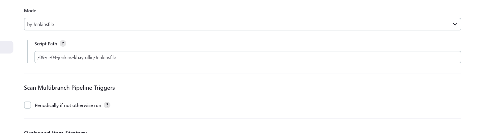
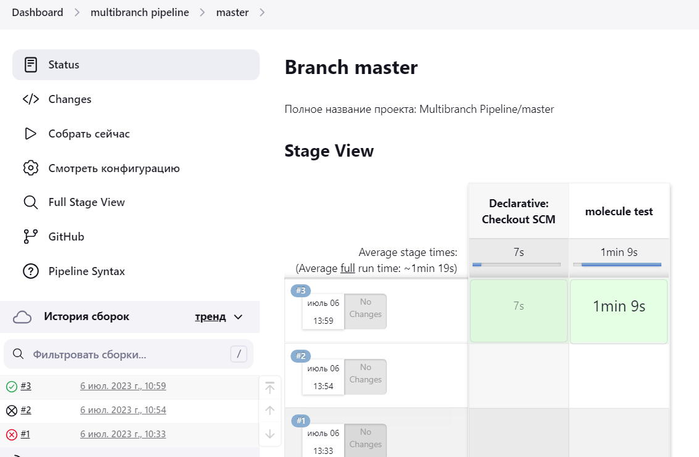
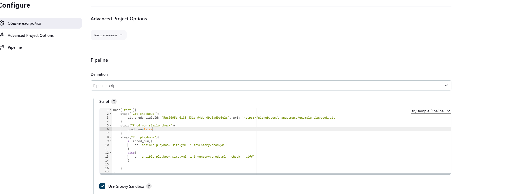

# Домашнее задание к занятию 10 «Jenkins»

### Выполнил Хайруллин Ильнур

## Основная часть

1. Сделать Freestyle Job, который будет запускать `molecule test` из любого вашего репозитория с ролью.
2. Сделать Declarative Pipeline Job, который будет запускать `molecule test` из любого вашего репозитория с ролью.
3. Перенести Declarative Pipeline в репозиторий в файл `Jenkinsfile`.
4. Создать Multibranch Pipeline на запуск `Jenkinsfile` из репозитория.
5. Создать Scripted Pipeline, наполнить его скриптом из [pipeline](./pipeline).
6. Внести необходимые изменения, чтобы Pipeline запускал `ansible-playbook` без флагов `--check --diff`, если не установлен параметр при запуске джобы (prod_run = True). По умолчанию параметр имеет значение False и запускает прогон с флагами `--check --diff`.
7. Проверить работоспособность, исправить ошибки, исправленный Pipeline вложить в репозиторий в файл `ScriptedJenkinsfile`.
8. Отправить ссылку на репозиторий с ролью и Declarative Pipeline и Scripted Pipeline.

### Ответ:

Установил и преднастроил сборщика (агента)

1. клонировал репозиторий с ролью:
    

    Успешно запустил freestyle:

    

2. Создал декларативный pipeline:
   
   

    Успешно запустил:

    

3. Запушил дженкинс файл в репозиторий.
4. Создал Multibranch Pipeline указал путь до дженкинс файла:

    
   
   Успешно запустил:

   

5. Создал скриптовый pipline и изменил скрипт:

   

6. Запустил со всеми изменениями:

   