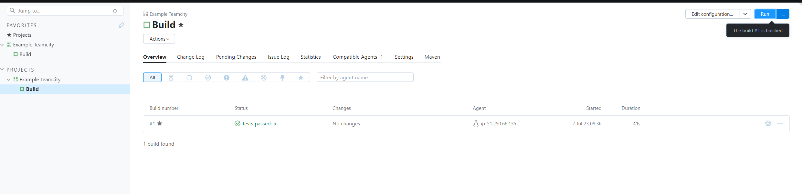

# Домашнее задание к занятию 11 «Teamcity»

### Выполнил Хайруллин Ильнур

## Основная часть

1. Создайте новый проект в teamcity на основе fork.
2. Сделайте autodetect конфигурации.
3. Сохраните необходимые шаги, запустите первую сборку master.
4. Поменяйте условия сборки: если сборка по ветке `master`, то должен происходит `mvn clean deploy`, иначе `mvn clean test`.
5. Для deploy будет необходимо загрузить [settings.xml](./teamcity/settings.xml) в набор конфигураций maven у teamcity, предварительно записав туда креды для подключения к nexus.
6. В pom.xml необходимо поменять ссылки на репозиторий и nexus.
7. Запустите сборку по master, убедитесь, что всё прошло успешно и артефакт появился в nexus.
8. Мигрируйте `build configuration` в репозиторий.
9. Создайте отдельную ветку `feature/add_reply` в репозитории.
10. Напишите новый метод для класса Welcomer: метод должен возвращать произвольную реплику, содержащую слово `hunter`.
11. Дополните тест для нового метода на поиск слова `hunter` в новой реплике.
12. Сделайте push всех изменений в новую ветку репозитория.
13. Убедитесь, что сборка самостоятельно запустилась, тесты прошли успешно.
14. Внесите изменения из произвольной ветки `feature/add_reply` в `master` через `Merge`.
15. Убедитесь, что нет собранного артефакта в сборке по ветке `master`.
16. Настройте конфигурацию так, чтобы она собирала `.jar` в артефакты сборки.
17. Проведите повторную сборку мастера, убедитесь, что сбора прошла успешно и артефакты собраны.
18. Проверьте, что конфигурация в репозитории содержит все настройки конфигурации из teamcity.
19. В ответе пришлите ссылку на репозиторий.


### Ответ:

1. Создал новый проект
2. Cделал autodetect и нашел Maven
3. Запустил:
    
    

4. Поменяйте условия сборки и вставил settings.xml:

   

7. Запустил сборку , артефакт появился:

   

9. Cоздал ветку
10. Написал новый метод для класса Welcomer:

```
	public String sayHunter(){
		return "bug hunter";
	}
```

11. Написал тест для нового класса hunter:

```
	@Test
	public void welcomerSaysHunter(){
		assertThat(welcomer.sayHunter(), containsString("hunter"));
	}
```
13. Cборка запустилась и тесты успешно пройдены:

   

14. Смержил в мастер
15. Артефакт не собрался:

   
   
16. в pom.xml и так описан сбор артефакта в jar, так же изменил версию для записи в nexus
17. повторно запустил сборку:

   

18. конфигурация сохранилась в nexuse

    