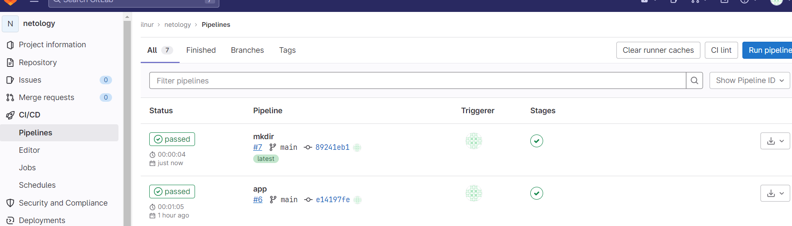

# Домашнее задание к занятию 12 «GitLab»

### Выполнил Хайруллин Ильнур

## Основная часть

### DevOps

В репозитории содержится код проекта на Python. Проект — RESTful API сервис. Ваша задача — автоматизировать сборку образа с выполнением python-скрипта:

1. Образ собирается на основе [centos:7](https://hub.docker.com/_/centos?tab=tags&page=1&ordering=last_updated).
2. Python версии не ниже 3.7.
3. Установлены зависимости: `flask` `flask-jsonpify` `flask-restful`.
4. Создана директория `/python_api`.
5. Скрипт из репозитория размещён в /python_api.
6. Точка вызова: запуск скрипта.
7. При комите в любую ветку должен собираться docker image с форматом имени hello:gitlab-$CI_COMMIT_SHORT_SHA . Образ должен быть выложен в Gitlab registry или yandex registry.   
8.* (задание необязательное к выполению) При комите в ветку master после сборки должен подняться pod в kubernetes. Примерный pipeline для push в kubernetes по [ссылке](https://github.com/awertoss/devops-netology/blob/main/09-ci-06-gitlab/gitlab-ci.yml).
Если вы еще не знакомы с k8s - автоматизируйте сборку и деплой приложения в docker на виртуальной машине.

### Product Owner

Вашему проекту нужна бизнесовая доработка: нужно поменять JSON ответа на вызов метода GET `/rest/api/get_info`, необходимо создать Issue в котором указать:

1. Какой метод необходимо исправить.
2. Текст с `{ "message": "Already started" }` на `{ "message": "Running"}`.
3. Issue поставить label: feature.

### Developer

Пришёл новый Issue на доработку, вам нужно:

1. Создать отдельную ветку, связанную с этим Issue.
2. Внести изменения по тексту из задания.
3. Подготовить Merge Request, влить необходимые изменения в `master`, проверить, что сборка прошла успешно.


### Tester

Разработчики выполнили новый Issue, необходимо проверить валидность изменений:

1. Поднять докер-контейнер с образом `python-api:latest` и проверить возврат метода на корректность.
2. Закрыть Issue с комментарием об успешности прохождения, указав желаемый результат и фактически достигнутый.


### Ответ:

Создал аплайнс с gitlab, установил ранера на ВМ с убунту. Создал в репозитории файлы со скриптом и requirements.


### DevOps

dockerfile: 
```
FROM centos:7

RUN yum install python3 python3-pip -y
COPY requirements.txt requirements.txt
RUN pip3 install  -r requirements.txt
RUN mkdir python_api
COPY python-api.py  /python_api/python-api.py
CMD ["python3","python-api.py"]
```

gitlab-ci.yaml
```
stages:
  - build
  - deploy
image: docker:20.10.5
services:
  - docker:20.10.5-dind
builder:
    stage: build
    script:
        - docker build -t some_local_build:latest
    except:
        - main
deployer:
    stage: deploy
    script:
        - docker build -t $CI_REGISTRY/ilnur/netology/gitlab-$CI_COMMIT_SHORT_SHA:latest .
        - docker login -u $CI_REGISTRY_USER -p $CI_REGISTRY_PASSWORD $CI_REGISTRY
        - docker push $CI_REGISTRY/ilnur/netology/gitlab-$CI_COMMIT_SHORT_SHA:latest
    only:
        - main
```

Сборка прошла успешно:


Image появился в registry:


### Product Owner - Developer - Tester

Создал задачу:


Решил в другой ветке и смержил:


Протестировал, запустив докер контейнер из образа:


Закрытый issue:

