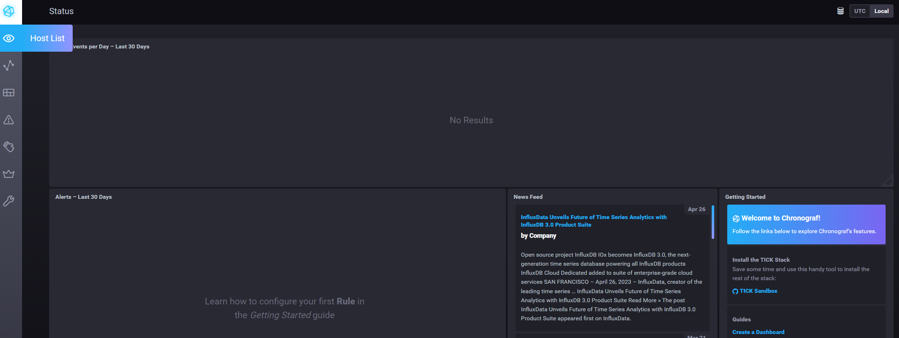
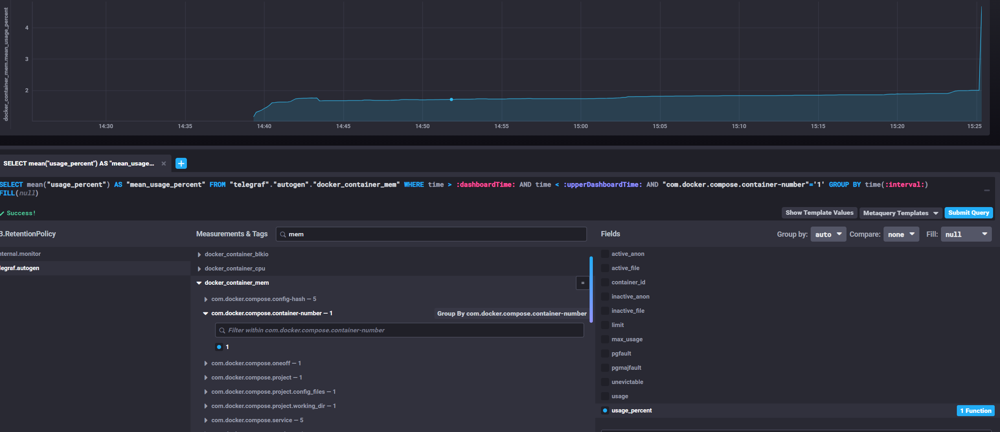
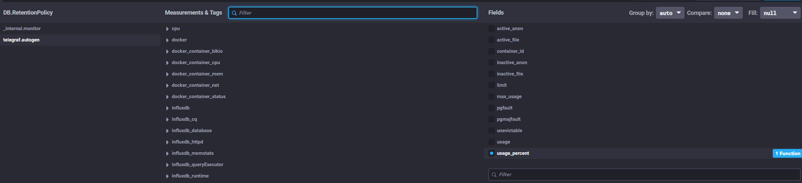

# Домашнее задание к занятию 13 «Системы мониторинга»

### Выполнил Хайруллин Ильнур


## Обязательные задания

1. Вас пригласили настроить мониторинг на проект. На онбординге вам рассказали, что проект представляет из себя 
платформу для вычислений с выдачей текстовых отчетов, которые сохраняются на диск. Взаимодействие с платформой 
осуществляется по протоколу http. Также вам отметили, что вычисления загружают ЦПУ. Какой минимальный набор метрик вы
выведите в мониторинг и почему?
#
2. Менеджер продукта посмотрев на ваши метрики сказал, что ему непонятно что такое RAM/inodes/CPUla. Также он сказал, 
что хочет понимать, насколько мы выполняем свои обязанности перед клиентами и какое качество обслуживания. Что вы 
можете ему предложить?
#
3. Вашей DevOps команде в этом году не выделили финансирование на построение системы сбора логов. Разработчики в свою 
очередь хотят видеть все ошибки, которые выдают их приложения. Какое решение вы можете предпринять в этой ситуации, 
чтобы разработчики получали ошибки приложения?
#
4. Вы, как опытный SRE, сделали мониторинг, куда вывели отображения выполнения SLA=99% по http кодам ответов. 
Вычисляете этот параметр по следующей формуле: summ_2xx_requests/summ_all_requests. Данный параметр не поднимается выше 
70%, но при этом в вашей системе нет кодов ответа 5xx и 4xx. Где у вас ошибка?
#
5. Опишите основные плюсы и минусы pull и push систем мониторинга.
#
6. Какие из ниже перечисленных систем относятся к push модели, а какие к pull? А может есть гибридные?

    - Prometheus 
    - TICK
    - Zabbix
    - VictoriaMetrics
    - Nagios
#
7. Склонируйте себе [репозиторий](https://github.com/influxdata/sandbox/tree/master) и запустите TICK-стэк, 
используя технологии docker и docker-compose.

В виде решения на это упражнение приведите скриншот веб-интерфейса ПО chronograf (`http://localhost:8888`). 

P.S.: если при запуске некоторые контейнеры будут падать с ошибкой - проставьте им режим `Z`, например
`./data:/var/lib:Z`
#
8. Перейдите в веб-интерфейс Chronograf (`http://localhost:8888`) и откройте вкладку `Data explorer`.

    - Нажмите на кнопку `Add a query`
    - Изучите вывод интерфейса и выберите БД `telegraf.autogen`
    - В `measurments` выберите mem->host->telegraf_container_id , а в `fields` выберите used_percent. 
    Внизу появится график утилизации оперативной памяти в контейнере telegraf.
    - Вверху вы можете увидеть запрос, аналогичный SQL-синтаксису. 
    Поэкспериментируйте с запросом, попробуйте изменить группировку и интервал наблюдений.

Для выполнения задания приведите скриншот с отображением метрик утилизации места на диске 
(disk->host->telegraf_container_id) из веб-интерфейса.
#
9. Изучите список [telegraf inputs](https://github.com/influxdata/telegraf/tree/master/plugins/inputs). 
Добавьте в конфигурацию telegraf следующий плагин - [docker](https://github.com/influxdata/telegraf/tree/master/plugins/inputs/docker):
```
[[inputs.docker]]
  endpoint = "unix:///var/run/docker.sock"
```

Дополнительно вам может потребоваться донастройка контейнера telegraf в `docker-compose.yml` дополнительного volume и 
режима privileged:
```
  telegraf:
    image: telegraf:1.4.0
    privileged: true
    volumes:
      - ./etc/telegraf.conf:/etc/telegraf/telegraf.conf:Z
      - /var/run/docker.sock:/var/run/docker.sock:Z
    links:
      - influxdb
    ports:
      - "8092:8092/udp"
      - "8094:8094"
      - "8125:8125/udp"
```

После настройке перезапустите telegraf, обновите веб интерфейс и приведите скриншотом список `measurments` в 
веб-интерфейсе базы telegraf.autogen . Там должны появиться метрики, связанные с docker.

Факультативно можете изучить какие метрики собирает telegraf после выполнения данного задания.


### Ответ:

1. Для мониторинга продукта выбрал бы:
   - load average CPU (для мониторинга загрузки по CPU)
   - Свободное пространство на диске, так как результаты хранятся внутри ВМ (по той же причине можно мониторить кол-во свободных inode)
   - Количество http запросов в разрезе с CPU LA и RAM/swap (Для выявления зависимоти кол-во запрос/системы)
   - Время ответа(отклика) веб сервера, для понимания влияния сервис со стороны клиента

2. Определив внутри команды SLO, можно обговорить с клиентом SLA и на протяжении временного периода его выдерживать, это будет являться признаком качества обслуживания.

3. Возможно я неправильно понял вопрос. Но я бы написал тг бота, который проверял бы локальный лог файл и отправлял сообщения с новыми строчками.

4. В формуле не учтены запросы с перенаправлением с кодом 3хх, формула должна быть  (summ_2xx_requests + summ_3xx_requests) / (summ_all_requests)
5. Я считаю, основной плюс push системы, для того чтоб она отдавала метрики не надо пробрасывать порты внутрь системы из вне. Но это влечет за собой более тяжелую настройку конфигов. Так же push методы работают по протоколу UDP, что увеличивает пропускную способность, но увеличивает риск получнеич "неподлинных данных"
Pull система, должна из вне иметь доступ до агента, но упрощается отладка данных. Работает по TCP, который гарантирует подлинность, но за счет этого падает возможная производительность.

6. Zabbix и Prometheus – могут работать в двух режимах
   TICK - скорее push
   VictoriaMetrics - бд, подключаемая обычно к Prometheus , тоже скорее push
   Nagios - скорее pull

7. Запустил TICK-стэк



8. Метрик по диску не нашел, оставляю скрин по mem:



9. Метрики докера:

