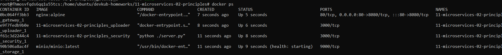
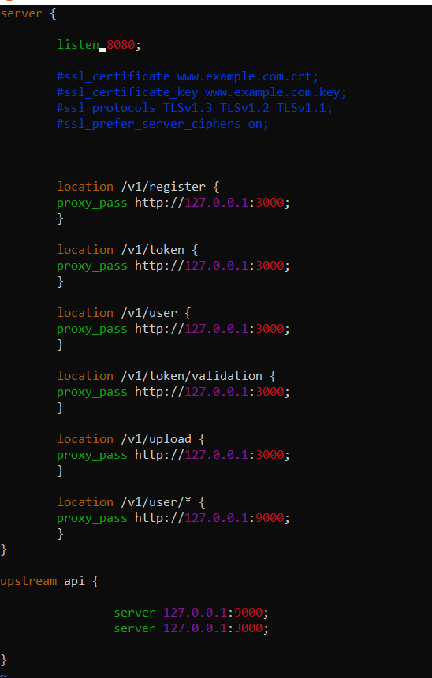

# Домашнее задание к занятию «Микросервисы: принципы»

### Выполнил Хайруллин Ильнур

## Основная часть

Вы работаете в крупной компании, которая строит систему на основе микросервисной архитектуры.
Вам как DevOps-специалисту необходимо выдвинуть предложение по организации инфраструктуры для разработки и эксплуатации.

## Задача 1: API Gateway 

Предложите решение для обеспечения реализации API Gateway. Составьте сравнительную таблицу возможностей различных программных решений. На основе таблицы сделайте выбор решения.

Решение должно соответствовать следующим требованиям:
- маршрутизация запросов к нужному сервису на основе конфигурации,
- возможность проверки аутентификационной информации в запросах,
- обеспечение терминации HTTPS.

Обоснуйте свой выбор.

## Задача 2: Брокер сообщений

Составьте таблицу возможностей различных брокеров сообщений. На основе таблицы сделайте обоснованный выбор решения.

Решение должно соответствовать следующим требованиям:
- поддержка кластеризации для обеспечения надёжности,
- хранение сообщений на диске в процессе доставки,
- высокая скорость работы,
- поддержка различных форматов сообщений,
- разделение прав доступа к различным потокам сообщений,
- простота эксплуатации.

Обоснуйте свой выбор.

## Задача 3: API Gateway * (необязательная)

### Есть три сервиса:

**minio**
- хранит загруженные файлы в бакете images,
- S3 протокол,

**uploader**
- принимает файл, если картинка сжимает и загружает его в minio,
- POST /v1/upload,

**security**
- регистрация пользователя POST /v1/user,
- получение информации о пользователе GET /v1/user,
- логин пользователя POST /v1/token,
- проверка токена GET /v1/token/validation.

### Необходимо воспользоваться любым балансировщиком и сделать API Gateway:

**POST /v1/register**
1. Анонимный доступ.
2. Запрос направляется в сервис security POST /v1/user.

**POST /v1/token**
1. Анонимный доступ.
2. Запрос направляется в сервис security POST /v1/token.

**GET /v1/user**
1. Проверка токена. Токен ожидается в заголовке Authorization. Токен проверяется через вызов сервиса security GET /v1/token/validation/.
2. Запрос направляется в сервис security GET /v1/user.

**POST /v1/upload**
1. Проверка токена. Токен ожидается в заголовке Authorization. Токен проверяется через вызов сервиса security GET /v1/token/validation/.
2. Запрос направляется в сервис uploader POST /v1/upload.

**GET /v1/user/{image}**
1. Проверка токена. Токен ожидается в заголовке Authorization. Токен проверяется через вызов сервиса security GET /v1/token/validation/.
2. Запрос направляется в сервис minio GET /images/{image}.

### Ответ:

## Задача 1: API Gateway 

| Название решения | маршрутизация запросов к нужному сервису на основе конфигурации | возможность проверки аутентификационной информации в запросах | обеспечение терминации HTTPS | Расширяемая архитектура плагинов |
|------------------|-----------------------------------------------------------------|---------------------------------------------------------------|------------------------------|----------------------------------|
| Kong Gateway     | +                                                               | +                                                             | +                            | +                                |
| Apache APISIX    | +                                                               | +                                                             | +                            | +                                |
| Tyk              | +                                                               | +                                                             | +                            | +                                |
| Goku             | +                                                               | +                                                             | +                            | +                                |
| Gloo             | +                                                               | +                                                             | +                            | +                                |

Выбор: На сегодняшний день, много решений обладает сходим функциионалом, поэтому выбирать необходимо, исходя из задач и конкретных фич. Так же весомыми фактороми при выборе станут: бесплатное решение или enterprise с поддержкой, возможность развернуть в публичном облаке (если сервисы там).
Для себя отмечу apache Apsix (хорошая документация с примерами настроек) и gloo (которые позиционируют себя как NG API gateway c поддержкой WAF)

## Задача 2: Брокер сообщений

| Название решения | поддержка кластеризации для обеспечения надёжности | хранение сообщений на диске в процессе доставки | высокая скорость работы | поддержка различных форматов сообщений | разделение прав доступа к различным потокам сообщений | простота эксплуатации                  |
|------------------|----------------------------------------------------|-------------------------------------------------|-------------------------|----------------------------------------|-------------------------------------------------------|----------------------------------------|
| Apache Kafka     | +                                                  | +                                               | +                       | +                                      | + (Kafka Security Manager)                            | ставится просто + хорошая документация |
| RabbitMQ         | +                                                  | - (хранит ссылку)                               | +                       | +                                      | +                                                     | Хорошая документация с примерами       |
| ActiveMQ         | +                                                  | +                                               | -                       | +                                      | +                                                     | продукт старый, документация скудна    |
| Platform V Corax | +                                                  | +                                               | +                       | +                                      | +                                                     | клауд решение на базе кафки            |
| Amazon MQ        | +                                                  | +                                               | -                       | +                                      | +                                                     | клауд решение, хорошая документация    |

Выбор: Опять же все зависит от конкретной задачи, какие функции критичны и какая среда будет при развертывании (публичное или локальное облако). Что ставится в приоритет скорость или надежность.

## Задача 3: API Gateway * (необязательная)

Запущенные контейнеры (Надо поправлять requirements.txt , потому что старые версии модулей, из-за который не стартует контейнер)

Конфиг nginx:

