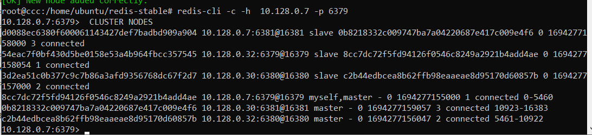

# Домашнее задание к занятию «Микросервисы: масштабирование»

### Выполнил Хайруллин Ильнур

## Основная часть

## Задача 1: Кластеризация

Предложите решение для обеспечения развёртывания, запуска и управления приложениями.
Решение может состоять из одного или нескольких программных продуктов и должно описывать способы и принципы их взаимодействия.

Решение должно соответствовать следующим требованиям:
- поддержка контейнеров;
- обеспечивать обнаружение сервисов и маршрутизацию запросов;
- обеспечивать возможность горизонтального масштабирования;
- обеспечивать возможность автоматического масштабирования;
- обеспечивать явное разделение ресурсов, доступных извне и внутри системы;
- обеспечивать возможность конфигурировать приложения с помощью переменных среды, в том числе с возможностью безопасного хранения чувствительных данных таких как пароли, ключи доступа, ключи шифрования и т. п.

Обоснуйте свой выбор.

## Задача 2: Распределённый кеш * (необязательная)

Разработчикам вашей компании понадобился распределённый кеш для организации хранения временной информации по сессиям пользователей.
Вам необходимо построить Redis Cluster, состоящий из трёх шард с тремя репликами.

### Схема:

### Ответ:

### Задача 1:

Зависит от задач, если известно, что приложение будет состоять из малого числа микросервисов, можно использовать dockerswarm и обойтись только им.
Если заранее известно, что приложение будет обрастать функционалом и увеличивать кол-во микросервисов, лучше сразу подумать о Kubernetes. Оркестрастор контейнеров позволит быстро разворачивать контейнеры с сервисами, автоматически масштабировать, обеспечивать связность между собой. Поддерживает основные технологии контейниризации и позволяет гибко распределять ресурсы между контейнерами.

## Задача 2:

P.S. использовал вот эту ссылку: https://netpoint-dc.com/blog/redis-cluster-linux/
P.S.S. вместо redis-trib.rb команд использовал redis cli
        
    redis-cli --cluster create 10.128.0.7:6379 10.128.0.32:6380 10.128.0.30:6381    
    redis-cli --cluster add-node 10.128.0.30:6380 10.128.0.32:6380 --cluster-slave --cluster-master-id c2b44edbcea8b62ffb98eaaeae8d95170d60857b