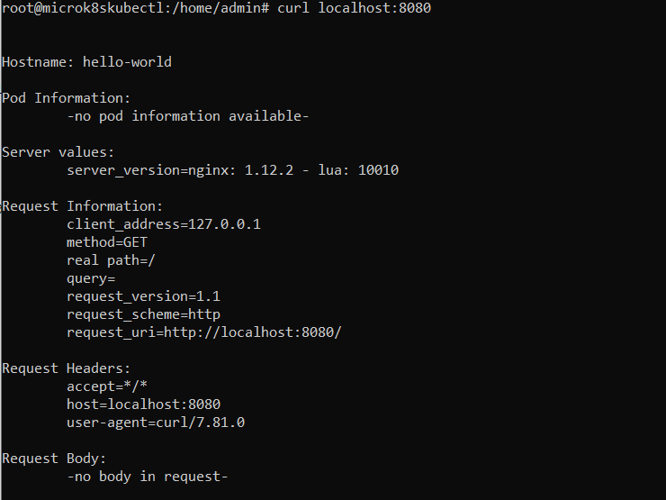
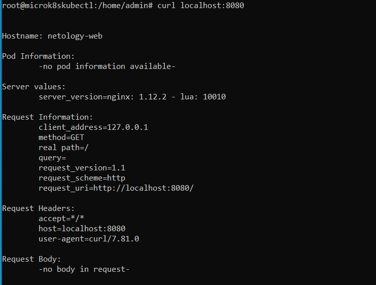
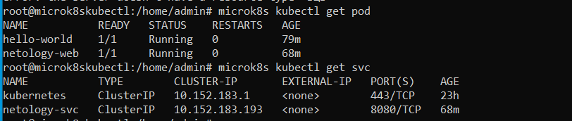

# Домашнее задание к занятию «Базовые объекты K8S»

### Выполнил Хайруллин Ильнур

## Основная часть

### Задание 1. Создать Pod с именем hello-world

1. Создать манифест (yaml-конфигурацию) Pod.
2. Использовать image - gcr.io/kubernetes-e2e-test-images/echoserver:2.2.
3. Подключиться локально к Pod с помощью `kubectl port-forward` и вывести значение (curl или в браузере).

------

### Задание 2. Создать Service и подключить его к Pod

1. Создать Pod с именем netology-web.
2. Использовать image — gcr.io/kubernetes-e2e-test-images/echoserver:2.2.
3. Создать Service с именем netology-svc и подключить к netology-web.
4. Подключиться локально к Service с помощью `kubectl port-forward` и вывести значение (curl или в браузере).

### Ответ:

### Задание 1.

Написал манифест pod.yaml и командой apply развернул под, командой port-forward пробросил порт 8080!

### Задание 2.

Написал новый манифест для poda с label. Написал манифест для сервера с selector (pod label)

Список всех под в дефолтном namespace:

