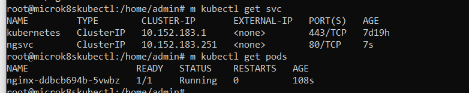

# Домашнее задание к занятию «Запуск приложений в K8S»

### Выполнил Хайруллин Ильнур

## Основная часть

### Задание 1. Создать Deployment и обеспечить доступ к репликам приложения из другого Pod

1. Создать Deployment приложения, состоящего из двух контейнеров — nginx и multitool. Решить возникшую ошибку.
2. После запуска увеличить количество реплик работающего приложения до 2.
3. Продемонстрировать количество подов до и после масштабирования.
4. Создать Service, который обеспечит доступ до реплик приложений из п.1.
5. Создать отдельный Pod с приложением multitool и убедиться с помощью `curl`, что из пода есть доступ до приложений из п.1.

------

### Задание 2. Создать Deployment и обеспечить старт основного контейнера при выполнении условий

1. Создать Deployment приложения nginx и обеспечить старт контейнера только после того, как будет запущен сервис этого приложения.
2. Убедиться, что nginx не стартует. В качестве Init-контейнера взять busybox.
3. Создать и запустить Service. Убедиться, что Init запустился.
4. Продемонстрировать состояние пода до и после запуска сервиса.

### Ответ:

### Задание 1.

Создал [Deployment](https://github.com/khayrullinii/devops-netology/blob/master/12-kuber-03-app-deploy-K8S-khayrullin/deployment.yaml) с двумя контейнерами ( ошибку нашел, заглянув в логи контейнера! logs <pod name> <container name>)

Скриншот с одной репликой:

Скриншот с двумя репликой:

Создал [service](https://github.com/khayrullinii/devops-netology/blob/master/12-kuber-03-app-deploy-K8S-khayrullin/svc.yaml) для доступа до приложений.

Создал pod для проверки командой: kubectl run multitool --image=wbitt/network-multitool

скриншоты курла по доменному имени сервиса:

### Задание 2.

Создал [Deployment](https://github.com/khayrullinii/devops-netology/blob/master/12-kuber-03-app-deploy-K8S-khayrullin/ngnix.yaml) для nginx и [service](https://github.com/khayrullinii/devops-netology/blob/master/12-kuber-03-app-deploy-K8S-khayrullin/ngsvc.yaml) для доступа к приложению.

Скриншот после запуска Deployment:

Скриншот после запуска service:

