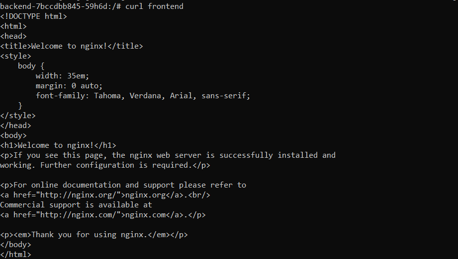
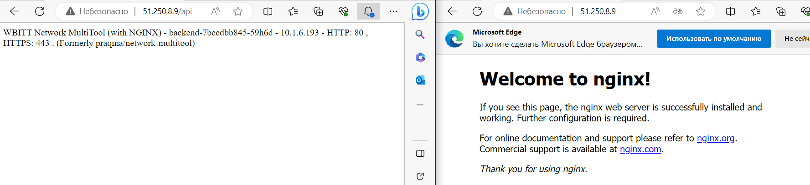

# Домашнее задание к занятию «Сетевое взаимодействие в K8S. Часть 2»

### Выполнил Хайруллин Ильнур

## Основная часть

### Задание 1. Создать Deployment приложений backend и frontend

1. Создать Deployment приложения _frontend_ из образа nginx с количеством реплик 3 шт.
2. Создать Deployment приложения _backend_ из образа multitool. 
3. Добавить Service, которые обеспечат доступ к обоим приложениям внутри кластера. 
4. Продемонстрировать, что приложения видят друг друга с помощью Service.
5. Предоставить манифесты Deployment и Service в решении, а также скриншоты или вывод команды п.4.

------

### Задание 2. Создать Ingress и обеспечить доступ к приложениям снаружи кластера

1. Включить Ingress-controller в MicroK8S.
2. Создать Ingress, обеспечивающий доступ снаружи по IP-адресу кластера MicroK8S так, чтобы при запросе только по адресу открывался _frontend_ а при добавлении /api - _backend_.
3. Продемонстрировать доступ с помощью браузера или `curl` с локального компьютера.
4. Предоставить манифесты и скриншоты или вывод команды п.2.

------

### Ответ:

### Задание 1.

Создал [Deployment frontend](https://github.com/khayrullinii/devops-netology/blob/master/12-kuber-05-network2-K8S-khayrullin/depl_front.yaml) и [service frontend](https://github.com/khayrullinii/devops-netology/blob/master/12-kuber-05-network2-K8S-khayrullin/svc_front.yaml) для доступа

Создал [Deployment backend](https://github.com/khayrullinii/devops-netology/blob/master/12-kuber-05-network2-K8S-khayrullin/depl_back.yaml) и [service backend](https://github.com/khayrullinii/devops-netology/blob/master/12-kuber-05-network2-K8S-khayrullin/svc_back.yaml) для доступа

Скриншот курла c backend на frontend по доменному имени:

### Задание 2.

Включил ingress:  "microk8s enable ingress" 

Написал [ingress](https://github.com/khayrullinii/devops-netology/blob/master/12-kuber-05-network2-K8S-khayrullin/ingress.yaml)

Скриншот из браузера, с / и /api

