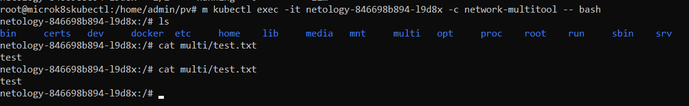

# Домашнее задание к занятию «Хранение в K8s. Часть 2»

### Выполнил Хайруллин Ильнур

## Основная часть

### Задание 1 
Создать Deployment приложения, использующего локальный PV, созданный вручную.

1. Создать Deployment приложения, состоящего из контейнеров busybox и multitool.
2. Создать PV и PVC для подключения папки на локальной ноде, которая будет использована в поде.
3. Продемонстрировать, что multitool может читать файл, в который busybox пишет каждые пять секунд в общей директории. 
4. Удалить Deployment и PVC. Продемонстрировать, что после этого произошло с PV. Пояснить, почему.
5. Продемонстрировать, что файл сохранился на локальном диске ноды. Удалить PV.  Продемонстрировать что произошло с файлом после удаления PV. Пояснить, почему.
5. Предоставить манифесты, а также скриншоты или вывод необходимых команд.

------

### Задание 2

Создать Deployment приложения, которое может хранить файлы на NFS с динамическим созданием PV.

1. Включить и настроить NFS-сервер на MicroK8S.
2. Создать Deployment приложения состоящего из multitool, и подключить к нему PV, созданный автоматически на сервере NFS.
3. Продемонстрировать возможность чтения и записи файла изнутри пода. 
4. Предоставить манифесты, а также скриншоты или вывод необходимых команд.

### Ответ:

### Задание 1.

Создал [Deployment](https://github.com/khayrullinii/devops-netology/blob/master/12-kuber-07-volume2-K8S-khayrullin/deployment.yaml) , [pv](https://github.com/khayrullinii/devops-netology/blob/master/12-kuber-07-volume2-K8S-khayrullin/pv.yaml) и [pvс](https://github.com/khayrullinii/devops-netology/blob/master/12-kuber-07-volume2-K8S-khayrullin/pvс.yaml)

Скриншот с контейнера multitool c доступным файлом:

Удалил Deployment и pvc. PV перешел в статус "RELEASED", это значит том освобожден, но использовать нельзя пока остаются данные от другого pvc:

Удалил pv. Файл остался на диске, так как в режиме retain, созданные файлы надо удалять вручную

### Задание 2.

Создал [Deployment](https://github.com/khayrullinii/devops-netology/blob/master/12-kuber-07-volume2-K8S-khayrullin/nfs_depl.yaml) , [pvc](https://github.com/khayrullinii/devops-netology/blob/master/12-kuber-07-volume2-K8S-khayrullin/pvc_nfs.yaml) и [sc](https://github.com/khayrullinii/devops-netology/blob/master/12-kuber-07-volume2-K8S-khayrullin/nfs_sc.yaml)

Скриншот изнутри пода с доступным примонтированным пространством:

