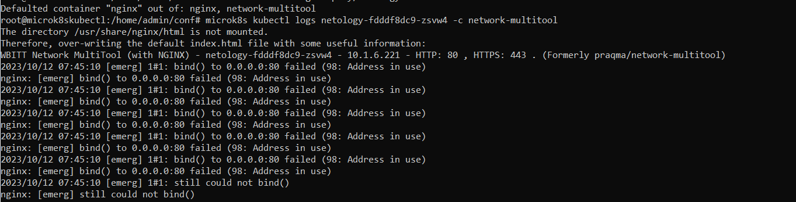
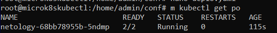
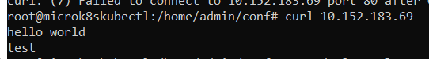
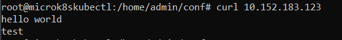
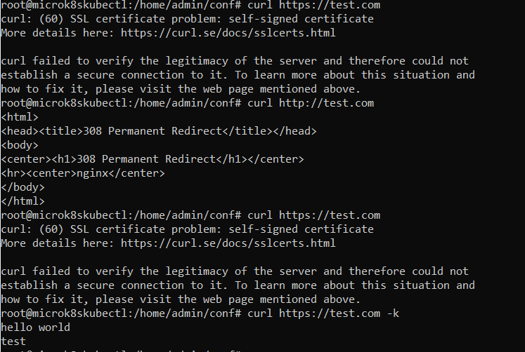

# Домашнее задание к занятию «Конфигурация приложений»

### Выполнил Хайруллин Ильнур

## Основная часть

### Задание 1. Создать Deployment приложения и решить возникшую проблему с помощью ConfigMap. Добавить веб-страницу

1. Создать Deployment приложения, состоящего из контейнеров busybox и multitool.
2. Решить возникшую проблему с помощью ConfigMap.
3. Продемонстрировать, что pod стартовал и оба конейнера работают.
4. Сделать простую веб-страницу и подключить её к Nginx с помощью ConfigMap. Подключить Service и показать вывод curl или в браузере.
5. Предоставить манифесты, а также скриншоты или вывод необходимых команд.

------

### Задание 2. Создать приложение с вашей веб-страницей, доступной по HTTPS 

1. Создать Deployment приложения, состоящего из Nginx.
2. Создать собственную веб-страницу и подключить её как ConfigMap к приложению.
3. Выпустить самоподписной сертификат SSL. Создать Secret для использования сертификата.
4. Создать Ingress и необходимый Service, подключить к нему SSL в вид. Продемонстировать доступ к приложению по HTTPS. 
4. Предоставить манифесты, а также скриншоты или вывод необходимых команд.

### Ответ:

### Задание 1.

Создал [Deployment](https://github.com/khayrullinii/devops-netology/blob/master/12-kuber-08-config-K8S-khayrullin/deployment.yaml) 

Cкриншот ошибки:

Создал [ConfigMap](https://github.com/khayrullinii/devops-netology/blob/master/12-kuber-08-config-K8S-khayrullin/configmap.yaml)

Запущенные поды:

Создал [ConfigMap](https://github.com/khayrullinii/devops-netology/blob/master/12-kuber-08-config-K8S-khayrullin/conf-ind.yaml) c index.html и создал сервис, чтобы проверить

### Задание 2.

Создал [Deployment ngnix](https://github.com/khayrullinii/devops-netology/blob/master/12-kuber-08-config-K8S-khayrullin/deployment-ng.yaml)  и [ConfigMap](https://github.com/khayrullinii/devops-netology/blob/master/12-kuber-08-config-K8S-khayrullin/conf_ngnix.yaml)

Создал сертификат: openssl req -x509 -newkey rsa:2048 -sha256 -nodes -keyout tls.key -out tls.crt -subj "/CN=test.com" -days 365

Создал [secret tls](https://github.com/khayrullinii/devops-netology/blob/master/12-kuber-08-config-K8S-khayrullin/tls.yaml), [ingress](https://github.com/khayrullinii/devops-netology/blob/master/12-kuber-08-config-K8S-khayrullin/ingress.yaml) и [svc](https://github.com/khayrullinii/devops-netology/blob/master/12-kuber-08-config-K8S-khayrullin/svc.yaml)

Доступ по https:

