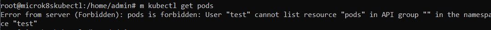
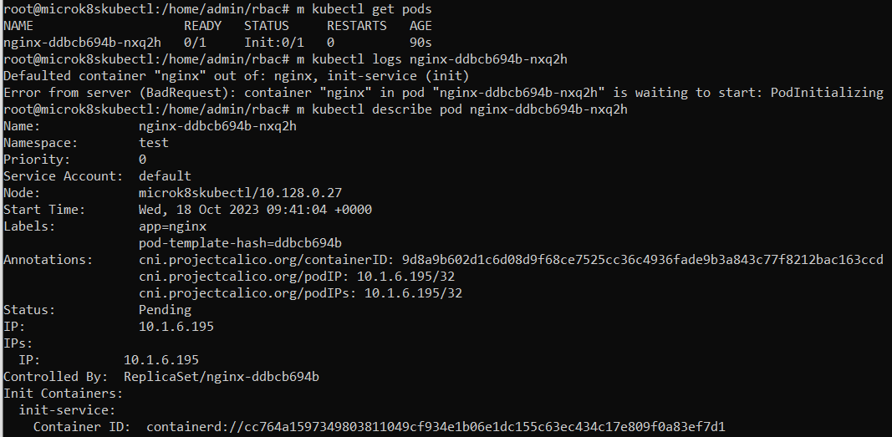

# Домашнее задание к занятию «Управление доступом»

### Выполнил Хайруллин Ильнур

## Основная часть

### Задание 1. Создайте конфигурацию для подключения пользователя

1. Создайте и подпишите SSL-сертификат для подключения к кластеру.
2. Настройте конфигурационный файл kubectl для подключения.
3. Создайте роли и все необходимые настройки для пользователя.
4. Предусмотрите права пользователя. Пользователь может просматривать логи подов и их конфигурацию (`kubectl logs pod <pod_id>`, `kubectl describe pod <pod_id>`).
5. Предоставьте манифесты и скриншоты и/или вывод необходимых команд.

### Ответ:

### Задание 1.

1. Включить rbac на microk8s
Cоздать сертифика и юзера:

        openssl genrsa -out test.key 2048
        openssl req -new -key test.key  -out test.csr -subj "/CN=test/O=dev"
        openssl x509 -req -in test.csr -CA /var/snap/microk8s/current/certs/ca.crt -CAkey /var/snap/microk8s/current/certs/ca.key -CAcreateserial -out test.crt -days 500
        m kubectl set-credentials test --client-certificate=test.crt --client-key=test.key --embed-certs=true
        m kubectl config set-context test --cluster=microk8s-cluster --user=test --namespace=test

Скриншот с ошибкой доступа:

Написал [role](https://github.com/khayrullinii/devops-netology/blob/master/12-kuber-09-rbac-K8S-khayrullin/role.yaml) и [rolebinding](https://github.com/khayrullinii/devops-netology/blob/master/12-kuber-09-rbac-K8S-khayrullin/rolebinding.yaml)

Скриншот с появившимся доступом:

