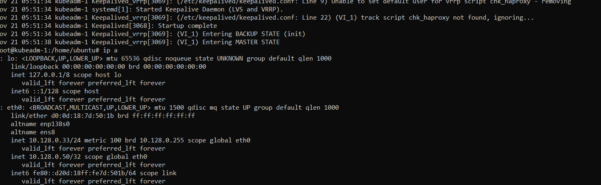

# Домашнее задание к занятию  «Установка Kubernetes»

### Выполнил Хайруллин Ильнур

## Основная часть

### Задание 1. Установить кластер k8s с 1 master node

1. Подготовка работы кластера из 5 нод: 1 мастер и 4 рабочие ноды.
2. В качестве CRI — containerd.
3. Запуск etcd производить на мастере.
4. Способ установки выбрать самостоятельно.

### Задание 2*. Установить HA кластер

1. Установить кластер в режиме HA.
2. Использовать нечётное количество Master-node.
3. Для cluster ip использовать keepalived или другой способ.

### Ответ:

### Задание 1.

Создал 5 нод, для установки воспользуюсь kubeadm

Решение проблемы с форвардингом:
    
    modprobe br_netfilter
    echo "net.ipv4.ip_forward=1" >> /etc/sysctl.conf
    echo "net.bridge.bridge-nf-call-iptables=1" >> /etc/sysctl.conf
    echo "net.bridge.bridge-nf-call-arptables=1" >> /etc/sysctl.conf
    echo "net.bridge.bridge-nf-call-ip6tables=1" >> /etc/sysctl.conf
    sysctl -p /etc/sysctl.conf

Для мастер ноды выполнил следующее:

    sudo apt install apt-transport-https ca-certificates curl

    sudo mkdir -p /etc/apt/keyrings
    echo "deb [signed-by=/etc/apt/keyrings/kubernetes.gpg] https://apt.kubernetes.io/ kubernetes-xenial main" | sudo tee /etc/apt/sources.list.d/kubernetes.list
    curl -fsSL https://packages.cloud.google.com/apt/doc/apt-key.gpg | sudo gpg --dearmor -o /etc/apt/keyrings/kubernetes.gpg

    sudo apt update
    sudo apt install kubelet kubeadm kubectl containerd

    sudo kubeadm init \
    --apiserver-advertise-address=10.128.0.33 \
    --pod-network-cidr 10.150.0.0/16 \
    --apiserver-cert-extra-sans=158.160.54.17

    mkdir -p $HOME/.kube
    sudo cp -i /etc/kubernetes/admin.conf $HOME/.kube/config
    sudo chown $(id -u):$(id -g) $HOME/.kube/config

    kubectl apply -f https://raw.githubusercontent.com/coreos/flannel/master/Documentation/kube-flannel.yml
Для воркер нод выполнил следующее:

    sudo mkdir -p /etc/apt/keyrings
    echo "deb [signed-by=/etc/apt/keyrings/kubernetes.gpg] https://apt.kubernetes.io/ kubernetes-xenial main" | sudo tee /etc/apt/sources.list.d/kubernetes.list
    curl -fsSL https://packages.cloud.google.com/apt/doc/apt-key.gpg | sudo gpg --dearmor -o /etc/apt/keyrings/kubernetes.gpg

    sudo apt install kubelet kubeadm kubectl containerd

    kubeadm join \
        10.128.0.33 \
        --token <token> \
        --discovery-token-ca-cert-hash sha256:<hash>

Ноды кластера:

### Задание 2*.

Ноды kubeadm-1, 2 и 3 cделаю мастер нодами, 4 и 5 оставлю воркерами, подниму HA c помощью keepalived и ha_proxy

.

Keepalive поднял, ha_proxy поднял, но виртуальный адрес не появляется в сети. На момент сдачи задания еще на разобрался с проблемой