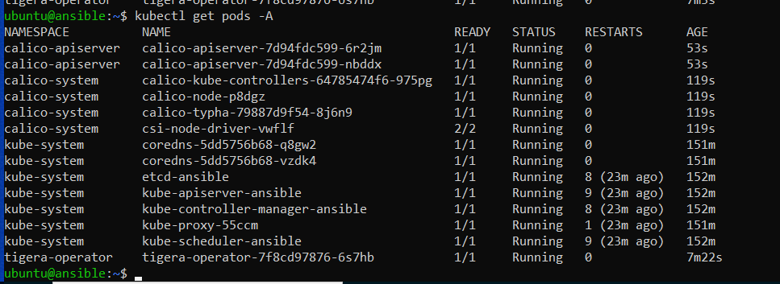
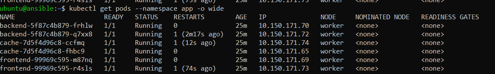
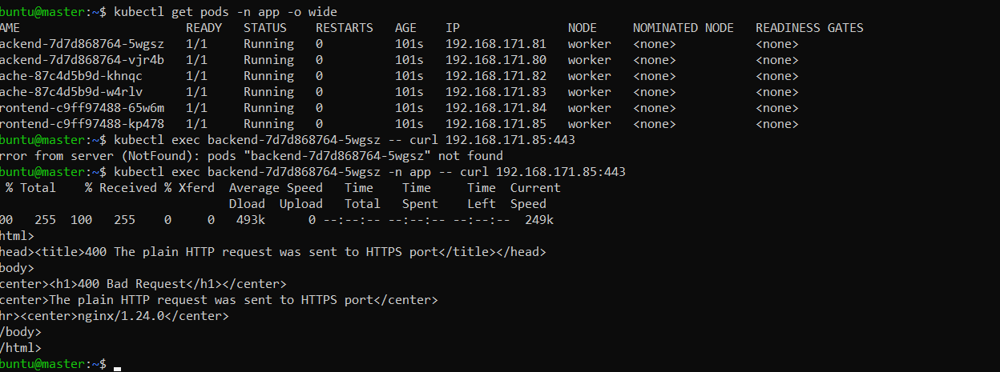
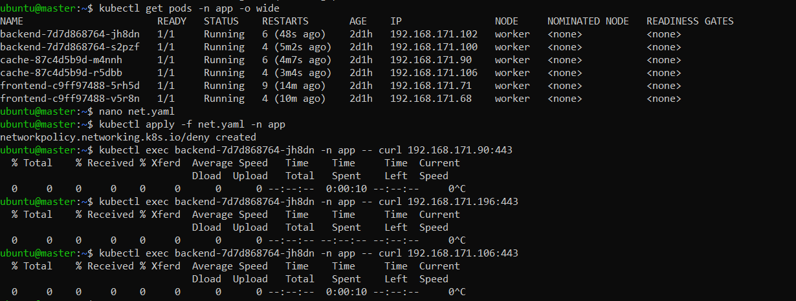
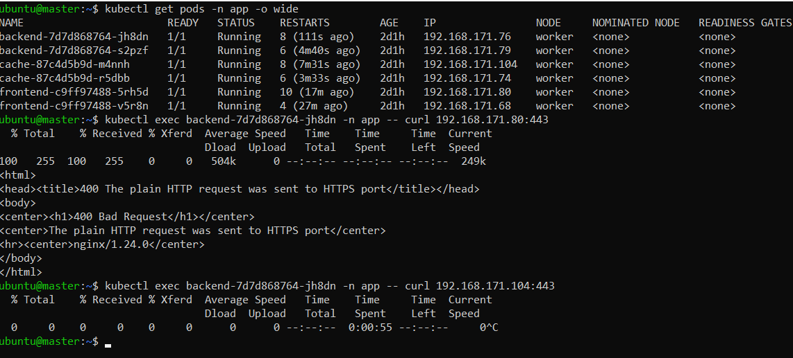

# Домашнее задание к занятию  «Как работает сеть в K8s»

### Выполнил Хайруллин Ильнур

## Основная часть

### Задание 1. Создать сетевую политику или несколько политик для обеспечения доступа

1. Создать deployment'ы приложений frontend, backend и cache и соответсвующие сервисы.
2. В качестве образа использовать network-multitool.
3. Разместить поды в namespace App.
4. Создать политики, чтобы обеспечить доступ frontend -> backend -> cache. Другие виды подключений должны быть запрещены.
5. Продемонстрировать, что трафик разрешён и запрещён.

### Ответ:

### Задание 1.

Развернул с помощью kubeadm кластер, под CNI поднял calico

Написал deployments [backend](https://github.com/khayrullinii/devops-netology/blob/master/13-kuber-03-network-K8S-khayrullin/back.yaml) , [frontend](https://github.com/khayrullinii/devops-netology/blob/master/13-kuber-03-network-K8S-khayrullin/front.yaml), [cache](https://github.com/khayrullinii/devops-netology/blob/master/13-kuber-03-network-K8S-khayrullin/cache.yaml). И для каждого svc соответсвенно. Поднял поды:

Проверю связность внутри подов до применения политик:

    kubectl exec backend-7d7d868764-5wgsz -n app -- curl 192.168.171.85:443

После применения запрещающего [правила](https://github.com/khayrullinii/devops-netology/blob/master/13-kuber-03-network-K8S-khayrullin/net_policy.yaml):

После применения разрешающего [правила](https://github.com/khayrullinii/devops-netology/blob/master/13-kuber-03-network-K8S-khayrullin/policy.yaml)

