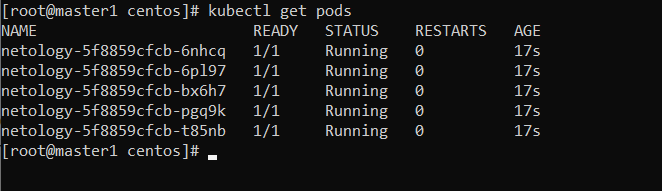
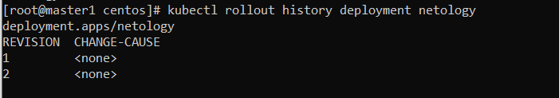
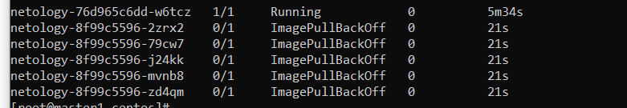
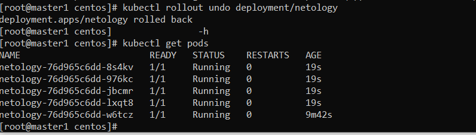
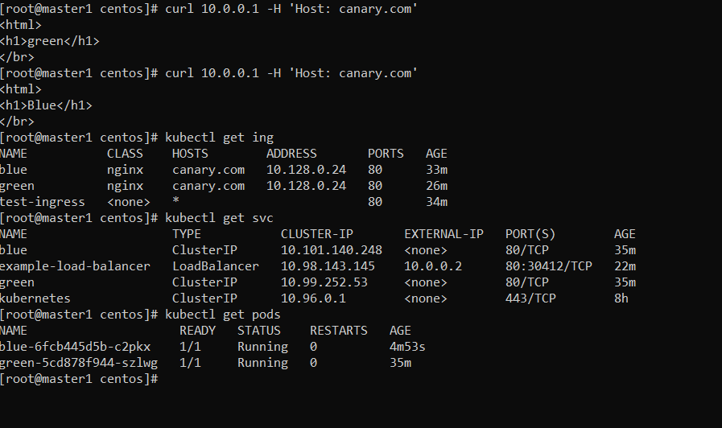

# Домашнее задание к занятию  «Обновление приложений»

### Выполнил Хайруллин Ильнур

## Основная часть

### Задание 1. Выбрать стратегию обновления приложения и описать ваш выбор

1. Имеется приложение, состоящее из нескольких реплик, которое требуется обновить.
2. Ресурсы, выделенные для приложения, ограничены, и нет возможности их увеличить.
3. Запас по ресурсам в менее загруженный момент времени составляет 20%.
4. Обновление мажорное, новые версии приложения не умеют работать со старыми.
5. Вам нужно объяснить свой выбор стратегии обновления приложения.

### Задание 2. Обновить приложение

1. Создать deployment приложения с контейнерами nginx и multitool. Версию nginx взять 1.19. Количество реплик — 5.
2. Обновить версию nginx в приложении до версии 1.20, сократив время обновления до минимума. Приложение должно быть доступно.
3. Попытаться обновить nginx до версии 1.28, приложение должно оставаться доступным.
4. Откатиться после неудачного обновления.

### Задание 3*. Создать Canary deployment

1. Создать два deployment'а приложения nginx.
2. При помощи разных ConfigMap сделать две версии приложения — веб-страницы.
3. С помощью ingress создать канареечный деплоймент, чтобы можно было часть трафика перебросить на разные версии приложения.

### Ответ:

### Задание 1.

Выбираем Recreate потому-что:
1) Нет SLA по доступности сервиса
2) Ограничены в ресурсах для постепенного обновления
3) новые версии приложения не умеют работать со старыми, поэтому лучше обновить все сразу

### Задание 2. Обновить приложение

Написал [deployment](https://github.com/khayrullinii/devops-netology/blob/master/13-kuber-04-update-K8S-khayrullin/depl.yaml)
 ,после деплоя:

Изменил версию и задеплоил, конфигурация 4 max недоступны и 3 пода можно поднимать дополнительно.

Изменил версию до 28 и получил ошибку:

Сделал rollout:

### Задание 3*. Создать Canary deployment

Написал [config](https://github.com/khayrullinii/devops-netology/blob/master/13-kuber-04-update-K8S-khayrullin/canary.yaml)

Балансировка будет происходить по 50%, прописано в игрес:

