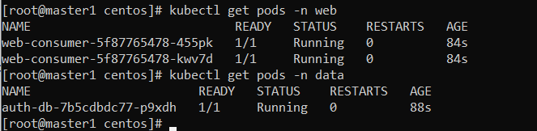
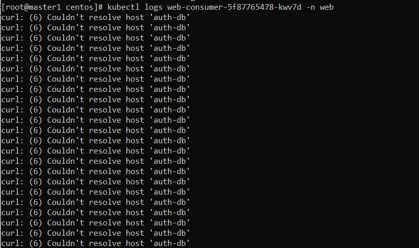
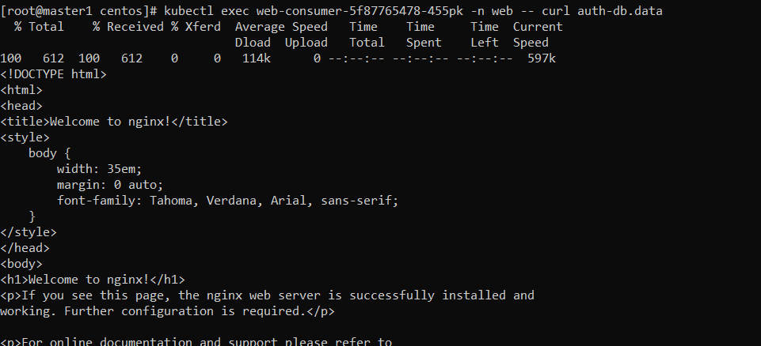
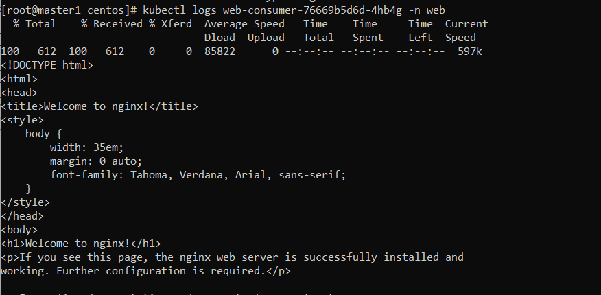

# Домашнее задание к занятию  «Troubleshooting»

### Выполнил Хайруллин Ильнур

## Основная часть

### Задание. При деплое приложение web-consumer не может подключиться к auth-db. Необходимо это исправить

1. Установить приложение по команде:
```shell
kubectl apply -f https://raw.githubusercontent.com/netology-code/kuber-homeworks/main/3.5/files/task.yaml
```
2. Выявить проблему и описать.
3. Исправить проблему, описать, что сделано.
4. Продемонстрировать, что проблема решена.

### Ответ:

### Задание 1.

Поставил приложение:



Контейнеры находятся в разных namespace, поэтому обращение только по имени сервиса невозможно:



Исправить можно несоклькими способами: поднять поды в одном namespace или при обращении добавить к имени svc еще и название namespace:



    kubectl edit deployment/web-consumer -n web
    добавил название namespace для резолва (auth-db.data)

Вывод команды "kubectl logs web-consumer-76669b5d6d-4hb4g -n web" :

