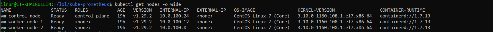
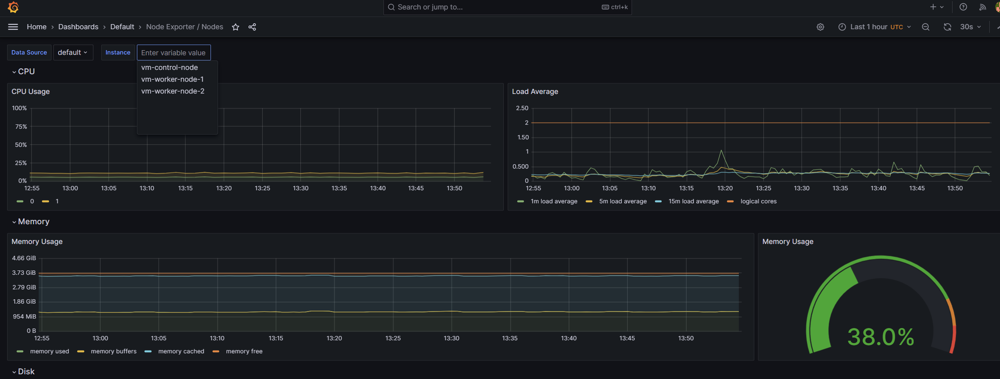
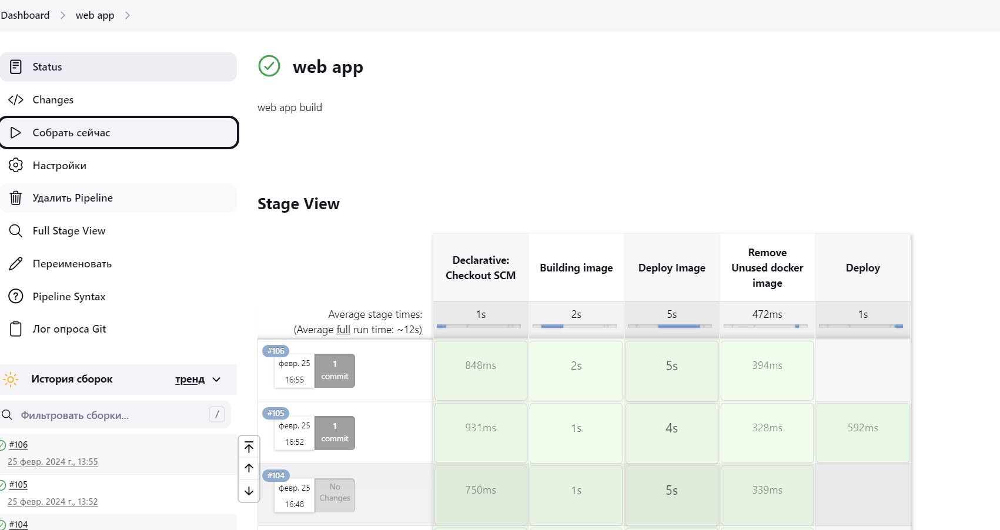

# Дипломный практикум в Yandex.Cloud 

### Выполнил Хайруллин Ильнур

## Задание на [дипломный практикум](https://github.com/netology-code/devops-diplom-yandexcloud)

Этапы выполнения:

1) Создание облачной инфраструктуры при помощи Terraform.
2) Создание Kubernetes кластера
3) Создание тестового приложения
4) Подготовка cистемы мониторинга и деплой приложения
5) Установка и настройка CI/CD

## Выполнение практикума

### Создание облачной инфраструктуры при помощи Terraform.

1) Манифест для создания  [сервисного аккаунта](https://github.com/khayrullinii/devops-netology/tree/master/devops-diplom-2024-khayrullin/YC-terraform/sa.tf)

2) Манифест для создания [S3 bucket](https://github.com/khayrullinii/devops-netology/tree/master/devops-diplom-2024-khayrullin/YC-terraform/bucket.tf)

3) Манифест для создания [VPC и подсетей](https://github.com/khayrullinii/devops-netology/tree/master/devops-diplom-2024-khayrullin/YC-terraform/vpc.tf)

Для изменения входных данных, необходимо внести изменения в [variables.tf](https://github.com/khayrullinii/devops-netology/tree/master/devops-diplom-2024-khayrullin/YC-terraform/variables.tf)

### Создание Kubernetes кластера.

1) Сделал клон репозитория [kubespray](https://github.com/kubernetes-sigs/kubespray)

    Добавил некоторые параметры в файлы конфигурации
    
        В манифест inventory/sample/group_vars/all/all.yml
        kube_read_only_port: 10255

        В манифест inventory/sample/group_vars/k8s_cluster/k8s-cluster.yml
        kubelet_authentication_token_webhook: true
        kubelet_authorization_mode_webhook: true

2) Написал [шаблон](https://github.com/khayrullinii/devops-netology/tree/master/devops-diplom-2024-khayrullin/YC-terraform/hosts.tftpl) для создания inventory файла через terraform 

3) Дописал в [main](https://github.com/khayrullinii/devops-netology/tree/master/devops-diplom-2024-khayrullin/YC-terraform/main.tf) блок для заполнения файла инвентори и запуска playbook'ов kubspray

4) После завершения выполнения плэйбуков зашел на controle-node и переместил файл с конфигом в директорию .kube и дал прав

        mkdir -p $HOME/.kube
        sudo cp -i /etc/kubernetes/admin.conf $HOME/.kube/config
        sudo chown $(id -u):$(id -g) $HOME/.kube/config

5) Выписал сертификаты и на публичный адрес, для удаленного администрирования кластером

### Создание тестового приложения

1) Создал в новом репозитории [страничку](https://github.com/khayrullinii/test_app) c цветом фона(буду его менять при тесте ci/cd) там же оставил [dockerfile](https://github.com/khayrullinii/test_app)

2) Запушил в [dockerhub](https://hub.docker.com/r/khayrullinii/app-nginx)

### Подготовка cистемы мониторинга и деплой приложения

1)  Склонировал репозиторий с [kube-prometheus](https://github.com/prometheus-operator/kube-prometheus) и запустил apply:

        kubectl apply --server-side -f manifests/setup
         kubectl wait \
         	--for condition=Established \
         	--all CustomResourceDefinition \
         	--namespace=monitoring
         kubectl apply -f manifests/

2) Создал сервис для доступа к  [grafana](https://github.com/khayrullinii/devops-netology/tree/master/devops-diplom-2024-khayrullin/kube_config/grafana.tf) графана доступна по [адресу](http://158.160.116.57:30003//)

       Можно не создавать отдельный сервис, а изменить type сервиса manifests/grafana-service.yaml на nodeport и указать порт внешного адреса, только после этого задеплоить. Если доступа по порту так и не появилось, попробуйте удалить networkpolicy(kubectl -n monitoring delete networkpolicies.networking.k8s.io --all), если проблема доступ появится измените файл  manifests/grafana-networkPolicy.yaml

3) Создал манифест для деплоя [тестового приложения](https://github.com/khayrullinii/devops-netology/tree/master/devops-diplom-2024-khayrullin/kube_config/deploy.tf) и запустил [приложение](http://158.160.116.57:30080//)

### Установка и настройка CI/CD'

1) Развернул [jenkins](http://178.154.205.122:8080/) и agenta, подцепил агента, создал SC Pipeline

2)  Написал [jenkinsfile](https://github.com/khayrullinii/test_app/blob/master/Jenkinsfile), который собирает docker image и пушит в docker hub

